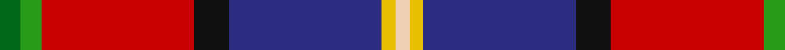

In pattern [GGRKBYW](/patterns/ggrkbyw/).

This was sourced from tartans-authority.  It is a [7 stripes tartan](/stripes/stripes7/).

Original link http://www.tartansauthority.com/tartan-ferret/display/2375/

## Thread count
Ga/6 G6 R44 K10 DB44 Y4 LR/4

## Palette
Each colour and its ΔE from the base-6 reference it is a variant of.

| Colour | Shade | Base | ΔE (OKLab) |
|---|---|---|---|
| DB | <code style="background-color:#2C2C80;">#2C2C80</code> `#2C2C80` | B <code style="background-color:#2A418A;">#2A418A</code> | 0.06 |
| G | <code style="background-color:#289C18;">#289C18</code> `#289C18` | G <code style="background-color:#006100;">#006100</code> | 0.19 |
| Ga | <code style="background-color:#006818;">#006818</code> `#006818` | G <code style="background-color:#006100;">#006100</code> | 0.02 |
| K | <code style="background-color:#101010;">#101010</code> `#101010` | K <code style="background-color:#000000;">#000000</code> | 0.17 |
| LR | <code style="background-color:#F0D0B4;">#F0D0B4</code> `#F0D0B4` | W <code style="background-color:#F7F7F7;">#F7F7F7</code> | 0.11 |
| R | <code style="background-color:#C80000;">#C80000</code> `#C80000` | R <code style="background-color:#CC0000;">#CC0000</code> | 0.01 |
| Y | <code style="background-color:#E8C000;">#E8C000</code> `#E8C000` | Y <code style="background-color:#F2BF00;">#F2BF00</code> | 0.02 |

# Sample pattern

## Nearest tartans

The nearest existing variants by ΔTartan distance.

1. [MacLeod Society of Scotland](/setts/s6/g6ga6r44k10b44y4-b2c2c80-g006818-ga289c18-k101010-rc80000-ye8c000/) — ΔT 0.98
1. [Loch Etive](/setts/s8/w6g4r42k52b36k4b6y6-b2c4084-g00643c-k101010-rdc0000-we0e0e0-yfccc00/) — ΔT 1.13
1. [MacCreary (Personal)](/setts/s9/k8b24w6b8g16y4r48b8r8-b1c0070-g006818-k101010-rcc4438-wa8ace8-yd09800/) — ΔT 1.16
1. [Loch Etive](/setts/s8/w6g4r42k52b36k4b6y6-b2c2c80-g289c18-k101010-rc80000-wc0c0c0-yfccc00/) — ΔT 1.19
1. [Bombeiros Voluntarios De Galicia (Co](/setts/s7/r6b4r50ra24k50w4wa4-b5c5c5c-k101010-rc80000-ra888888-we0e0e0-waa8ace8/) — ΔT 1.19
1. [Bombeiros Voluntarios De Galicia](/setts/s7/r6b4r50ra24k50w4wa4-b5c5c5c-k101010-rc80000-ra888888-wffffff-waa8ace8/) — ΔT 1.20
1. [Asman Red (Personal)](/setts/s10/b8y6b44r12w4k12w4ra52k6ra8-b2c2c80-k101010-r888888-rac80000-wfcfcfc-ye8c000/) — ΔT 1.22
1. [Wishart Dress (Clan)](/setts/s7/k14b8r62ba6y4ba54w8-b2c2c80-ba202060-k000000-rc80000-wc8c8c8-ye8c000/) — ΔT 1.23
1. [Crieff Primary School](/setts/s10/k12g4r4b24ba8b4ba4b4r40w4-b202060-ba5c5c5c-g006818-k101010-rc80000-wfcfcfc/) — ΔT 1.24
1. [Walter (Personal)](/setts/s7/r48w6y8g36b36ga6ba8-b780078-ba5c8ca8-g003820-ga5c6428-rc80000-wfcfcfc-ye8c000/) — ΔT 1.27

## Neighbour map

Every grey dot is one of 15726 variants placed by the first two principal components of the ΔTartan feature space (44% of its variance). Red is this tartan; blue dots are its nearest — click one to open its page.

<svg viewBox="0 0 640 380" role="img" style="max-width:100%;height:auto;border:1px solid #e0e0e0;border-radius:4px;display:block" xmlns="http://www.w3.org/2000/svg"><image href="/nn/cloud.v1.png" width="640" height="380"/><a href="/setts/s6/g6ga6r44k10b44y4-b2c2c80-g006818-ga289c18-k101010-rc80000-ye8c000/"><circle cx="185.4" cy="157.2" r="4" fill="#3465a4"><title>MacLeod Society of Scotland</title></circle></a><a href="/setts/s8/w6g4r42k52b36k4b6y6-b2c4084-g00643c-k101010-rdc0000-we0e0e0-yfccc00/"><circle cx="149.5" cy="132.1" r="4" fill="#3465a4"><title>Loch Etive</title></circle></a><a href="/setts/s9/k8b24w6b8g16y4r48b8r8-b1c0070-g006818-k101010-rcc4438-wa8ace8-yd09800/"><circle cx="179.4" cy="134.7" r="4" fill="#3465a4"><title>MacCreary (Personal)</title></circle></a><a href="/setts/s8/w6g4r42k52b36k4b6y6-b2c2c80-g289c18-k101010-rc80000-wc0c0c0-yfccc00/"><circle cx="154.3" cy="135.3" r="4" fill="#3465a4"><title>Loch Etive</title></circle></a><a href="/setts/s7/r6b4r50ra24k50w4wa4-b5c5c5c-k101010-rc80000-ra888888-we0e0e0-waa8ace8/"><circle cx="183.9" cy="136.0" r="4" fill="#3465a4"><title>Bombeiros Voluntarios De Galicia (Co</title></circle></a><a href="/setts/s7/r6b4r50ra24k50w4wa4-b5c5c5c-k101010-rc80000-ra888888-wffffff-waa8ace8/"><circle cx="181.6" cy="135.0" r="4" fill="#3465a4"><title>Bombeiros Voluntarios De Galicia</title></circle></a><a href="/setts/s10/b8y6b44r12w4k12w4ra52k6ra8-b2c2c80-k101010-r888888-rac80000-wfcfcfc-ye8c000/"><circle cx="165.5" cy="111.6" r="4" fill="#3465a4"><title>Asman Red (Personal)</title></circle></a><a href="/setts/s7/k14b8r62ba6y4ba54w8-b2c2c80-ba202060-k000000-rc80000-wc8c8c8-ye8c000/"><circle cx="196.9" cy="127.0" r="4" fill="#3465a4"><title>Wishart Dress (Clan)</title></circle></a><a href="/setts/s10/k12g4r4b24ba8b4ba4b4r40w4-b202060-ba5c5c5c-g006818-k101010-rc80000-wfcfcfc/"><circle cx="176.0" cy="128.0" r="4" fill="#3465a4"><title>Crieff Primary School</title></circle></a><a href="/setts/s7/r48w6y8g36b36ga6ba8-b780078-ba5c8ca8-g003820-ga5c6428-rc80000-wfcfcfc-ye8c000/"><circle cx="91.0" cy="150.0" r="4" fill="#3465a4"><title>Walter (Personal)</title></circle></a><circle cx="152.8" cy="125.0" r="5" fill="#c00000"/></svg>

ID: /setts/s7/g6ga6r44k10b44y4w4-b2c2c80-g006818-ga289c18-k101010-rc80000-wf0d0b4-ye8c000/
