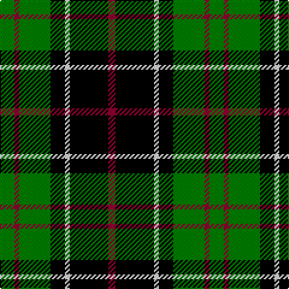

In pattern [GRGKWKR](/stripes/grgkwkr/).

This was sourced from weddslist.  It is a [7 stripe tartan](/stripes/stripes7/).

Original link http://www.weddslist.com/cgi-bin/tartans/pg.pl?source=sts

## Also known as

This cloth is also recorded under:

- Sinclair, hunting

## Thread count
G/12 DR4 G26 K12 LN4 K32 DR/6

## Palette
Each colour and the base-6 reference it is a variant of.

| Colour | Shade | Base |
|---|---|---|
| DR | <code style="background-color:#900030;">#900030</code> `oklch(41.6% 0.166 13.6)` <small>#900030</small> | R <code style="background-color:#CC0000;">#CC0000</code> |
| G | <code style="background-color:#008000;">#008000</code> `oklch(52.0% 0.177 142.5)` <small>#008000</small> | G <code style="background-color:#006100;">#006100</code> |
| K | <code style="background-color:#000000;">#000000</code> `oklch(0.0% 0.000 0.0)` <small>#000000</small> | K <code style="background-color:#000000;">#000000</code> |
| LN | <code style="background-color:#E0E0E0;">#E0E0E0</code> `oklch(90.7% 0.000 89.9)` <small>#E0E0E0</small> | W <code style="background-color:#F7F7F7;">#F7F7F7</code> |

# Sample pattern

## Nearest tartans

The nearest existing variants by ΔTartan distance.

1. [Douglas, Black](/setts/s5/k8b5g44k40r6/) — ΔT 0.88
1. [Cleghorn (Personal)](/setts/s7/g8r3g30k8w3k36w8~x2/) — ΔT 0.92
1. [Wilson's, No 108](/setts/s8/k7g7k1g7k7t1p7k1~x4/) — ΔT 1.04
1. [Walker, James](/setts/s6/k2g7t1k6r4g2~x4/) — ΔT 1.06
1. [Unnamed 3](/setts/s6/k2g9t1k6b4g2~x2/) — ΔT 1.07
1. [Wilson's, No 160](/setts/s6/g21ly2g4k16p14k3~x2/) — ΔT 1.07
1. [Wilson's, No 150 "Coburg"](/setts/s6/g18t2g4k14p12k3~x2/) — ΔT 1.09
1. [MacCallum](/setts/s7/g8k2t1g4k6db6k1~x2/) — ΔT 1.11
1. [Robert Gordon University](/setts/s5/k7r3k24g28ly3~x2/) — ΔT 1.11
1. [Wilson's No 158](/setts/s6/g21w2g4k17p14k3~x2/) — ΔT 1.13

## Neighbour map

Every grey dot is one of 14299 variants placed by the first two principal components of the ΔTartan feature space (44% of its variance). Red is this tartan; blue dots are its nearest — click one to open its page.

<svg viewBox="0 0 640 380" role="img" style="max-width:100%;height:auto;border:1px solid #e0e0e0;border-radius:4px;display:block" xmlns="http://www.w3.org/2000/svg"><image href="/nn/cloud.v1.png" width="640" height="380"/><a href="/setts/s5/k8b5g44k40r6/"><circle cx="237.8" cy="222.7" r="4" fill="#3465a4"><title>Douglas, Black</title></circle></a><a href="/setts/s7/g8r3g30k8w3k36w8~x2/"><circle cx="223.2" cy="184.7" r="4" fill="#3465a4"><title>Cleghorn (Personal)</title></circle></a><a href="/setts/s8/k7g7k1g7k7t1p7k1~x4/"><circle cx="163.8" cy="228.5" r="4" fill="#3465a4"><title>Wilson's, No 108</title></circle></a><a href="/setts/s6/k2g7t1k6r4g2~x4/"><circle cx="158.0" cy="236.6" r="4" fill="#3465a4"><title>Walker, James</title></circle></a><a href="/setts/s6/k2g9t1k6b4g2~x2/"><circle cx="190.0" cy="221.9" r="4" fill="#3465a4"><title>Unnamed 3</title></circle></a><a href="/setts/s6/g21ly2g4k16p14k3~x2/"><circle cx="185.1" cy="208.6" r="4" fill="#3465a4"><title>Wilson's, No 160</title></circle></a><a href="/setts/s6/g18t2g4k14p12k3~x2/"><circle cx="177.0" cy="220.1" r="4" fill="#3465a4"><title>Wilson's, No 150 &quot;Coburg&quot;</title></circle></a><a href="/setts/s7/g8k2t1g4k6db6k1~x2/"><circle cx="171.3" cy="231.1" r="4" fill="#3465a4"><title>MacCallum</title></circle></a><a href="/setts/s5/k7r3k24g28ly3~x2/"><circle cx="233.3" cy="214.7" r="4" fill="#3465a4"><title>Robert Gordon University</title></circle></a><a href="/setts/s6/g21w2g4k17p14k3~x2/"><circle cx="182.0" cy="208.3" r="4" fill="#3465a4"><title>Wilson's No 158</title></circle></a><circle cx="203.3" cy="215.8" r="5" fill="#c00000"/></svg>

ID: /setts/s7/g6r2g13k6w2k16r3~x2/
