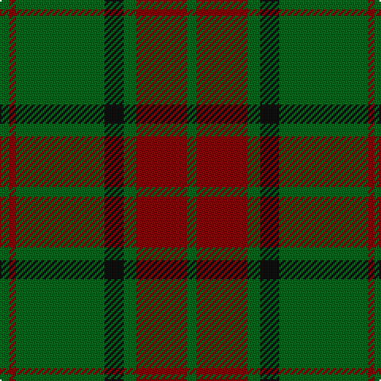

In pattern [GRGKGRG](/patterns/grgkgrg/).

This was sourced from tartans-authority.  It is a [7 stripes tartan](/stripes/stripes7/).

Original link http://www.tartansauthority.com/tartan-ferret/display/865/

## Attestations

This cloth appears in 2 source records; the oldest owns this page.

- pre 1980 — Maxwell Htg (Clan) (tartans-authority, [record](http://www.tartansauthority.com/tartan-ferret/display/865/))
- 01/01/1981 — Maxwell Hunting (register-of-tartans, [record](https://www.tartanregister.gov.uk/tartanDetails.aspx?ref=2863))

## Thread count
G/6 DR4 G56 K12 G8 DR32 G/6

## Palette
Each colour and its ΔE from the base-6 reference it is a variant of.

| Colour | Shade | Base | ΔE (OKLab) |
|---|---|---|---|
| DR | <code style="background-color:#880000;">#880000</code> `#880000` | R <code style="background-color:#CC0000;">#CC0000</code> | 0.15 |
| G | <code style="background-color:#006818;">#006818</code> `#006818` | G <code style="background-color:#006100;">#006100</code> | 0.02 |
| K | <code style="background-color:#101010;">#101010</code> `#101010` | K <code style="background-color:#000000;">#000000</code> | 0.17 |

# Sample pattern

## Nearest tartans

The nearest existing variants by ΔTartan distance.

1. [Angle, Green (Fashion)](/setts/s7/y4g44k24g12y4g4y4-g285800-k101010-ybc8c00/) — ΔT 0.87
1. [Glen Trool](/setts/s5/g74r18g6ra18r6-g003000-r806050-rac00000/) — ΔT 1.07
1. [Glen Trool (Fashion)](/setts/s5/g84r20g6ra20r6-g004428-ra07c58-ra880000/) — ΔT 1.11
1. [Connell (Personal?)](/setts/s6/r8g8r4g48r12k4-g006818-k101010-rc80000/) — ΔT 1.15
1. [Scott Autumn (Fashion)](/setts/s7/g32y6g28r32g4r4g6-g004c00-r8c0000-yc89800/) — ΔT 1.20
1. [MacArthur-Fox 2000 (Personal)](/setts/s10/g10k4g60r4k20g10k4g10k20r4-g5c6428-k101010-rc80000/) — ΔT 1.21
1. [Glenbarr](/setts/s8/g12k24r8k24g12k8g64k4-g006818-k101010-rc80000/) — ΔT 1.30
1. [Loton (Personal)](/setts/s5/r24g8b8g68r8-b00008c-g004c00-r880000/) — ΔT 1.33
1. [Northcroft (Personal)](/setts/s7/g48r8g6k28g10r4g20-g006818-k101010-rc80000/) — ΔT 1.33
1. [O'Neill Pipe Band 1983 (Corporate)](/setts/s7/r4g4r20g32y4g4y4-g006818-rb84c00-y48a4c0/) — ΔT 1.36

## Neighbour map

Every grey dot is one of 15726 variants placed by the first two principal components of the ΔTartan feature space (44% of its variance). Red is this tartan; blue dots are its nearest — click one to open its page.

<svg viewBox="0 0 640 380" role="img" style="max-width:100%;height:auto;border:1px solid #e0e0e0;border-radius:4px;display:block" xmlns="http://www.w3.org/2000/svg"><image href="/nn/cloud.v1.png" width="640" height="380"/><a href="/setts/s7/y4g44k24g12y4g4y4-g285800-k101010-ybc8c00/"><circle cx="395.4" cy="222.6" r="4" fill="#3465a4"><title>Angle, Green (Fashion)</title></circle></a><a href="/setts/s5/g74r18g6ra18r6-g003000-r806050-rac00000/"><circle cx="441.0" cy="234.9" r="4" fill="#3465a4"><title>Glen Trool</title></circle></a><a href="/setts/s5/g84r20g6ra20r6-g004428-ra07c58-ra880000/"><circle cx="466.4" cy="235.5" r="4" fill="#3465a4"><title>Glen Trool (Fashion)</title></circle></a><a href="/setts/s6/r8g8r4g48r12k4-g006818-k101010-rc80000/"><circle cx="445.7" cy="215.8" r="4" fill="#3465a4"><title>Connell (Personal?)</title></circle></a><a href="/setts/s7/g32y6g28r32g4r4g6-g004c00-r8c0000-yc89800/"><circle cx="406.6" cy="258.2" r="4" fill="#3465a4"><title>Scott Autumn (Fashion)</title></circle></a><a href="/setts/s10/g10k4g60r4k20g10k4g10k20r4-g5c6428-k101010-rc80000/"><circle cx="413.1" cy="187.3" r="4" fill="#3465a4"><title>MacArthur-Fox 2000 (Personal)</title></circle></a><a href="/setts/s8/g12k24r8k24g12k8g64k4-g006818-k101010-rc80000/"><circle cx="374.5" cy="211.4" r="4" fill="#3465a4"><title>Glenbarr</title></circle></a><a href="/setts/s5/r24g8b8g68r8-b00008c-g004c00-r880000/"><circle cx="452.7" cy="262.0" r="4" fill="#3465a4"><title>Loton (Personal)</title></circle></a><a href="/setts/s7/g48r8g6k28g10r4g20-g006818-k101010-rc80000/"><circle cx="417.3" cy="236.4" r="4" fill="#3465a4"><title>Northcroft (Personal)</title></circle></a><a href="/setts/s7/r4g4r20g32y4g4y4-g006818-rb84c00-y48a4c0/"><circle cx="368.1" cy="235.2" r="4" fill="#3465a4"><title>O'Neill Pipe Band 1983 (Corporate)</title></circle></a><circle cx="418.9" cy="219.0" r="5" fill="#c00000"/></svg>

ID: /setts/s7/g6r32g8k12g56r4g6-g006818-k101010-r880000/
