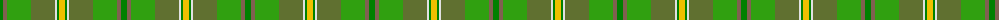

In pattern [GRGGWGY](/patterns/grggwgy/).

This was sourced from weddslist.  It is a [7 stripes tartan](/stripes/stripes7/).

Original link http://www.weddslist.com/cgi-bin/tartans/pg.pl?source=sts

## Thread count
Gb/6 LT4 Ga24 G24 LN2 Gb2 Y/6

## Palette
Each colour and its ΔE from the base-6 reference it is a variant of.

| Colour | Shade | Base | ΔE (OKLab) |
|---|---|---|---|
| G | <code style="background-color:#607030;">#607030</code> `#607030` | G <code style="background-color:#006400;">#006400</code> | 0.11 |
| Ga | <code style="background-color:#30A010;">#30A010</code> `#30A010` | G <code style="background-color:#006400;">#006400</code> | 0.19 |
| Gb | <code style="background-color:#008000;">#008000</code> `#008000` | G <code style="background-color:#006400;">#006400</code> | 0.09 |
| LN | <code style="background-color:#E0E0E0;">#E0E0E0</code> `#E0E0E0` | W <code style="background-color:#F4F4F0;">#F4F4F0</code> | 0.06 |
| LT | <code style="background-color:#806050;">#806050</code> `#806050` | R <code style="background-color:#C80000;">#C80000</code> | 0.17 |
| Y | <code style="background-color:#F0C000;">#F0C000</code> `#F0C000` | Y <code style="background-color:#E8C000;">#E8C000</code> | 0.01 |

# Sample pattern

## Nearest tartans

The nearest existing variants by ΔTartan distance.

1. [Braemar House Corporate Tartan Tartan Number: 908. Earliest known date: 1987 The Lords Kilmarnock are descended from both the Hays (the Earls of Errol), and the Stewarts and the design incorporates elements from the Hay-Leith tartan (the red section) and the Hunting Stewart (the green section) with minor alterations to each. The representation here follows the count registered with Lord Lyon on 7th March 1956. The Boyd family are closely associated with the town of Kilmarnock in the South West of the Scottish Lowlands. See products available Copyright © Blair Urquhart, Comrie, 2015](/setts/s7/g6ga4gb24gc24w2g2y6-g006818-ga604000-gb289c18-gc5c6428-we0e0e0-ye8c000/) — ΔT 0.85
1. [Shrek](/setts/s12/r8g6r60ga24g10y8g6y28ya4y4ya20yb6-g006438-ga707830-ra87448-y40c440-yaa4cc74-ybbcc41c/) — ΔT 1.65
1. [Glens of Corbie](/setts/s9/y6g60ga40r12ga6r6ga6b40ra4-b003c64-g006818-ga5c6428-r94783c-rac80000-ybc8c00/) — ΔT 1.92
1. [City of Vancouver (Commemorative)](/setts/s6/g8y4g48w24ga48r4-g006818-ga408060-r880000-wc0c0c0-yd09800/) — ΔT 2.05
1. [Glens of Corbie (Corporate)](/setts/s9/k6g60ga40r12ga6r6ga6b40ra4-b003c64-g006818-ga5c6428-k000000-r94783c-rac80000/) — ΔT 2.08
1. [Tomass](/setts/s8/r8g4ga36gb4g8gb24gc8gb4-g503c28-ga003800-gb647c00-gc007800-r8c0000/) — ΔT 2.09
1. [Keogh (Name?)](/setts/s8/g58k8ga12y8ga56ya56k2w10-g289c18-ga006818-k101010-w98c8e8-yd87c00-yabc8c00/) — ΔT 2.18
1. [Ramsay (Green Fashion)](/setts/s7/g4r28g28b8r4ga60w4-b5c5c5c-g006818-ga285800-r880000-wc0c0c0/) — ΔT 2.21
1. [T.H.E. C.O.G. USA (Corporate)](/setts/s6/y36g72b36r4w4ba4-b5c7888-ba2c2c80-g006818-rc8002c-we0e0e0-ybc8c00/) — ΔT 2.22
1. [McAlbourne (Corporate)](/setts/s9/g4ga52gb4gc8gb6gd12g17ga7y4-g006818-ga608048-gb003820-gc288028-gd10441c-yd87c00/) — ΔT 2.24

## Neighbour map

Every grey dot is one of 15726 variants placed by the first two principal components of the ΔTartan feature space (44% of its variance). Red is this tartan; blue dots are its nearest — click one to open its page.

<svg viewBox="0 0 640 380" role="img" style="max-width:100%;height:auto;border:1px solid #e0e0e0;border-radius:4px;display:block" xmlns="http://www.w3.org/2000/svg"><image href="/nn/cloud.v1.png" width="640" height="380"/><a href="/setts/s7/g6ga4gb24gc24w2g2y6-g006818-ga604000-gb289c18-gc5c6428-we0e0e0-ye8c000/"><circle cx="201.5" cy="181.5" r="4" fill="#3465a4"><title>Braemar House Corporate Tartan Tartan Number: 908. Earliest known date: 1987 The Lords Kilmarnock are descended from both the Hays (the Earls of Errol), and the Stewarts and the design incorporates elements from the Hay-Leith tartan (the red section) and the Hunting Stewart (the green section) with minor alterations to each. The representation here follows the count registered with Lord Lyon on 7th March 1956. The Boyd family are closely associated with the town of Kilmarnock in the South West of the Scottish Lowlands. See products available Copyright © Blair Urquhart, Comrie, 2015</title></circle></a><a href="/setts/s12/r8g6r60ga24g10y8g6y28ya4y4ya20yb6-g006438-ga707830-ra87448-y40c440-yaa4cc74-ybbcc41c/"><circle cx="197.8" cy="138.4" r="4" fill="#3465a4"><title>Shrek</title></circle></a><a href="/setts/s9/y6g60ga40r12ga6r6ga6b40ra4-b003c64-g006818-ga5c6428-r94783c-rac80000-ybc8c00/"><circle cx="232.2" cy="179.1" r="4" fill="#3465a4"><title>Glens of Corbie</title></circle></a><a href="/setts/s6/g8y4g48w24ga48r4-g006818-ga408060-r880000-wc0c0c0-yd09800/"><circle cx="242.7" cy="208.5" r="4" fill="#3465a4"><title>City of Vancouver (Commemorative)</title></circle></a><a href="/setts/s9/k6g60ga40r12ga6r6ga6b40ra4-b003c64-g006818-ga5c6428-k000000-r94783c-rac80000/"><circle cx="208.4" cy="169.4" r="4" fill="#3465a4"><title>Glens of Corbie (Corporate)</title></circle></a><a href="/setts/s8/r8g4ga36gb4g8gb24gc8gb4-g503c28-ga003800-gb647c00-gc007800-r8c0000/"><circle cx="230.0" cy="212.6" r="4" fill="#3465a4"><title>Tomass</title></circle></a><a href="/setts/s8/g58k8ga12y8ga56ya56k2w10-g289c18-ga006818-k101010-w98c8e8-yd87c00-yabc8c00/"><circle cx="189.6" cy="135.4" r="4" fill="#3465a4"><title>Keogh (Name?)</title></circle></a><a href="/setts/s7/g4r28g28b8r4ga60w4-b5c5c5c-g006818-ga285800-r880000-wc0c0c0/"><circle cx="310.3" cy="202.7" r="4" fill="#3465a4"><title>Ramsay (Green Fashion)</title></circle></a><a href="/setts/s6/y36g72b36r4w4ba4-b5c7888-ba2c2c80-g006818-rc8002c-we0e0e0-ybc8c00/"><circle cx="265.0" cy="166.3" r="4" fill="#3465a4"><title>T.H.E. C.O.G. USA (Corporate)</title></circle></a><a href="/setts/s9/g4ga52gb4gc8gb6gd12g17ga7y4-g006818-ga608048-gb003820-gc288028-gd10441c-yd87c00/"><circle cx="339.5" cy="185.1" r="4" fill="#3465a4"><title>McAlbourne (Corporate)</title></circle></a><circle cx="219.9" cy="190.1" r="5" fill="#c00000"/></svg>

ID: /setts/s7/g6r4ga24gb24w2g2y6-g008000-ga30a010-gb607030-r806050-we0e0e0-yf0c000/
