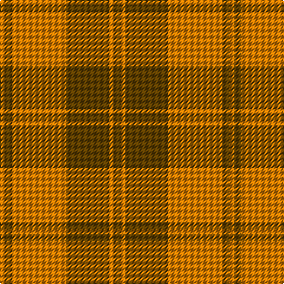

In pattern [GYGYYGY](/patterns/gygyygy/).

This was sourced from tartans-authority.  It is a [7 stripes tartan](/stripes/stripes7/).

Original link http://www.tartansauthority.com/tartan-ferret/display/826/

## Thread count
O/4 T6 O4 Oa42 T36 Oa4 T/6

## Palette
Each colour and its ΔE from the base-6 reference it is a variant of.

| Colour | Shade | Base | ΔE (OKLab) |
|---|---|---|---|
| O | <code style="background-color:#D87C00;">#D87C00</code> `#D87C00` | Y <code style="background-color:#F2BF00;">#F2BF00</code> | 0.17 |
| Oa | <code style="background-color:#D87C00;">#D87C00</code> `#D87C00` | Y <code style="background-color:#F2BF00;">#F2BF00</code> | 0.17 |
| T | <code style="background-color:#604000;">#604000</code> `#604000` | G <code style="background-color:#006100;">#006100</code> | 0.14 |

# Sample pattern

## Nearest tartans

The nearest existing variants by ΔTartan distance.

1. [MacDonald of Vallay (Uist) (?)](/setts/s11/g36r6g4r4b12r4g4r48g4r4g12-b506878-g006818-rc80000/) — ΔT 1.38
1. [Crossnor School](/setts/s7/g8r4g26w4r26g4r8-g285800-rb03000-we8ccb8/) — ΔT 1.43
1. [Burnett](/setts/s8/g8r58ga6r8ga28y6ga28r8-g789484-ga006818-rc80000-yd8b000/) — ΔT 1.46
1. [Lennox](/setts/s7/g8y4g40r8ra40r4ra8-g006818-r880000-rac80000-yb8b8b8/) — ΔT 1.47
1. [Scottish Piping Soc. of London (Corp](/setts/s7/r60g6b10g42r6g42b4-b202060-g5c6428-rc8002c/) — ΔT 1.47
1. [Miyuki #4](/setts/s8/r6y16r6y40g40y6g16y6-g604000-rc80000-ya08858/) — ΔT 1.50
1. [Burnett of Powis (Personal)](/setts/s8/b6r42g6r6g38y6g38r6-b2888c4-g5c6428-rc80000-ye8c000/) — ΔT 1.54
1. [Valdres, Kvam & Vang (Artefact)](/setts/s9/r20ra8r4g64ra8r44ra4r4ra8-g006c3c-rc80000-radc0058/) — ΔT 1.54
1. [Spice Apple](/setts/s7/g16y4r88g48y16g16r16-g006818-rc80000-yd09800/) — ΔT 1.56
1. [Loch Rannoch #2](/setts/s8/g48ga4g10r28ga4r10y34g4-g604000-ga289c18-re86000-ydc943c/) — ΔT 1.57

## Neighbour map

Every grey dot is one of 15726 variants placed by the first two principal components of the ΔTartan feature space (44% of its variance). Red is this tartan; blue dots are its nearest — click one to open its page.

<svg viewBox="0 0 640 380" role="img" style="max-width:100%;height:auto;border:1px solid #e0e0e0;border-radius:4px;display:block" xmlns="http://www.w3.org/2000/svg"><image href="/nn/cloud.v1.png" width="640" height="380"/><a href="/setts/s11/g36r6g4r4b12r4g4r48g4r4g12-b506878-g006818-rc80000/"><circle cx="348.4" cy="178.1" r="4" fill="#3465a4"><title>MacDonald of Vallay (Uist) (?)</title></circle></a><a href="/setts/s7/g8r4g26w4r26g4r8-g285800-rb03000-we8ccb8/"><circle cx="327.5" cy="248.1" r="4" fill="#3465a4"><title>Crossnor School</title></circle></a><a href="/setts/s8/g8r58ga6r8ga28y6ga28r8-g789484-ga006818-rc80000-yd8b000/"><circle cx="308.4" cy="193.1" r="4" fill="#3465a4"><title>Burnett</title></circle></a><a href="/setts/s7/g8y4g40r8ra40r4ra8-g006818-r880000-rac80000-yb8b8b8/"><circle cx="284.2" cy="196.5" r="4" fill="#3465a4"><title>Lennox</title></circle></a><a href="/setts/s7/r60g6b10g42r6g42b4-b202060-g5c6428-rc8002c/"><circle cx="390.3" cy="215.8" r="4" fill="#3465a4"><title>Scottish Piping Soc. of London (Corp</title></circle></a><a href="/setts/s8/r6y16r6y40g40y6g16y6-g604000-rc80000-ya08858/"><circle cx="351.1" cy="251.4" r="4" fill="#3465a4"><title>Miyuki #4</title></circle></a><a href="/setts/s8/b6r42g6r6g38y6g38r6-b2888c4-g5c6428-rc80000-ye8c000/"><circle cx="352.4" cy="222.4" r="4" fill="#3465a4"><title>Burnett of Powis (Personal)</title></circle></a><a href="/setts/s9/r20ra8r4g64ra8r44ra4r4ra8-g006c3c-rc80000-radc0058/"><circle cx="337.2" cy="174.0" r="4" fill="#3465a4"><title>Valdres, Kvam &amp; Vang (Artefact)</title></circle></a><a href="/setts/s7/g16y4r88g48y16g16r16-g006818-rc80000-yd09800/"><circle cx="368.8" cy="183.5" r="4" fill="#3465a4"><title>Spice Apple</title></circle></a><a href="/setts/s8/g48ga4g10r28ga4r10y34g4-g604000-ga289c18-re86000-ydc943c/"><circle cx="268.1" cy="186.4" r="4" fill="#3465a4"><title>Loch Rannoch #2</title></circle></a><circle cx="364.1" cy="210.0" r="5" fill="#c00000"/></svg>

ID: /setts/s7/g6y4g36y42y4g6y4-g604000-yd87c00/
