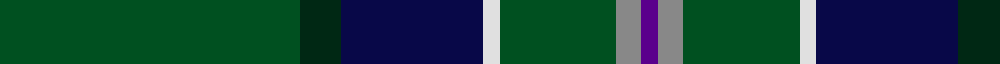
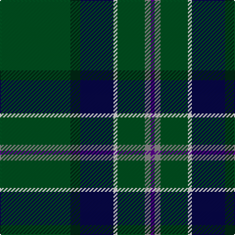

In pattern [BRGWBBG](/patterns/brgwbbg/).

This was sourced from register-of-tartans.  It is a [7 stripes tartan](/stripes/stripes7/).

Original link https://www.tartanregister.gov.uk/tartanDetails.aspx?ref=3033

## Thread count
G/72 DG10 DB34 LN4 G28 N6 P/4

## Palette
Each colour and its ΔE from the base-6 reference it is a variant of.

| Colour | Shade | Base | ΔE (OKLab) |
|---|---|---|---|
| DB | <code style="background-color:#080848;">#080848</code> `#080848` | B <code style="background-color:#2C4084;">#2C4084</code> | 0.19 |
| DG | <code style="background-color:#002814;">#002814</code> `#002814` | B <code style="background-color:#2C4084;">#2C4084</code> | 0.21 |
| G | <code style="background-color:#005020;">#005020</code> `#005020` | G <code style="background-color:#006400;">#006400</code> | 0.08 |
| LN | <code style="background-color:#E0E0E0;">#E0E0E0</code> `#E0E0E0` | W <code style="background-color:#F4F4F0;">#F4F4F0</code> | 0.06 |
| N | <code style="background-color:#888888;">#888888</code> `#888888` | R <code style="background-color:#C80000;">#C80000</code> | 0.24 |
| P | <code style="background-color:#5A008C;">#5A008C</code> `#5A008C` | B <code style="background-color:#2C4084;">#2C4084</code> | 0.12 |

# Sample pattern

## Nearest tartans

The nearest existing variants by ΔTartan distance.

1. [Green Swamp Youth Campers](/setts/s6/k16r4k26y4g96b12-b2474e8-g004028-k101010-rc82828-ye0a126/) — ΔT 1.24
1. [U.S. Army (Military)](/setts/s6/b12k34g8ga102y6gb8-b2c2c80-g8c7038-ga006818-gb408060-k101010-ye8c000/) — ΔT 1.34
1. [State Seal of Maine (Fashion)](/setts/s10/g98k16y40ya6g46r12k10b6g20y20-b2888c4-g003820-k101010-rc80000-ya08858-yabc8c00/) — ΔT 1.39
1. [Lambert (Front Royal) Kai](/setts/s8/k6g68b20g10r4k16ra4w6-b5f749c-g23321b-k1c1714-rb62531-raa58065-we0e0e0/) — ΔT 1.40
1. [Henderson/MacKendrick](/setts/s9/w4b24g16b4g64k4g16k24y4-b2c2c80-g006818-k101010-we0e0e0-ye8c000/) — ΔT 1.48
1. [MacKendrick](/setts/s9/w2b12g8b2g32k2g8k12y2-b2c2c80-g006818-k101010-we0e0e0-ye8c000/) — ΔT 1.48
1. [U.S. Army](/setts/s10/k34g8ga102y6gb8y6ga102g8k34b12-b2c2c80-g8c7038-ga006818-gb408060-k101010-ye8c000/) — ΔT 1.50
1. [Sevlon Bruce Personal Tartan Tartan Number: 7566. Earliest known date: 2008 The tartan has been designed to celebrate the wedding of Nathalie Selvon and Alex Bruce, to mark the beginning of a new family. The colours blend the histories of our two families. The red and green are from the Ancient Bruce and the yellow and blue are consistent with the flag of Mauritius, the country where the Selvon family trace their roots. See products available Copyright © Blair Urquhart, Comrie, 2015](/setts/s7/k12g8k12g72r8b8y4-b1c1c50-g006818-k101010-r880000-ybc8c00/) — ΔT 1.50
1. [New York Caledonian Club Day](/setts/s11/g18y2g4r6g56k32b2g16b2ba16r2-b5c8ca8-ba202060-g006818-k101010-rc80000-yd87c00/) — ΔT 1.53
1. [Henderson](/setts/s9/y2k12g8k2g32b2g8b12ya2-b000052-g11450d-k000000-yaaaa00-yaaaaaaa/) — ΔT 1.57

## Neighbour map

Every grey dot is one of 15726 variants placed by the first two principal components of the ΔTartan feature space (44% of its variance). Red is this tartan; blue dots are its nearest — click one to open its page.

<svg viewBox="0 0 640 380" role="img" style="max-width:100%;height:auto;border:1px solid #e0e0e0;border-radius:4px;display:block" xmlns="http://www.w3.org/2000/svg"><image href="/nn/cloud.v1.png" width="640" height="380"/><a href="/setts/s6/k16r4k26y4g96b12-b2474e8-g004028-k101010-rc82828-ye0a126/"><circle cx="404.2" cy="169.0" r="4" fill="#3465a4"><title>Green Swamp Youth Campers</title></circle></a><a href="/setts/s6/b12k34g8ga102y6gb8-b2c2c80-g8c7038-ga006818-gb408060-k101010-ye8c000/"><circle cx="335.6" cy="154.8" r="4" fill="#3465a4"><title>U.S. Army (Military)</title></circle></a><a href="/setts/s10/g98k16y40ya6g46r12k10b6g20y20-b2888c4-g003820-k101010-rc80000-ya08858-yabc8c00/"><circle cx="309.8" cy="143.5" r="4" fill="#3465a4"><title>State Seal of Maine (Fashion)</title></circle></a><a href="/setts/s8/k6g68b20g10r4k16ra4w6-b5f749c-g23321b-k1c1714-rb62531-raa58065-we0e0e0/"><circle cx="322.5" cy="139.5" r="4" fill="#3465a4"><title>Lambert (Front Royal) Kai</title></circle></a><a href="/setts/s9/w4b24g16b4g64k4g16k24y4-b2c2c80-g006818-k101010-we0e0e0-ye8c000/"><circle cx="323.2" cy="162.1" r="4" fill="#3465a4"><title>Henderson/MacKendrick</title></circle></a><a href="/setts/s9/w2b12g8b2g32k2g8k12y2-b2c2c80-g006818-k101010-we0e0e0-ye8c000/"><circle cx="323.2" cy="162.1" r="4" fill="#3465a4"><title>MacKendrick</title></circle></a><a href="/setts/s10/k34g8ga102y6gb8y6ga102g8k34b12-b2c2c80-g8c7038-ga006818-gb408060-k101010-ye8c000/"><circle cx="350.2" cy="139.1" r="4" fill="#3465a4"><title>U.S. Army</title></circle></a><a href="/setts/s7/k12g8k12g72r8b8y4-b1c1c50-g006818-k101010-r880000-ybc8c00/"><circle cx="399.6" cy="164.3" r="4" fill="#3465a4"><title>Sevlon Bruce Personal Tartan Tartan Number: 7566. Earliest known date: 2008 The tartan has been designed to celebrate the wedding of Nathalie Selvon and Alex Bruce, to mark the beginning of a new family. The colours blend the histories of our two families. The red and green are from the Ancient Bruce and the yellow and blue are consistent with the flag of Mauritius, the country where the Selvon family trace their roots. See products available Copyright © Blair Urquhart, Comrie, 2015</title></circle></a><a href="/setts/s11/g18y2g4r6g56k32b2g16b2ba16r2-b5c8ca8-ba202060-g006818-k101010-rc80000-yd87c00/"><circle cx="343.0" cy="116.1" r="4" fill="#3465a4"><title>New York Caledonian Club Day</title></circle></a><a href="/setts/s9/y2k12g8k2g32b2g8b12ya2-b000052-g11450d-k000000-yaaaa00-yaaaaaaa/"><circle cx="326.4" cy="166.5" r="4" fill="#3465a4"><title>Henderson</title></circle></a><circle cx="362.9" cy="167.4" r="5" fill="#c00000"/></svg>

ID: /setts/s7/g72b10ba34w4g28r6bb4-b002814-ba080848-bb5a008c-g005020-r888888-we0e0e0/
