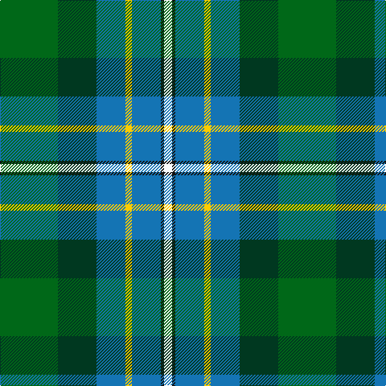

In pattern [GGBYBKW](/patterns/ggbybkw/).

This was sourced from tartans-authority.  It is a [7 stripes tartan](/stripes/stripes7/).

Original link http://www.tartansauthority.com/tartan-ferret/display/2599/

## Thread count
G/72 DG48 B36 Y8 B36 K4 W/10

## Palette
Each colour and its ΔE from the base-6 reference it is a variant of.

| Colour | Shade | Base | ΔE (OKLab) |
|---|---|---|---|
| B | <code style="background-color:#1474B4;">#1474B4</code> `#1474B4` | B <code style="background-color:#2C4084;">#2C4084</code> | 0.15 |
| DG | <code style="background-color:#003820;">#003820</code> `#003820` | G <code style="background-color:#006400;">#006400</code> | 0.16 |
| G | <code style="background-color:#006818;">#006818</code> `#006818` | G <code style="background-color:#006400;">#006400</code> | 0.02 |
| K | <code style="background-color:#101010;">#101010</code> `#101010` | K <code style="background-color:#000000;">#000000</code> | 0.17 |
| W | <code style="background-color:#FCFCFC;">#FCFCFC</code> `#FCFCFC` | W <code style="background-color:#F4F4F0;">#F4F4F0</code> | 0.03 |
| Y | <code style="background-color:#FCCC00;">#FCCC00</code> `#FCCC00` | Y <code style="background-color:#E8C000;">#E8C000</code> | 0.04 |

# Sample pattern

## Nearest tartans

The nearest existing variants by ΔTartan distance.

1. [Hughes](/setts/s7/g80ga56b36y8b36k4w8-b304080-g008000-ga003000-k000000-we0e0e0-yf0c000/) — ΔT 0.72
1. [Porteous](/setts/s6/k2y2b16g20ba14w2-b304080-ba5480b0-g008000-k000000-we0e0e0-yf0c000/) — ΔT 1.06
1. [Macneil of Barra - Chief (Personal)](/setts/s7/w2r4b32k28g30k6y2-b1474b4-g006818-k101010-rc80000-wfcfcfc-ye8c000/) — ΔT 1.16
1. [Hogg Dress (Name)](/setts/s9/b34r3b8ba4b8k24g34k2w6-b4880a0-ba1c1c50-g006818-k101010-rc80000-we0e0e0/) — ΔT 1.16
1. [Iroquois Falls Centenary (Commem.)](/setts/s8/g36ga12gb6w2gb6w2b12ba12-b2888c4-ba202060-g006818-ga289c18-gb604000-we0e0e0/) — ΔT 1.24
1. [Hogg Dress](/setts/s9/b34r3b8ba4b8k24g34k2w6-b2888c4-ba003c64-g006818-k101010-rc80000-wffffff/) — ΔT 1.32
1. [Hughes](/setts/s7/g80b56ba36y8ba36k4w8-b002814-ba2c4084-g005020-k101010-we0e0e0-ye8c000/) — ΔT 1.32
1. [Bruntsfield Links Golfing Soc. (Corp](/setts/s11/r6g22ga8g4ga12g2ga18b8ba12b35y4-b1c1c50-ba2888c4-g289c18-ga003820-rc80000-yc4bc68/) — ΔT 1.33
1. [MacWilliam (Clan)](/setts/s6/g8ga48k40r4b64r8-b1474b4-g604000-ga006818-k101010-rc80000/) — ΔT 1.34
1. [Birch Family Tartan Tartan Number: 2157. Earliest known date: 1993 The Birch family tartan was designed and produced by Mr Robin Birch of Connell Reid kiltmaker, Blairgowrie. The new sett has been recorded by the Scottish Tartans Society. See products available Copyright © Blair Urquhart, Comrie, 2015](/setts/s9/g6b8g46k20r4k20ba36k2w6-b780078-ba5c8ca8-g006818-k101010-rc8002c-we0e0e0/) — ΔT 1.34

## Neighbour map

Every grey dot is one of 15726 variants placed by the first two principal components of the ΔTartan feature space (44% of its variance). Red is this tartan; blue dots are its nearest — click one to open its page.

<svg viewBox="0 0 640 380" role="img" style="max-width:100%;height:auto;border:1px solid #e0e0e0;border-radius:4px;display:block" xmlns="http://www.w3.org/2000/svg"><image href="/nn/cloud.v1.png" width="640" height="380"/><a href="/setts/s7/g80ga56b36y8b36k4w8-b304080-g008000-ga003000-k000000-we0e0e0-yf0c000/"><circle cx="161.6" cy="156.4" r="4" fill="#3465a4"><title>Hughes</title></circle></a><a href="/setts/s6/k2y2b16g20ba14w2-b304080-ba5480b0-g008000-k000000-we0e0e0-yf0c000/"><circle cx="137.7" cy="183.5" r="4" fill="#3465a4"><title>Porteous</title></circle></a><a href="/setts/s7/w2r4b32k28g30k6y2-b1474b4-g006818-k101010-rc80000-wfcfcfc-ye8c000/"><circle cx="146.7" cy="152.8" r="4" fill="#3465a4"><title>Macneil of Barra - Chief (Personal)</title></circle></a><a href="/setts/s9/b34r3b8ba4b8k24g34k2w6-b4880a0-ba1c1c50-g006818-k101010-rc80000-we0e0e0/"><circle cx="176.1" cy="138.4" r="4" fill="#3465a4"><title>Hogg Dress (Name)</title></circle></a><a href="/setts/s8/g36ga12gb6w2gb6w2b12ba12-b2888c4-ba202060-g006818-ga289c18-gb604000-we0e0e0/"><circle cx="183.7" cy="149.2" r="4" fill="#3465a4"><title>Iroquois Falls Centenary (Commem.)</title></circle></a><a href="/setts/s9/b34r3b8ba4b8k24g34k2w6-b2888c4-ba003c64-g006818-k101010-rc80000-wffffff/"><circle cx="162.4" cy="133.8" r="4" fill="#3465a4"><title>Hogg Dress</title></circle></a><a href="/setts/s7/g80b56ba36y8ba36k4w8-b002814-ba2c4084-g005020-k101010-we0e0e0-ye8c000/"><circle cx="190.3" cy="170.3" r="4" fill="#3465a4"><title>Hughes</title></circle></a><a href="/setts/s11/r6g22ga8g4ga12g2ga18b8ba12b35y4-b1c1c50-ba2888c4-g289c18-ga003820-rc80000-yc4bc68/"><circle cx="125.5" cy="141.7" r="4" fill="#3465a4"><title>Bruntsfield Links Golfing Soc. (Corp</title></circle></a><a href="/setts/s6/g8ga48k40r4b64r8-b1474b4-g604000-ga006818-k101010-rc80000/"><circle cx="188.9" cy="187.6" r="4" fill="#3465a4"><title>MacWilliam (Clan)</title></circle></a><a href="/setts/s9/g6b8g46k20r4k20ba36k2w6-b780078-ba5c8ca8-g006818-k101010-rc8002c-we0e0e0/"><circle cx="155.2" cy="125.7" r="4" fill="#3465a4"><title>Birch Family Tartan Tartan Number: 2157. Earliest known date: 1993 The Birch family tartan was designed and produced by Mr Robin Birch of Connell Reid kiltmaker, Blairgowrie. The new sett has been recorded by the Scottish Tartans Society. See products available Copyright © Blair Urquhart, Comrie, 2015</title></circle></a><circle cx="147.6" cy="165.5" r="5" fill="#c00000"/></svg>

ID: /setts/s7/g72ga48b36y8b36k4w10-b1474b4-g006818-ga003820-k101010-wfcfcfc-yfccc00/
