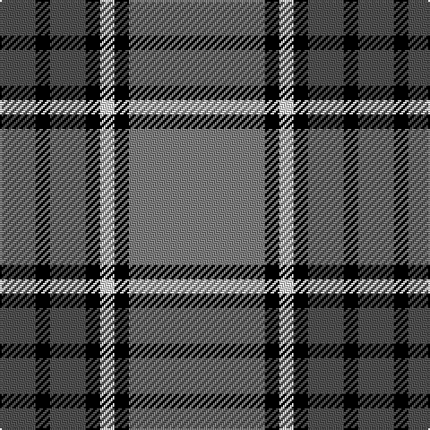

In pattern [BKBKWKG](/patterns/bkbkwkg/).

This was sourced from weddslist.  It is a [7 stripes tartan](/stripes/stripes7/).

Original link http://www.weddslist.com/cgi-bin/tartans/pg.pl?source=sts

## Thread count
N/20 K8 N20 K8 LN8 K8 Na/76

## Palette
Each colour and its ΔE from the base-6 reference it is a variant of.

| Colour | Shade | Base | ΔE (OKLab) |
|---|---|---|---|
| K | <code style="background-color:#000000;">#000000</code> `#000000` | K <code style="background-color:#000000;">#000000</code> | 0.00 |
| LN | <code style="background-color:#E0E0E0;">#E0E0E0</code> `#E0E0E0` | W <code style="background-color:#F4F4F0;">#F4F4F0</code> | 0.06 |
| N | <code style="background-color:#505050;">#505050</code> `#505050` | B <code style="background-color:#2C4084;">#2C4084</code> | 0.12 |
| Na | <code style="background-color:#808080;">#808080</code> `#808080` | G <code style="background-color:#006400;">#006400</code> | 0.22 |

# Sample pattern

## Nearest tartans

The nearest existing variants by ΔTartan distance.

1. [Kyle Tartan Tartan Number: 1288. Earliest known date: pre 1984 Seen in Service Station at Gretna Green in 1984 by Angela Nisbett MSTS . Berars no relation to the other two Kyles (3615 & 3616). See products available Copyright © Blair Urquhart, Comrie, 2015](/setts/s7/r38k4w8k4b10k4b10-b5c5c5c-k101010-r888888-we0e0e0/) — ΔT 1.00
1. [New York State Troopers (Corporate)](/setts/s7/r12b8r4w4r48k50y8-b780078-k101010-r888888-we0e0e0-ybc8c00/) — ΔT 1.06
1. [Downside (Corporate)](/setts/s6/r8ra82k10w28k36r8-k101010-rc80000-ra888888-we0e0e0/) — ΔT 1.07
1. [Kyle](/setts/s7/g76k8w8k8b20k8b20-b505050-g808080-k101010-we0e0e0/) — ΔT 1.07
1. [Laing of Archiestown Clan/Family Tartan Tartan Number: 2544. Earliest known date: 1783 Said to have been woven in 1783 in Knockando Morayshire, by William Donald Laing of Queensland, Australia who donated a sample to the Tartans Society in 1996. The dark line in the centre of the red band is either blue or black. Apparently William Laing acquired the piece of tartan in 1961 from a Mr Jack Garden whose g.g. grandfather was John Laing (dob 1767) who wove the tartan. In the 1810 census he lived in his shop in the Square at Archiestown. See products available Copyright © Blair Urquhart, Comrie, 2015](/setts/s8/k8r8ka8r8b64r8ka8r8-b1474b4-k101010-ka000000-rc80000/) — ΔT 1.07
1. [Tiree Grey](/setts/s6/w12k12w12k12r60ra4-k101010-r888888-ra880000-wc0c0c0/) — ΔT 1.11
1. [Eglinton District Tartan Tartan Number: 2075. Earliest known date: pre 1847 The Eglinton tartan is the Montgomerie with a narrower ground. D W Stewart in his book, Old and Rare, was of the opinion that the Montgomerie tartan was adopted by the Montgomeries of Ayrshire in 1707. He stated that in 1893 there were historic relics at Eglinton Castle which furnished evidence of the early use of the tartan. See products available Copyright © Blair Urquhart, Comrie, 2015](/setts/s7/k6g6k6b32k6r6k6-b5c8ca8-g006818-k101010-rc80000/) — ΔT 1.13
1. [Australian Police](/setts/s8/k10w10k10b22k6g34k60b6-b2888c4-g808080-k101010-we0e0e0/) — ΔT 1.14
1. [Thayer USA](/setts/s6/r10b50w10b6g50b6-b202060-g255210-ra51805-wffffff/) — ΔT 1.14
1. [St Andrews University Corporate Tartan Tartan Number: 2398. Earliest known date: pre 1998 Originally named St. Andrews International. Apparently a Gordon Paton MD, bought the company from North East Fife Enterprise Trust in 1997, the aim being to brand quality Scottish products for export worldwide. The company intended to set up a membership scheme but the company went into liquidation. The intended venue belonged to St Andrews University and it appears that the ownership of the tartan has fallen to the University and its name has been changed from 'International' to 'University' (Deirdre Kinloch Anderson, Aug 2004).No thread count given so this entry is based on an estimate from a small computer graphic. Has since been corrected to conform to the SRT (Scottish Register of Tartans) See products available Copyright © Blair Urquhart, Comrie, 2015](/setts/s10/b6g4k6g6b36y10k4y6b4k6-b202060-g006818-k101010-ye8c000/) — ΔT 1.16

## Neighbour map

Every grey dot is one of 15726 variants placed by the first two principal components of the ΔTartan feature space (44% of its variance). Red is this tartan; blue dots are its nearest — click one to open its page.

<svg viewBox="0 0 640 380" role="img" style="max-width:100%;height:auto;border:1px solid #e0e0e0;border-radius:4px;display:block" xmlns="http://www.w3.org/2000/svg"><image href="/nn/cloud.v1.png" width="640" height="380"/><a href="/setts/s7/r38k4w8k4b10k4b10-b5c5c5c-k101010-r888888-we0e0e0/"><circle cx="253.3" cy="187.0" r="4" fill="#3465a4"><title>Kyle Tartan Tartan Number: 1288. Earliest known date: pre 1984 Seen in Service Station at Gretna Green in 1984 by Angela Nisbett MSTS . Berars no relation to the other two Kyles (3615 &amp; 3616). See products available Copyright © Blair Urquhart, Comrie, 2015</title></circle></a><a href="/setts/s7/r12b8r4w4r48k50y8-b780078-k101010-r888888-we0e0e0-ybc8c00/"><circle cx="239.5" cy="158.3" r="4" fill="#3465a4"><title>New York State Troopers (Corporate)</title></circle></a><a href="/setts/s6/r8ra82k10w28k36r8-k101010-rc80000-ra888888-we0e0e0/"><circle cx="222.6" cy="183.1" r="4" fill="#3465a4"><title>Downside (Corporate)</title></circle></a><a href="/setts/s7/g76k8w8k8b20k8b20-b505050-g808080-k101010-we0e0e0/"><circle cx="290.4" cy="190.2" r="4" fill="#3465a4"><title>Kyle</title></circle></a><a href="/setts/s8/k8r8ka8r8b64r8ka8r8-b1474b4-k101010-ka000000-rc80000/"><circle cx="270.3" cy="168.6" r="4" fill="#3465a4"><title>Laing of Archiestown Clan/Family Tartan Tartan Number: 2544. Earliest known date: 1783 Said to have been woven in 1783 in Knockando Morayshire, by William Donald Laing of Queensland, Australia who donated a sample to the Tartans Society in 1996. The dark line in the centre of the red band is either blue or black. Apparently William Laing acquired the piece of tartan in 1961 from a Mr Jack Garden whose g.g. grandfather was John Laing (dob 1767) who wove the tartan. In the 1810 census he lived in his shop in the Square at Archiestown. See products available Copyright © Blair Urquhart, Comrie, 2015</title></circle></a><a href="/setts/s6/w12k12w12k12r60ra4-k101010-r888888-ra880000-wc0c0c0/"><circle cx="289.6" cy="171.0" r="4" fill="#3465a4"><title>Tiree Grey</title></circle></a><a href="/setts/s7/k6g6k6b32k6r6k6-b5c8ca8-g006818-k101010-rc80000/"><circle cx="218.1" cy="213.9" r="4" fill="#3465a4"><title>Eglinton District Tartan Tartan Number: 2075. Earliest known date: pre 1847 The Eglinton tartan is the Montgomerie with a narrower ground. D W Stewart in his book, Old and Rare, was of the opinion that the Montgomerie tartan was adopted by the Montgomeries of Ayrshire in 1707. He stated that in 1893 there were historic relics at Eglinton Castle which furnished evidence of the early use of the tartan. See products available Copyright © Blair Urquhart, Comrie, 2015</title></circle></a><a href="/setts/s8/k10w10k10b22k6g34k60b6-b2888c4-g808080-k101010-we0e0e0/"><circle cx="255.2" cy="188.4" r="4" fill="#3465a4"><title>Australian Police</title></circle></a><a href="/setts/s6/r10b50w10b6g50b6-b202060-g255210-ra51805-wffffff/"><circle cx="247.6" cy="213.9" r="4" fill="#3465a4"><title>Thayer USA</title></circle></a><a href="/setts/s10/b6g4k6g6b36y10k4y6b4k6-b202060-g006818-k101010-ye8c000/"><circle cx="243.2" cy="171.7" r="4" fill="#3465a4"><title>St Andrews University Corporate Tartan Tartan Number: 2398. Earliest known date: pre 1998 Originally named St. Andrews International. Apparently a Gordon Paton MD, bought the company from North East Fife Enterprise Trust in 1997, the aim being to brand quality Scottish products for export worldwide. The company intended to set up a membership scheme but the company went into liquidation. The intended venue belonged to St Andrews University and it appears that the ownership of the tartan has fallen to the University and its name has been changed from 'International' to 'University' (Deirdre Kinloch Anderson, Aug 2004).No thread count given so this entry is based on an estimate from a small computer graphic. Has since been corrected to conform to the SRT (Scottish Register of Tartans) See products available Copyright © Blair Urquhart, Comrie, 2015</title></circle></a><circle cx="261.1" cy="178.4" r="5" fill="#c00000"/></svg>

ID: /setts/s7/g76k8w8k8b20k8b20-b505050-g808080-k000000-we0e0e0/
