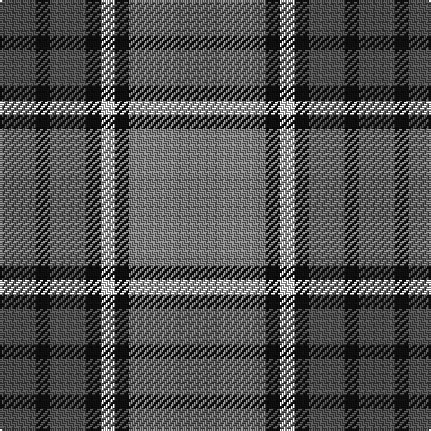

In pattern [BKBKWKG](/patterns/bkbkwkg/).

This was sourced from register-of-tartans.  It is a [7 stripes tartan](/stripes/stripes7/).

Original link https://www.tartanregister.gov.uk/tartanDetails.aspx?ref=2018

## Thread count
N/20 K8 N20 K8 LN8 K8 Na/76

## Palette
Each colour and its ΔE from the base-6 reference it is a variant of.

| Colour | Shade | Base | ΔE (OKLab) |
|---|---|---|---|
| K | <code style="background-color:#101010;">#101010</code> `#101010` | K <code style="background-color:#000000;">#000000</code> | 0.17 |
| LN | <code style="background-color:#E0E0E0;">#E0E0E0</code> `#E0E0E0` | W <code style="background-color:#F4F4F0;">#F4F4F0</code> | 0.06 |
| N | <code style="background-color:#505050;">#505050</code> `#505050` | B <code style="background-color:#2C4084;">#2C4084</code> | 0.12 |
| Na | <code style="background-color:#808080;">#808080</code> `#808080` | G <code style="background-color:#006400;">#006400</code> | 0.22 |

# Sample pattern

## Nearest tartans

The nearest existing variants by ΔTartan distance.

1. [Kyle Tartan Tartan Number: 1288. Earliest known date: pre 1984 Seen in Service Station at Gretna Green in 1984 by Angela Nisbett MSTS . Berars no relation to the other two Kyles (3615 & 3616). See products available Copyright © Blair Urquhart, Comrie, 2015](/setts/s7/r38k4w8k4b10k4b10-b5c5c5c-k101010-r888888-we0e0e0/) — ΔT 0.66
1. [Speyside Blue (Fashion)](/setts/s8/b64k6b6k6ba10k16r42k8-b5c5c5c-ba1474b4-k101010-r888888/) — ΔT 1.05
1. [Kyle](/setts/s7/g76k8w8k8b20k8b20-b505050-g808080-k000000-we0e0e0/) — ΔT 1.07
1. [Speyside Grey (Fashion)](/setts/s8/b64k6b6k6r10k16ra42k8-b5c5c5c-k101010-r98481c-ra888888/) — ΔT 1.08
1. [Beck-McSorley](/setts/s8/r6g6r6g42ra42r6ra6rb6-g003820-r9c68a4-ra888888-rbe87878/) — ΔT 1.08
1. [Cape Breton University Chemistry Society](/setts/s10/b8r34b8g8b4g8b8g54b8y8-b000080-g546c3a-r943602-yc49d38/) — ΔT 1.15
1. [Balfour #2](/setts/s6/b36y4g12y4g38r6-b2c2c80-g604000-rc80000-ye8c000/) — ΔT 1.17
1. [Balfour (Clan)](/setts/s6/b72y8g24y8g76r12-b2c2c80-g604000-rc80000-ye8c000/) — ΔT 1.17
1. [Auld Lang Syne (Philip King Tailoring)](/setts/s8/k6b6k6b42g42k6g6w6-b5c8ca8-g8c7038-k101010-w98c8e8/) — ΔT 1.17
1. [Donnolly](/setts/s6/b6g42b6r42b70w6-b2c2c80-g00643c-rc04c08-wfcfcfc/) — ΔT 1.21

## Neighbour map

Every grey dot is one of 15726 variants placed by the first two principal components of the ΔTartan feature space (44% of its variance). Red is this tartan; blue dots are its nearest — click one to open its page.

<svg viewBox="0 0 640 380" role="img" style="max-width:100%;height:auto;border:1px solid #e0e0e0;border-radius:4px;display:block" xmlns="http://www.w3.org/2000/svg"><image href="/nn/cloud.v1.png" width="640" height="380"/><a href="/setts/s7/r38k4w8k4b10k4b10-b5c5c5c-k101010-r888888-we0e0e0/"><circle cx="253.3" cy="187.0" r="4" fill="#3465a4"><title>Kyle Tartan Tartan Number: 1288. Earliest known date: pre 1984 Seen in Service Station at Gretna Green in 1984 by Angela Nisbett MSTS . Berars no relation to the other two Kyles (3615 &amp; 3616). See products available Copyright © Blair Urquhart, Comrie, 2015</title></circle></a><a href="/setts/s8/b64k6b6k6ba10k16r42k8-b5c5c5c-ba1474b4-k101010-r888888/"><circle cx="263.6" cy="193.3" r="4" fill="#3465a4"><title>Speyside Blue (Fashion)</title></circle></a><a href="/setts/s7/g76k8w8k8b20k8b20-b505050-g808080-k000000-we0e0e0/"><circle cx="261.1" cy="178.4" r="4" fill="#3465a4"><title>Kyle</title></circle></a><a href="/setts/s8/b64k6b6k6r10k16ra42k8-b5c5c5c-k101010-r98481c-ra888888/"><circle cx="267.0" cy="192.9" r="4" fill="#3465a4"><title>Speyside Grey (Fashion)</title></circle></a><a href="/setts/s8/r6g6r6g42ra42r6ra6rb6-g003820-r9c68a4-ra888888-rbe87878/"><circle cx="232.6" cy="200.5" r="4" fill="#3465a4"><title>Beck-McSorley</title></circle></a><a href="/setts/s10/b8r34b8g8b4g8b8g54b8y8-b000080-g546c3a-r943602-yc49d38/"><circle cx="277.4" cy="171.6" r="4" fill="#3465a4"><title>Cape Breton University Chemistry Society</title></circle></a><a href="/setts/s6/b36y4g12y4g38r6-b2c2c80-g604000-rc80000-ye8c000/"><circle cx="295.9" cy="216.1" r="4" fill="#3465a4"><title>Balfour #2</title></circle></a><a href="/setts/s6/b72y8g24y8g76r12-b2c2c80-g604000-rc80000-ye8c000/"><circle cx="295.9" cy="216.1" r="4" fill="#3465a4"><title>Balfour (Clan)</title></circle></a><a href="/setts/s8/k6b6k6b42g42k6g6w6-b5c8ca8-g8c7038-k101010-w98c8e8/"><circle cx="231.4" cy="199.7" r="4" fill="#3465a4"><title>Auld Lang Syne (Philip King Tailoring)</title></circle></a><a href="/setts/s6/b6g42b6r42b70w6-b2c2c80-g00643c-rc04c08-wfcfcfc/"><circle cx="262.5" cy="205.0" r="4" fill="#3465a4"><title>Donnolly</title></circle></a><circle cx="290.4" cy="190.2" r="5" fill="#c00000"/></svg>

ID: /setts/s7/g76k8w8k8b20k8b20-b505050-g808080-k101010-we0e0e0/
