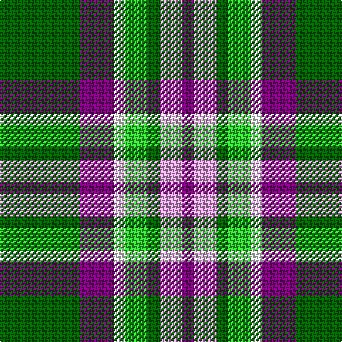

In pattern [BWGYWBG](/stripes/bwgywbg/).

This was sourced from register-of-tartans.  It is a [7 stripe tartan](/stripes/stripes7/).

Original link https://www.tartanregister.gov.uk/tartanDetails.aspx?ref=10002

## Also known as

This cloth is also recorded under:

- Lindley-Highfield of Ballumbie Castle

## Register references

External register numbers recorded for this tartan.

- Scottish Register of Tartans: [10002](https://www.tartanregister.gov.uk/tartanDetails.aspx?ref=10002)

## Thread count
G/56 P24 W8 Ga16 G8 LP16 P/8

## Palette
Each colour and the base-6 reference it is a variant of.

| Colour | Shade | Base |
|---|---|---|
| G | <code style="background-color:#006400;">#006400</code> `oklch(43.6% 0.148 142.5)` <small>#006400</small> | G <code style="background-color:#006100;">#006100</code> |
| Ga | <code style="background-color:#32CD32;">#32CD32</code> `oklch(74.2% 0.229 142.8)` <small>#32CD32</small> | Y <code style="background-color:#F2BF00;">#F2BF00</code> |
| LP | <code style="background-color:#DDA0DD;">#DDA0DD</code> `oklch(78.3% 0.108 326.5)` <small>#DDA0DD</small> | W <code style="background-color:#F7F7F7;">#F7F7F7</code> |
| P | <code style="background-color:#800080;">#800080</code> `oklch(42.1% 0.193 328.4)` <small>#800080</small> | B <code style="background-color:#2A418A;">#2A418A</code> |
| W | <code style="background-color:#FFFFFF;">#FFFFFF</code> `oklch(100.0% 0.000 89.9)` <small>#FFFFFF</small> | W <code style="background-color:#F7F7F7;">#F7F7F7</code> |

# Sample pattern

## Nearest tartans

The nearest existing variants by ΔTartan distance.

1. [Bannockbane Dark Green](/setts/s7/dg4g3dg24w15lo21g3lo4~x2/) — ΔT 0.83
1. [Lindley-Highfield Name Tartan Tartan Number: 10002. Earliest known date: 13 February 2009 'Lindley-Highfield of Ballumbie Castle' is a tartan of the family of the Lindley-Highfields of Ballumbie Castle, sometime Barons of Cartsburn. The colours of this particular tartan are taken from the armorial bearings of the Head of the Family of Lindley-Highfield of Ballumbie Castle. See products available Copyright © Blair Urquhart, Comrie, 2015](/setts/s7/g7p3w1lg2g1k2p1~x8/) — ΔT 0.89
1. [ChuMac (Personal)](/setts/s5/g15ly3r3dp8w2~x6/) — ΔT 1.01
1. [Bannockbane, Green](/setts/s7/dg8g6dg48w31o42g6o8/) — ΔT 1.01
1. [Vermont Dress](/setts/s8/g1w1g6db5w6r1g1lo1~x4/) — ΔT 1.04
1. [Bahamas](/setts/s8/db3g11w11r2g7db22ly2db2~x2/) — ΔT 1.11
1. [Mellor (Name)](/setts/s6/w8k16g32dt3lo5w5~x2/) — ΔT 1.13
1. [Unidentified #46](/setts/s9/w16dg2k5r2k10dg11ly2dg11k2~x2/) — ΔT 1.14
1. [MacTavish Dress](/setts/s6/r4t28k6lb12k12lo3~x2/) — ΔT 1.15
1. [Entre Rios Province (Provisional](/setts/s6/g36lb4g8k29r24w7~x2/) — ΔT 1.16

## Neighbour map

Every grey dot is one of 14299 variants placed by the first two principal components of the ΔTartan feature space (44% of its variance). Red is this tartan; blue dots are its nearest — click one to open its page.

<svg viewBox="0 0 640 380" role="img" style="max-width:100%;height:auto;border:1px solid #e0e0e0;border-radius:4px;display:block" xmlns="http://www.w3.org/2000/svg"><image href="/nn/cloud.v1.png" width="640" height="380"/><a href="/setts/s7/dg4g3dg24w15lo21g3lo4~x2/"><circle cx="144.8" cy="184.5" r="4" fill="#3465a4"><title>Bannockbane Dark Green</title></circle></a><a href="/setts/s7/g7p3w1lg2g1k2p1~x8/"><circle cx="163.1" cy="189.2" r="4" fill="#3465a4"><title>Lindley-Highfield Name Tartan Tartan Number: 10002. Earliest known date: 13 February 2009 'Lindley-Highfield of Ballumbie Castle' is a tartan of the family of the Lindley-Highfields of Ballumbie Castle, sometime Barons of Cartsburn. The colours of this particular tartan are taken from the armorial bearings of the Head of the Family of Lindley-Highfield of Ballumbie Castle. See products available Copyright © Blair Urquhart, Comrie, 2015</title></circle></a><a href="/setts/s5/g15ly3r3dp8w2~x6/"><circle cx="205.8" cy="210.4" r="4" fill="#3465a4"><title>ChuMac (Personal)</title></circle></a><a href="/setts/s7/dg8g6dg48w31o42g6o8/"><circle cx="143.0" cy="184.1" r="4" fill="#3465a4"><title>Bannockbane, Green</title></circle></a><a href="/setts/s8/g1w1g6db5w6r1g1lo1~x4/"><circle cx="111.0" cy="180.0" r="4" fill="#3465a4"><title>Vermont Dress</title></circle></a><a href="/setts/s8/db3g11w11r2g7db22ly2db2~x2/"><circle cx="192.2" cy="166.3" r="4" fill="#3465a4"><title>Bahamas</title></circle></a><a href="/setts/s6/w8k16g32dt3lo5w5~x2/"><circle cx="187.3" cy="178.6" r="4" fill="#3465a4"><title>Mellor (Name)</title></circle></a><a href="/setts/s9/w16dg2k5r2k10dg11ly2dg11k2~x2/"><circle cx="124.7" cy="176.2" r="4" fill="#3465a4"><title>Unidentified #46</title></circle></a><a href="/setts/s6/r4t28k6lb12k12lo3~x2/"><circle cx="168.3" cy="187.2" r="4" fill="#3465a4"><title>MacTavish Dress</title></circle></a><a href="/setts/s6/g36lb4g8k29r24w7~x2/"><circle cx="144.7" cy="193.6" r="4" fill="#3465a4"><title>Entre Rios Province (Provisional</title></circle></a><circle cx="170.4" cy="187.1" r="5" fill="#c00000"/></svg>

ID: /setts/s7/g7p3w1lg2g1lp2p1~x8/
