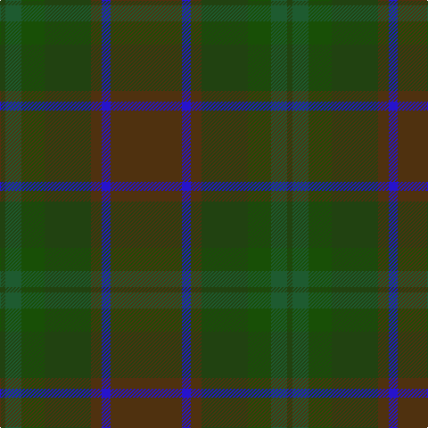

In pattern [GBGGGGG](/patterns/gbggggg/).

This was sourced from register-of-tartans.  It is a [7 stripes tartan](/stripes/stripes7/).

Original link https://www.tartanregister.gov.uk/tartanDetails.aspx?ref=10576

## Thread count
G/6 Ga18 Gb26 G52 T12 B10 T/80

## Palette
Each colour and its ΔE from the base-6 reference it is a variant of.

| Colour | Shade | Base | ΔE (OKLab) |
|---|---|---|---|
| B | <code style="background-color:#2613CD;">#2613CD</code> `#2613CD` | B <code style="background-color:#2C4084;">#2C4084</code> | 0.14 |
| G | <code style="background-color:#214211;">#214211</code> `#214211` | G <code style="background-color:#006400;">#006400</code> | 0.11 |
| Ga | <code style="background-color:#1E5B30;">#1E5B30</code> `#1E5B30` | G <code style="background-color:#006400;">#006400</code> | 0.06 |
| Gb | <code style="background-color:#184F06;">#184F06</code> `#184F06` | G <code style="background-color:#006400;">#006400</code> | 0.07 |
| T | <code style="background-color:#4F310F;">#4F310F</code> `#4F310F` | G <code style="background-color:#006400;">#006400</code> | 0.17 |

# Sample pattern

ID: /setts/s7/g80b10g12ga52gb26gc18ga6-b2613cd-g4f310f-ga214211-gb184f06-gc1e5b30/
