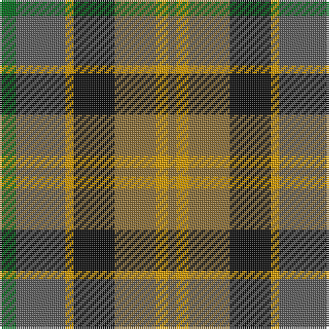

In pattern [GBYKGYG](/patterns/gbykgyg/).

This was sourced from register-of-tartans.  It is a [7 stripes tartan](/stripes/stripes7/).

Original link https://www.tartanregister.gov.uk/tartanDetails.aspx?ref=3571

## Attestations

This cloth appears in 2 source records; the oldest owns this page.

- 01/01/2002 — Rothesay (register-of-tartans, [record](https://www.tartanregister.gov.uk/tartanDetails.aspx?ref=3571))
- pre 2002 — Rothesay (Fashion) (tartans-authority, [record](http://www.tartansauthority.com/tartan-ferret/display/834/))

## Thread count
G/8 N24 DY4 K20 LT20 DY6 LT/4

## Palette
Each colour and its ΔE from the base-6 reference it is a variant of.

| Colour | Shade | Base | ΔE (OKLab) |
|---|---|---|---|
| DY | <code style="background-color:#D09800;">#D09800</code> `#D09800` | Y <code style="background-color:#E8C000;">#E8C000</code> | 0.11 |
| G | <code style="background-color:#006818;">#006818</code> `#006818` | G <code style="background-color:#006400;">#006400</code> | 0.02 |
| K | <code style="background-color:#101010;">#101010</code> `#101010` | K <code style="background-color:#000000;">#000000</code> | 0.17 |
| LT | <code style="background-color:#8C7038;">#8C7038</code> `#8C7038` | G <code style="background-color:#006400;">#006400</code> | 0.18 |
| N | <code style="background-color:#5C5C5C;">#5C5C5C</code> `#5C5C5C` | B <code style="background-color:#2C4084;">#2C4084</code> | 0.14 |

# Sample pattern

## Nearest tartans

The nearest existing variants by ΔTartan distance.

1. [Casely (Name)](/setts/s6/r16g44k44g8b44y12-b506878-g30644c-k101010-re87878-ye0b000/) — ΔT 1.00
1. [McEachem (Name)](/setts/s6/b28w4r24ba40g40w4-b5c5c5c-ba003c64-g006818-rc80000-we0e0e0/) — ΔT 1.05
1. [Christmas Hill Game Farm](/setts/s7/g10y40r6ga26g26b6w6-b500050-g4c3400-ga004828-ra00000-w00ccd0-ya08858/) — ΔT 1.09
1. [Roscommon, County](/setts/s10/r10y6r38b12y10b12g24ba10g24ba6-b441800-ba303070-g003820-rb03000-yd8b000/) — ΔT 1.23
1. [Falardeau-Murphy (Canada) (Personal)](/setts/s7/g42b42y6r42ba6bb10ba6-b5c8ca8-ba5c5c5c-bb780078-g006818-ra00000-yfccc00/) — ΔT 1.24
1. [Casely](/setts/s6/r16g44k44g8b44ga12-b506878-g30644c-ga446428-k101010-rc80000/) — ΔT 1.25
1. [Sikh](/setts/s8/r56k12r7k12r7g50b50y10-b2c2c80-g006818-k101010-rb84c00-ye8c000/) — ΔT 1.26
1. [Loch Fyne](/setts/s6/b4ba20y20g20ga12r4-b5c8ca8-ba14283c-g289c18-ga604000-rc80000-ya08858/) — ΔT 1.28
1. [Glen Chalmadale](/setts/s9/g26w4g20k10r26k6r10b30ra10-b003c64-g006818-k101010-rc80000-ra843c50-we0e0e0/) — ΔT 1.29
1. [Corcoran of Sherbrooke (Personal)](/setts/s9/k4y4g20b4g8ga20y4gb12y4-b780078-g006818-ga603800-gb8c7038-k101010-yb8b8b8/) — ΔT 1.30

## Neighbour map

Every grey dot is one of 15726 variants placed by the first two principal components of the ΔTartan feature space (44% of its variance). Red is this tartan; blue dots are its nearest — click one to open its page.

<svg viewBox="0 0 640 380" role="img" style="max-width:100%;height:auto;border:1px solid #e0e0e0;border-radius:4px;display:block" xmlns="http://www.w3.org/2000/svg"><image href="/nn/cloud.v1.png" width="640" height="380"/><a href="/setts/s6/r16g44k44g8b44y12-b506878-g30644c-k101010-re87878-ye0b000/"><circle cx="95.5" cy="240.7" r="4" fill="#3465a4"><title>Casely (Name)</title></circle></a><a href="/setts/s6/b28w4r24ba40g40w4-b5c5c5c-ba003c64-g006818-rc80000-we0e0e0/"><circle cx="127.2" cy="218.6" r="4" fill="#3465a4"><title>McEachem (Name)</title></circle></a><a href="/setts/s7/g10y40r6ga26g26b6w6-b500050-g4c3400-ga004828-ra00000-w00ccd0-ya08858/"><circle cx="131.4" cy="202.5" r="4" fill="#3465a4"><title>Christmas Hill Game Farm</title></circle></a><a href="/setts/s10/r10y6r38b12y10b12g24ba10g24ba6-b441800-ba303070-g003820-rb03000-yd8b000/"><circle cx="114.3" cy="206.0" r="4" fill="#3465a4"><title>Roscommon, County</title></circle></a><a href="/setts/s7/g42b42y6r42ba6bb10ba6-b5c8ca8-ba5c5c5c-bb780078-g006818-ra00000-yfccc00/"><circle cx="108.5" cy="190.2" r="4" fill="#3465a4"><title>Falardeau-Murphy (Canada) (Personal)</title></circle></a><a href="/setts/s6/r16g44k44g8b44ga12-b506878-g30644c-ga446428-k101010-rc80000/"><circle cx="129.7" cy="258.2" r="4" fill="#3465a4"><title>Casely</title></circle></a><a href="/setts/s8/r56k12r7k12r7g50b50y10-b2c2c80-g006818-k101010-rb84c00-ye8c000/"><circle cx="139.3" cy="186.9" r="4" fill="#3465a4"><title>Sikh</title></circle></a><a href="/setts/s6/b4ba20y20g20ga12r4-b5c8ca8-ba14283c-g289c18-ga604000-rc80000-ya08858/"><circle cx="45.0" cy="233.5" r="4" fill="#3465a4"><title>Loch Fyne</title></circle></a><a href="/setts/s9/g26w4g20k10r26k6r10b30ra10-b003c64-g006818-k101010-rc80000-ra843c50-we0e0e0/"><circle cx="87.8" cy="194.7" r="4" fill="#3465a4"><title>Glen Chalmadale</title></circle></a><a href="/setts/s9/k4y4g20b4g8ga20y4gb12y4-b780078-g006818-ga603800-gb8c7038-k101010-yb8b8b8/"><circle cx="105.5" cy="201.2" r="4" fill="#3465a4"><title>Corcoran of Sherbrooke (Personal)</title></circle></a><circle cx="101.7" cy="225.6" r="5" fill="#c00000"/></svg>

ID: /setts/s7/g8b24y4k20ga20y6ga4-b5c5c5c-g006818-ga8c7038-k101010-yd09800/
