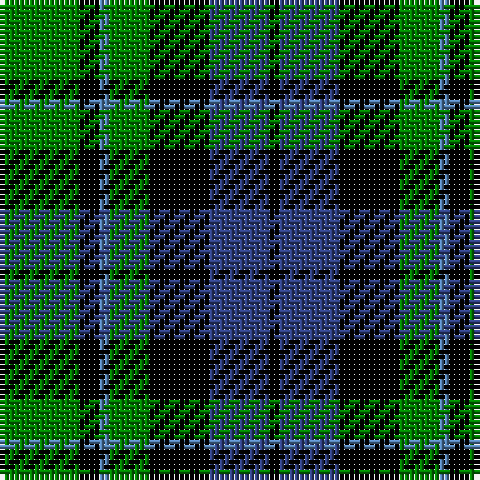

This page is one **sett** — a single exact thread-count. It belongs to the [tartan](/tartans/g8k2ba1g4k6b6k1/)
(the same proportion at any scale), whose colour order is pattern [GKBGKBK](/stripes/gkbgkbk/).

Sourced from weddslist.  It is a [7 stripe tartan](/stripes/stripes7/).

Original link http://www.weddslist.com/cgi-bin/tartans/pg.pl?source=sts

2 attestations — the source records this cloth was collapsed from (oldest owns this page)

<ul>
<li>undated — MacCallum (weddslist, <a href="http://www.weddslist.com/cgi-bin/tartans/pg.pl?source=sts">record</a>)</li>
<li>undated — MacCallum Clan Tartan Tartan Number: 767. Earliest known date: 1893 D. W. Stewart wrote, "It is believed that the family (MacCallum), having lost trace of the old sett 50 or 60 years ago (i.e. 1832 - 1843), had the modern design prepared from the recollection of old people in Argyllshire; but the recovery of the original design shows that considerable deviation had been made." 'Old and Rare Scottish Tartans' recorded just 45 tartans, specially woven in silk, of particular interest or antiquity. Copies of the book are now valuable collectors items. See products available Copyright © Blair Urquhart, Comrie, 2015 (house-of-tartan, <a href="http://www.house-of-tartan.scotland.net/house/TartanViewjs.asp?colr=Def&tnam=767">record</a>)</li>
</ul>

## Thread count
G/16 K4 Ba2 G8 K12 B12 K/2

## Palette
Each colour and the base-6 reference it is a variant of.

| Colour | Shade | Base |
|---|---|---|
| B | <code style="background-color:#304080;">#304080</code> `oklch(39.4% 0.109 270.2)` <small>#304080</small> | B <code style="background-color:#2A418A;">#2A418A</code> |
| Ba | <code style="background-color:#5480B0;">#5480B0</code> `oklch(58.8% 0.089 251.5)` <small>#5480B0</small> | B <code style="background-color:#2A418A;">#2A418A</code> |
| G | <code style="background-color:#008000;">#008000</code> `oklch(52.0% 0.177 142.5)` <small>#008000</small> | G <code style="background-color:#006100;">#006100</code> |
| K | <code style="background-color:#000000;">#000000</code> `oklch(0.0% 0.000 0.0)` <small>#000000</small> | K <code style="background-color:#000000;">#000000</code> |

# Sample pattern

## Nearest tartans

The nearest existing variants by ΔTartan distance, with this tartan at the top so the swatches line up against it.

ΔTartan

Tartan

Sett

—

<a href="/ttd/edit/#slug=g8k2t1g4k6db6k1~x2">MacCallum</a> <a class="nn-out" href="/setts/s7/g8k2t1g4k6db6k1~x2/" title="open its dictionary page">↗</a>

0.44

<a href="/ttd/edit/#slug=g18t2g4k14db12k3~x2">Graham of Menteith</a> <a class="nn-out" href="/setts/s6/g18t2g4k14db12k3~x2/" title="open its dictionary page">↗</a>

0.63

<a href="/ttd/edit/#slug=k4g19k16w2db15g4~x2">Graham of Montrose</a> <a class="nn-out" href="/setts/s6/k4g19k16w2db15g4~x2/" title="open its dictionary page">↗</a>

0.68

<a href="/ttd/edit/#slug=k2g9t1k6b4g2~x2">Unnamed 3</a> <a class="nn-out" href="/setts/s6/k2g9t1k6b4g2~x2/" title="open its dictionary page">↗</a>

0.69

<a href="/ttd/edit/#slug=g1db5g1k5g6ly1~x2">MacKay</a> <a class="nn-out" href="/setts/s6/g1db5g1k5g6ly1~x2/" title="open its dictionary page">↗</a>

0.75

<a href="/ttd/edit/#slug=g9w1g6k7db7k1~x2">Menteith</a> <a class="nn-out" href="/setts/s6/g9w1g6k7db7k1~x2/" title="open its dictionary page">↗</a>

0.78

<a href="/ttd/edit/#slug=k4w2g18k13db12k2~x2">Melville</a> <a class="nn-out" href="/setts/s6/k4w2g18k13db12k2~x2/" title="open its dictionary page">↗</a>

0.82

<a href="/ttd/edit/#slug=k7g6w1g6k7db7k1~x4">MacLaggan</a> <a class="nn-out" href="/setts/s7/k7g6w1g6k7db7k1~x4/" title="open its dictionary page">↗</a>

0.91

<a href="/ttd/edit/#slug=db12k17g19w2k5~x2">Wilson's, Folio 131</a> <a class="nn-out" href="/setts/s5/db12k17g19w2k5~x2/" title="open its dictionary page">↗</a>

0.96

<a href="/setts/s8/db10k6t1g6k1~x2/">Unnamed, No 115</a>

0.96

<a href="/ttd/edit/#slug=b10k3b10k14r2g14k4~x2">Fletcher #2</a> <a class="nn-out" href="/setts/s7/b10k3b10k14r2g14k4~x2/" title="open its dictionary page">↗</a>

## Neighbour map

Every grey dot is one of 14299 variants placed by the first two principal components of the ΔTartan feature space (44% of its variance). Red is this tartan; blue dots are its nearest — click one to open its page.

<svg viewBox="0 0 640 380" role="img" style="max-width:100%;height:auto;border:1px solid #e0e0e0;border-radius:4px;display:block" xmlns="http://www.w3.org/2000/svg"><image href="/nn/cloud.v1.png" width="640" height="380"/><a href="/setts/s6/g18t2g4k14db12k3~x2/"><circle cx="177.8" cy="228.0" r="4" fill="#3465a4"><title>Graham of Menteith</title></circle></a><a href="/setts/s6/k4g19k16w2db15g4~x2/"><circle cx="162.2" cy="224.2" r="4" fill="#3465a4"><title>Graham of Montrose</title></circle></a><a href="/setts/s6/k2g9t1k6b4g2~x2/"><circle cx="190.0" cy="221.9" r="4" fill="#3465a4"><title>Unnamed 3</title></circle></a><a href="/setts/s6/g1db5g1k5g6ly1~x2/"><circle cx="157.1" cy="237.7" r="4" fill="#3465a4"><title>MacKay</title></circle></a><a href="/setts/s6/g9w1g6k7db7k1~x2/"><circle cx="194.6" cy="236.0" r="4" fill="#3465a4"><title>Menteith</title></circle></a><a href="/setts/s6/k4w2g18k13db12k2~x2/"><circle cx="159.8" cy="221.5" r="4" fill="#3465a4"><title>Melville</title></circle></a><a href="/setts/s7/k7g6w1g6k7db7k1~x4/"><circle cx="152.5" cy="249.0" r="4" fill="#3465a4"><title>MacLaggan</title></circle></a><a href="/setts/s5/db12k17g19w2k5~x2/"><circle cx="165.1" cy="240.6" r="4" fill="#3465a4"><title>Wilson's, Folio 131</title></circle></a><a href="/setts/s8/db10k6t1g6k1~x2/"><circle cx="146.4" cy="214.8" r="4" fill="#3465a4"><title>Unnamed, No 115</title></circle></a><a href="/setts/s7/b10k3b10k14r2g14k4~x2/"><circle cx="131.8" cy="238.3" r="4" fill="#3465a4"><title>Fletcher #2</title></circle></a><circle cx="171.3" cy="231.1" r="5" fill="#c00000"/></svg>

ID: /setts/s7/g8k2t1g4k6db6k1~x2/
