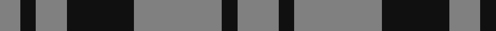

In pattern [GKGKGKG](/patterns/gkgkgkg/).

This was sourced from register-of-tartans.  It is a [7 stripes tartan](/stripes/stripes7/).

Original link https://www.tartanregister.gov.uk/tartanDetails.aspx?ref=3696

## Register references

External register numbers recorded for this tartan.

- Scottish Register of Tartans: [3696](https://www.tartanregister.gov.uk/tartanDetails.aspx?ref=3696)
- Scottish Tartans World Register: 1287

## Thread count
N/8 K6 N12 K26 N34 K6 N/16

## Palette
Each colour and its ΔE from the base-6 reference it is a variant of.

| Colour | Shade | Base | ΔE (OKLab) |
|---|---|---|---|
| K | <code style="background-color:#101010;">#101010</code> `#101010` | K <code style="background-color:#000000;">#000000</code> | 0.17 |
| N | <code style="background-color:#808080;">#808080</code> `#808080` | G <code style="background-color:#006100;">#006100</code> | 0.23 |

# Sample pattern

## Nearest tartans

The nearest existing variants by ΔTartan distance.

1. [Scott Black & Grey (Corporate)](/setts/s7/r8k3r17k13r6k3r4~k101010-r888888~x2/) — ΔT 0.25
1. [Unidentified, Sample](/setts/s6/b11r4y9b4y2b11~b304080-rc00000-yf0c000~x2/) — ΔT 1.48
1. [Bute Heather, Black](/setts/s10/k6g20k6g4k4g8g2k8g2k5~g808080-k101010~x2/) — ΔT 1.50
1. [Unidentified Sample](/setts/s6/b11r4y9b4y2b11~b2c4084-rdc0000-ye8c000~x2/) — ΔT 1.50
1. [Wilson's, No 211](/setts/s4/g8b4g1b2~b800080-g008000~x4/) — ΔT 1.55
1. [Tokharion](/setts/s6/b1y5b1y5b2w1~b2c2c80-we0e0e0-ya08858~x4/) — ΔT 1.61
1. [Special Saffron](/setts/s6/g86y44g21y44g86b10~b2888c4-g003820-ydc943c/) — ΔT 1.67
1. [Latin](/setts/s6/b3y9b3y9b20r3~b2c2c80-rc8002c-ybc8c00~x2/) — ΔT 1.70
1. [Douglas, Grey (Vestiarium Scoticum)](/setts/s8/k10r1k2r1k4r10k1r2~k101010-r888888~x4/) — ΔT 1.76
1. [Grey Breton](/setts/s9/b14k19b14k6b14k6b14k47b6~b666666-k101010/) — ΔT 1.79

## Neighbour map

Every grey dot is one of 15726 variants placed by the first two principal components of the ΔTartan feature space (44% of its variance). Red is this tartan; blue dots are its nearest — click one to open its page.

<svg viewBox="0 0 640 380" role="img" style="max-width:100%;height:auto;border:1px solid #e0e0e0;border-radius:4px;display:block" xmlns="http://www.w3.org/2000/svg"><image href="/nn/cloud.v1.png" width="640" height="380"/><a href="/setts/s7/r8k3r17k13r6k3r4~k101010-r888888~x2/"><circle cx="354.2" cy="275.5" r="4" fill="#3465a4"><title>Scott Black &amp; Grey (Corporate)</title></circle></a><a href="/setts/s6/b11r4y9b4y2b11~b304080-rc00000-yf0c000~x2/"><circle cx="293.2" cy="271.1" r="4" fill="#3465a4"><title>Unidentified, Sample</title></circle></a><a href="/setts/s10/k6g20k6g4k4g8g2k8g2k5~g808080-k101010~x2/"><circle cx="338.5" cy="232.0" r="4" fill="#3465a4"><title>Bute Heather, Black</title></circle></a><a href="/setts/s6/b11r4y9b4y2b11~b2c4084-rdc0000-ye8c000~x2/"><circle cx="291.9" cy="271.1" r="4" fill="#3465a4"><title>Unidentified Sample</title></circle></a><a href="/setts/s4/g8b4g1b2~b800080-g008000~x4/"><circle cx="373.6" cy="286.0" r="4" fill="#3465a4"><title>Wilson's, No 211</title></circle></a><a href="/setts/s6/b1y5b1y5b2w1~b2c2c80-we0e0e0-ya08858~x4/"><circle cx="359.5" cy="263.4" r="4" fill="#3465a4"><title>Tokharion</title></circle></a><a href="/setts/s6/g86y44g21y44g86b10~b2888c4-g003820-ydc943c/"><circle cx="353.3" cy="261.2" r="4" fill="#3465a4"><title>Special Saffron</title></circle></a><a href="/setts/s6/b3y9b3y9b20r3~b2c2c80-rc8002c-ybc8c00~x2/"><circle cx="303.9" cy="243.5" r="4" fill="#3465a4"><title>Latin</title></circle></a><a href="/setts/s8/k10r1k2r1k4r10k1r2~k101010-r888888~x4/"><circle cx="351.1" cy="225.9" r="4" fill="#3465a4"><title>Douglas, Grey (Vestiarium Scoticum)</title></circle></a><a href="/setts/s9/b14k19b14k6b14k6b14k47b6~b666666-k101010/"><circle cx="365.3" cy="260.2" r="4" fill="#3465a4"><title>Grey Breton</title></circle></a><circle cx="360.9" cy="278.8" r="5" fill="#c00000"/></svg>

ID: /setts/s7/g8k3g17k13g6k3g4~g808080-k101010~x2/
