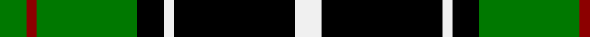

In pattern [GRGKWKW](/stripes/grgkwkw/).

This was sourced from register-of-tartans.  It is a [7 stripe tartan](/stripes/stripes7/).

Original link https://www.tartanregister.gov.uk/tartanDetails.aspx?ref=671

## Attestations

This cloth appears in 2 source records; the oldest owns this page.

- 01/01/2002 — Cleghorn (Personal) (register-of-tartans, [record](https://www.tartanregister.gov.uk/tartanDetails.aspx?ref=671))
- pre 2002 — Cleghorn (Personal) (tartans-authority, [record](http://www.tartansauthority.com/tartan-ferret/display/4144/))

## Register references

External register numbers recorded for this tartan.

- Scottish Register of Tartans: [671](https://www.tartanregister.gov.uk/tartanDetails.aspx?ref=671)
- Scottish Tartans Authority (ITI): 4144

## Thread count
G/16 DR6 G60 K16 W6 K72 W/16

## Palette
Each colour and the base-6 reference it is a variant of.

| Colour | Shade | Base |
|---|---|---|
| DR | <code style="background-color:#8C0000;">#8C0000</code> `oklch(40.2% 0.165 29.2)` <small>#8C0000</small> | R <code style="background-color:#CC0000;">#CC0000</code> |
| G | <code style="background-color:#007800;">#007800</code> `oklch(49.6% 0.169 142.5)` <small>#007800</small> | G <code style="background-color:#006100;">#006100</code> |
| K | <code style="background-color:#000000;">#000000</code> `oklch(0.0% 0.000 0.0)` <small>#000000</small> | K <code style="background-color:#000000;">#000000</code> |
| W | <code style="background-color:#F0F0F0;">#F0F0F0</code> `oklch(95.5% 0.000 89.9)` <small>#F0F0F0</small> | W <code style="background-color:#F7F7F7;">#F7F7F7</code> |

# Sample pattern

## Nearest tartans

The nearest existing variants by ΔTartan distance, with this tartan at the top so the swatches line up against it.

ΔTartan

Tartan

Sett

—

<a href="/ttd/edit/#slug=g8r3g30k8w3k36w8~x2">Cleghorn (Personal)</a> <a class="nn-out" href="/setts/s7/g8r3g30k8w3k36w8~x2/" title="open its dictionary page">↗</a>

0.92

<a href="/ttd/edit/#slug=g6r2g13k6w2k16r3~x2">Sinclair, hunting</a> <a class="nn-out" href="/setts/s7/g6r2g13k6w2k16r3~x2/" title="open its dictionary page">↗</a>

1.00

<a href="/ttd/edit/#slug=k60g64g5g8g5g64k60ly8k8ly8">Sin-Cos</a> <a class="nn-out" href="/setts/s10/k60g64g5g8g5g64k60ly8k8ly8/" title="open its dictionary page">↗</a>

1.03

<a href="/ttd/edit/#slug=k8b5g44k40r6">Douglas, Black</a> <a class="nn-out" href="/setts/s5/k8b5g44k40r6/" title="open its dictionary page">↗</a>

1.04

<a href="/ttd/edit/#slug=k7r3k24g28ly3~x2">Robert Gordon University</a> <a class="nn-out" href="/setts/s5/k7r3k24g28ly3~x2/" title="open its dictionary page">↗</a>

1.15

<a href="/ttd/edit/#slug=g14w1g7k7db2k2db2k2db7~x2">Abercrombie</a> <a class="nn-out" href="/setts/s9/g14w1g7k7db2k2db2k2db7~x2/" title="open its dictionary page">↗</a>

1.17

<a href="/ttd/edit/#slug=k4g32k4g4k8w3k8b4~x2">Hartmann</a> <a class="nn-out" href="/setts/s8/k4g32k4g4k8w3k8b4~x2/" title="open its dictionary page">↗</a>

1.19

<a href="/ttd/edit/#slug=k2g9t1k6b4g2~x2">Unnamed 3</a> <a class="nn-out" href="/setts/s6/k2g9t1k6b4g2~x2/" title="open its dictionary page">↗</a>

1.22

<a href="/ttd/edit/#slug=g21ly2g4k16p14k3~x2">Wilson's, No 160</a> <a class="nn-out" href="/setts/s6/g21ly2g4k16p14k3~x2/" title="open its dictionary page">↗</a>

1.24

<a href="/ttd/edit/#slug=k12r1g14w1g14k14r1db8k2~x2">Abercrombie</a> <a class="nn-out" href="/setts/s9/k12r1g14w1g14k14r1db8k2~x2/" title="open its dictionary page">↗</a>

1.26

<a href="/ttd/edit/#slug=g21w2g4k17p14k3~x2">Wilson's No 158</a> <a class="nn-out" href="/setts/s6/g21w2g4k17p14k3~x2/" title="open its dictionary page">↗</a>

## Neighbour map

Every grey dot is one of 14299 variants placed by the first two principal components of the ΔTartan feature space (44% of its variance). Red is this tartan; blue dots are its nearest — click one to open its page.

<svg viewBox="0 0 640 380" role="img" style="max-width:100%;height:auto;border:1px solid #e0e0e0;border-radius:4px;display:block" xmlns="http://www.w3.org/2000/svg"><image href="/nn/cloud.v1.png" width="640" height="380"/><a href="/setts/s7/g6r2g13k6w2k16r3~x2/"><circle cx="203.3" cy="215.8" r="4" fill="#3465a4"><title>Sinclair, hunting</title></circle></a><a href="/setts/s10/k60g64g5g8g5g64k60ly8k8ly8/"><circle cx="238.8" cy="170.3" r="4" fill="#3465a4"><title>Sin-Cos</title></circle></a><a href="/setts/s5/k8b5g44k40r6/"><circle cx="237.8" cy="222.7" r="4" fill="#3465a4"><title>Douglas, Black</title></circle></a><a href="/setts/s5/k7r3k24g28ly3~x2/"><circle cx="233.3" cy="214.7" r="4" fill="#3465a4"><title>Robert Gordon University</title></circle></a><a href="/setts/s9/g14w1g7k7db2k2db2k2db7~x2/"><circle cx="224.4" cy="183.2" r="4" fill="#3465a4"><title>Abercrombie</title></circle></a><a href="/setts/s8/k4g32k4g4k8w3k8b4~x2/"><circle cx="270.6" cy="175.3" r="4" fill="#3465a4"><title>Hartmann</title></circle></a><a href="/setts/s6/k2g9t1k6b4g2~x2/"><circle cx="190.0" cy="221.9" r="4" fill="#3465a4"><title>Unnamed 3</title></circle></a><a href="/setts/s6/g21ly2g4k16p14k3~x2/"><circle cx="185.1" cy="208.6" r="4" fill="#3465a4"><title>Wilson's, No 160</title></circle></a><a href="/setts/s9/k12r1g14w1g14k14r1db8k2~x2/"><circle cx="188.1" cy="171.2" r="4" fill="#3465a4"><title>Abercrombie</title></circle></a><a href="/setts/s6/g21w2g4k17p14k3~x2/"><circle cx="182.0" cy="208.3" r="4" fill="#3465a4"><title>Wilson's No 158</title></circle></a><circle cx="223.2" cy="184.7" r="5" fill="#c00000"/></svg>

ID: /setts/s7/g8r3g30k8w3k36w8~x2/
