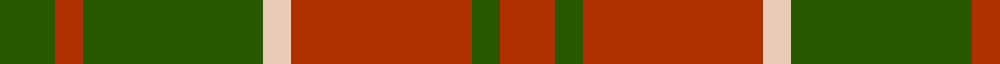
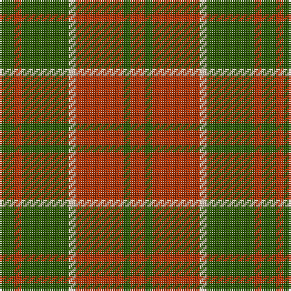

In pattern [GRGWRGR](/patterns/grgwrgr/).

This was sourced from register-of-tartans.  It is a [7 stripes tartan](/stripes/stripes7/).

Original link https://www.tartanregister.gov.uk/tartanDetails.aspx?ref=815

## Thread count
G/8 R4 G26 LR4 R26 G4 R/8

## Palette
Each colour and its ΔE from the base-6 reference it is a variant of.

| Colour | Shade | Base | ΔE (OKLab) |
|---|---|---|---|
| G | <code style="background-color:#285800;">#285800</code> `#285800` | G <code style="background-color:#006400;">#006400</code> | 0.04 |
| LR | <code style="background-color:#E8CCB8;">#E8CCB8</code> `#E8CCB8` | W <code style="background-color:#F4F4F0;">#F4F4F0</code> | 0.11 |
| R | <code style="background-color:#B03000;">#B03000</code> `#B03000` | R <code style="background-color:#C80000;">#C80000</code> | 0.05 |

# Sample pattern

ID: /setts/s7/g8r4g26w4r26g4r8-g285800-rb03000-we8ccb8/
