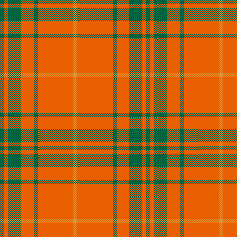

In pattern [GRGRGRY](/patterns/grgrgry/).

This was sourced from tartans-authority.  It is a [7 stripes tartan](/stripes/stripes7/).

Original link http://www.tartansauthority.com/tartan-ferret/display/4096/

## Thread count
G/8 Oa8 G26 Oa26 G8 Oa72 O/8

## Palette
Each colour and its ΔE from the base-6 reference it is a variant of.

| Colour | Shade | Base | ΔE (OKLab) |
|---|---|---|---|
| G | <code style="background-color:#00643C;">#00643C</code> `#00643C` | G <code style="background-color:#006400;">#006400</code> | 0.06 |
| O | <code style="background-color:#DC943C;">#DC943C</code> `#DC943C` | Y <code style="background-color:#E8C000;">#E8C000</code> | 0.12 |
| Oa | <code style="background-color:#E86000;">#E86000</code> `#E86000` | R <code style="background-color:#C80000;">#C80000</code> | 0.14 |

# Sample pattern

## Nearest tartans

The nearest existing variants by ΔTartan distance.

1. [Wolfe](/setts/s12/r72g8r26g26r8g8r8g26r26g8r72y8-g00643c-re86000-ydc943c/) — ΔT 1.23
1. [Cameron](/setts/s6/r8g24r8g24r64y8-g006818-rc80000-ye8c000/) — ΔT 1.43
1. [Cameron](/setts/s6/r4g12r4g12r32y2-g008000-rc00000-yf0c000/) — ΔT 1.46
1. [Cameron (Clan)](/setts/s6/r8g24r8g24r64y4-g006818-rc80000-ye8c000/) — ΔT 1.49
1. [Cameron Clan Tartan Tartan Number: 1538. Earliest known date: 1842 First illustrated in the 'Vestiarium Scoticum' this sett is known as the Cameron Clan tartan. It may be derived from the tartan worn by the MacFees who also had a close association with Lochaber. The sett was recorded by Lord Lyon in the Public Register of All Arms and Bearings in 1947. See products available Copyright © Blair Urquhart, Comrie, 2015](/setts/s6/r4g12r4g12r32y2-g006818-rc80000-ye8c000/) — ΔT 1.49
1. [Cameron, Ancient](/setts/s7/r58y3r6g16r12g16r6-g008000-rc00000-yf0c000/) — ΔT 1.52
1. [Claus of the North Pole (Corporate)](/setts/s7/r42g6r42g32y6w4y6-g00841c-rc80000-wdcdce0-yf4a404/) — ΔT 1.61
1. [MacDonell of Keppoch](/setts/s11/r16g4r12b2r4b2r16g24r28b2r4-b304080-g008000-rc00000/) — ΔT 1.61
1. [Cameron Old Clan Tartan Tartan Number: 1517. Earliest known date: 0 A document written in Latin of 1689 descibes the Cameron men from Lochaber as being clad in blue and yellow when they followed their great Chief, Sir Ewan Cameron, to battle and victory at Killiecrankie. This new design was evolved in the 1940s by J G MacKay of Portree and first put on show at the Cameron Gathering at Achnacarry in 1956. The original Cameron first appeared in the Vestiarium Scoticum (1842). See products available Copyright © Blair Urquhart, Comrie, 2015](/setts/s7/r58y3r6g16r12g16r6-g006818-rc80000-ye8c000/) — ΔT 1.62
1. [Crawford](/setts/s7/r6w2r30g12r3g12r3-g004c00-rc80000-wd0d0d0/) — ΔT 1.68

## Neighbour map

Every grey dot is one of 15726 variants placed by the first two principal components of the ΔTartan feature space (44% of its variance). Red is this tartan; blue dots are its nearest — click one to open its page.

<svg viewBox="0 0 640 380" role="img" style="max-width:100%;height:auto;border:1px solid #e0e0e0;border-radius:4px;display:block" xmlns="http://www.w3.org/2000/svg"><image href="/nn/cloud.v1.png" width="640" height="380"/><a href="/setts/s12/r72g8r26g26r8g8r8g26r26g8r72y8-g00643c-re86000-ydc943c/"><circle cx="464.6" cy="197.5" r="4" fill="#3465a4"><title>Wolfe</title></circle></a><a href="/setts/s6/r8g24r8g24r64y8-g006818-rc80000-ye8c000/"><circle cx="372.8" cy="227.3" r="4" fill="#3465a4"><title>Cameron</title></circle></a><a href="/setts/s6/r4g12r4g12r32y2-g008000-rc00000-yf0c000/"><circle cx="418.4" cy="201.2" r="4" fill="#3465a4"><title>Cameron</title></circle></a><a href="/setts/s6/r8g24r8g24r64y4-g006818-rc80000-ye8c000/"><circle cx="423.5" cy="202.4" r="4" fill="#3465a4"><title>Cameron (Clan)</title></circle></a><a href="/setts/s6/r4g12r4g12r32y2-g006818-rc80000-ye8c000/"><circle cx="423.5" cy="202.4" r="4" fill="#3465a4"><title>Cameron Clan Tartan Tartan Number: 1538. Earliest known date: 1842 First illustrated in the 'Vestiarium Scoticum' this sett is known as the Cameron Clan tartan. It may be derived from the tartan worn by the MacFees who also had a close association with Lochaber. The sett was recorded by Lord Lyon in the Public Register of All Arms and Bearings in 1947. See products available Copyright © Blair Urquhart, Comrie, 2015</title></circle></a><a href="/setts/s7/r58y3r6g16r12g16r6-g008000-rc00000-yf0c000/"><circle cx="498.2" cy="181.8" r="4" fill="#3465a4"><title>Cameron, Ancient</title></circle></a><a href="/setts/s7/r42g6r42g32y6w4y6-g00841c-rc80000-wdcdce0-yf4a404/"><circle cx="356.4" cy="192.3" r="4" fill="#3465a4"><title>Claus of the North Pole (Corporate)</title></circle></a><a href="/setts/s11/r16g4r12b2r4b2r16g24r28b2r4-b304080-g008000-rc00000/"><circle cx="464.6" cy="189.2" r="4" fill="#3465a4"><title>MacDonell of Keppoch</title></circle></a><a href="/setts/s7/r58y3r6g16r12g16r6-g006818-rc80000-ye8c000/"><circle cx="503.3" cy="182.8" r="4" fill="#3465a4"><title>Cameron Old Clan Tartan Tartan Number: 1517. Earliest known date: 0 A document written in Latin of 1689 descibes the Cameron men from Lochaber as being clad in blue and yellow when they followed their great Chief, Sir Ewan Cameron, to battle and victory at Killiecrankie. This new design was evolved in the 1940s by J G MacKay of Portree and first put on show at the Cameron Gathering at Achnacarry in 1956. The original Cameron first appeared in the Vestiarium Scoticum (1842). See products available Copyright © Blair Urquhart, Comrie, 2015</title></circle></a><a href="/setts/s7/r6w2r30g12r3g12r3-g004c00-rc80000-wd0d0d0/"><circle cx="418.8" cy="194.2" r="4" fill="#3465a4"><title>Crawford</title></circle></a><circle cx="450.8" cy="215.0" r="5" fill="#c00000"/></svg>

ID: /setts/s7/g8r8g26r26g8r72y8-g00643c-re86000-ydc943c/
