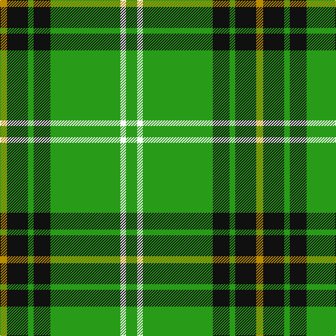

In pattern [GWGKGKY](/patterns/gwgkgky/).

This was sourced from tartans-authority.  It is a [7 stripes tartan](/stripes/stripes7/).

Original link http://www.tartansauthority.com/tartan-ferret/display/7551/

## Thread count
DY/10 K30 G8 K24 G100 W8 G/16

## Palette
Each colour and its ΔE from the base-6 reference it is a variant of.

| Colour | Shade | Base | ΔE (OKLab) |
|---|---|---|---|
| DY | <code style="background-color:#BC8C00;">#BC8C00</code> `#BC8C00` | Y <code style="background-color:#F2BF00;">#F2BF00</code> | 0.16 |
| G | <code style="background-color:#289C18;">#289C18</code> `#289C18` | G <code style="background-color:#006100;">#006100</code> | 0.19 |
| K | <code style="background-color:#101010;">#101010</code> `#101010` | K <code style="background-color:#000000;">#000000</code> | 0.17 |
| W | <code style="background-color:#F8F8F8;">#F8F8F8</code> `#F8F8F8` | W <code style="background-color:#F7F7F7;">#F7F7F7</code> | 0.00 |

# Sample pattern

## Nearest tartans

The nearest existing variants by ΔTartan distance.

1. [Leach Hunting](/setts/s7/k3w1g15g6k2b3w2x2~b501400-g289c18-k101010-wc0c0c0/) — ΔT 0.58
1. [Leach Htg (Name)](/setts/s6/k3w1g21k2b3w2x2~b501400-g289c18-k101010-wc0c0c0/) — ΔT 1.09
1. [Freedom of Derry](/setts/s7/g14y7g14ga50g64w6g7~g289c18-ga003820-we0e0e0-ye8c000/) — ΔT 1.15
1. [Sir Billi (Corporate)](/setts/s6/r8g12w5k11g42k3x2~g347400-k101010-rc80000-wf4f8c8/) — ΔT 1.16
1. [Loch Rannoch](/setts/s5/g37w9g3k9w3~g008000-k000000-we0e0e0/) — ΔT 1.21
1. [Loch Rannoch Fancy Tartan Tartan Number: 943. Earliest known date: 1975 Nothing See products available Copyright © Blair Urquhart, Comrie, 2015](/setts/s5/g37w9g3k9w3~g006818-k101010-we0e0e0/) — ΔT 1.32
1. [Limerick County Crest (Fashion)](/setts/s6/w12k3g50w3k13y6x2~g006818-k101010-we0e0e0-ybc8c00/) — ΔT 1.33
1. [Duke of York, hunting](/setts/s8/g99b20w8b30y8b10y8g46~b304080-g008000-we0e0e0-yf0c000/) — ΔT 1.36
1. [Tahrir - Liberation (Fashion)](/setts/s6/k5w4r15g70k4w5x2~g289c18-k101010-rc80000-we0e0e0/) — ΔT 1.39
1. [McGirr (Letterkenny) David, (Pers.)](/setts/s8/g4r1g15b5r1w5g4r1x4~b68889c-g006818-rc8002c-we0e0e0/) — ΔT 1.45

## Neighbour map

Every grey dot is one of 15726 variants placed by the first two principal components of the ΔTartan feature space (44% of its variance). Red is this tartan; blue dots are its nearest — click one to open its page.

<svg viewBox="0 0 640 380" role="img" style="max-width:100%;height:auto;border:1px solid #e0e0e0;border-radius:4px;display:block" xmlns="http://www.w3.org/2000/svg"><image href="/nn/cloud.v1.png" width="640" height="380"/><a href="/setts/s7/k3w1g15g6k2b3w2x2~b501400-g289c18-k101010-wc0c0c0/"><circle cx="349.5" cy="182.4" r="4" fill="#3465a4"><title>Leach Hunting</title></circle></a><a href="/setts/s6/k3w1g21k2b3w2x2~b501400-g289c18-k101010-wc0c0c0/"><circle cx="385.1" cy="156.7" r="4" fill="#3465a4"><title>Leach Htg (Name)</title></circle></a><a href="/setts/s7/g14y7g14ga50g64w6g7~g289c18-ga003820-we0e0e0-ye8c000/"><circle cx="334.4" cy="205.2" r="4" fill="#3465a4"><title>Freedom of Derry</title></circle></a><a href="/setts/s6/r8g12w5k11g42k3x2~g347400-k101010-rc80000-wf4f8c8/"><circle cx="371.9" cy="194.9" r="4" fill="#3465a4"><title>Sir Billi (Corporate)</title></circle></a><a href="/setts/s5/g37w9g3k9w3~g008000-k000000-we0e0e0/"><circle cx="354.7" cy="209.3" r="4" fill="#3465a4"><title>Loch Rannoch</title></circle></a><a href="/setts/s5/g37w9g3k9w3~g006818-k101010-we0e0e0/"><circle cx="370.3" cy="214.2" r="4" fill="#3465a4"><title>Loch Rannoch Fancy Tartan Tartan Number: 943. Earliest known date: 1975 Nothing See products available Copyright © Blair Urquhart, Comrie, 2015</title></circle></a><a href="/setts/s6/w12k3g50w3k13y6x2~g006818-k101010-we0e0e0-ybc8c00/"><circle cx="306.9" cy="168.8" r="4" fill="#3465a4"><title>Limerick County Crest (Fashion)</title></circle></a><a href="/setts/s8/g99b20w8b30y8b10y8g46~b304080-g008000-we0e0e0-yf0c000/"><circle cx="360.2" cy="190.5" r="4" fill="#3465a4"><title>Duke of York, hunting</title></circle></a><a href="/setts/s6/k5w4r15g70k4w5x2~g289c18-k101010-rc80000-we0e0e0/"><circle cx="404.5" cy="156.9" r="4" fill="#3465a4"><title>Tahrir - Liberation (Fashion)</title></circle></a><a href="/setts/s8/g4r1g15b5r1w5g4r1x4~b68889c-g006818-rc8002c-we0e0e0/"><circle cx="351.4" cy="181.3" r="4" fill="#3465a4"><title>McGirr (Letterkenny) David, (Pers.)</title></circle></a><circle cx="335.9" cy="180.1" r="5" fill="#c00000"/></svg>

ID: /setts/s7/g8w4g50k12g4k15y5x2~g289c18-k101010-wf8f8f8-ybc8c00/
