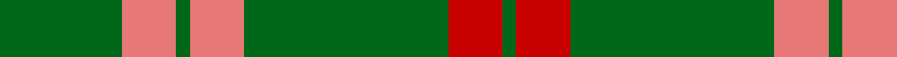

In pattern [GRGRGRG](/patterns/grgrgrg/).

This was sourced from register-of-tartans.  It is a [7 stripes tartan](/stripes/stripes7/).

Original link https://www.tartanregister.gov.uk/tartanDetails.aspx?ref=2184

## Register references

External register numbers recorded for this tartan.

- Scottish Register of Tartans: [2184](https://www.tartanregister.gov.uk/tartanDetails.aspx?ref=2184)
- Scottish Tartans Authority (ITI): 855
- Scottish Tartans World Register: 855

## Thread count
G/36 LR16 G4 LR16 G60 R16 G/4

## Palette
Each colour and its ΔE from the base-6 reference it is a variant of.

| Colour | Shade | Base | ΔE (OKLab) |
|---|---|---|---|
| G | <code style="background-color:#006818;">#006818</code> `#006818` | G <code style="background-color:#006100;">#006100</code> | 0.02 |
| LR | <code style="background-color:#E87878;">#E87878</code> `#E87878` | R <code style="background-color:#CC0000;">#CC0000</code> | 0.19 |
| R | <code style="background-color:#C80000;">#C80000</code> `#C80000` | R <code style="background-color:#CC0000;">#CC0000</code> | 0.01 |

# Sample pattern

## Nearest tartans

The nearest existing variants by ΔTartan distance.

1. [Logan](/setts/s7/g10r4g1r4g15ra4g1~g008000-rd03030-rac00000~x4/) — ΔT 0.74
1. [Connell (Personal?)](/setts/s6/r2g2r1g12r3k1~g006818-k101010-rc80000~x4/) — ΔT 1.02
1. [Leeds, University of (Dance)](/setts/s8/g34r4g4r4g4r12g20w5~g006818-ra00048-we0e0e0~x2/) — ΔT 1.16
1. [Northcroft (Personal)](/setts/s7/g24r4g3k14g5r2g10~g006818-k101010-rc80000~x2/) — ΔT 1.23
1. [Arkansas](/setts/s7/g3w1g12r6g3k3g2~g006818-k101010-rc8002c-wfcfcfc~x4/) — ΔT 1.25
1. [MacKintosh, hunting](/setts/s7/b1r3g11r2b5g11y1~b304080-g008000-rc00000-yf0c000~x2/) — ΔT 1.32
1. [Connell (Dalgliesh) (Personal)](/setts/s10/r3g12r1g2r2g2r1g12r3k1~g006818-k101010-rc80000~x4/) — ΔT 1.33
1. [MacKintosh Hunting Clan Tartan Tartan Number: 544. Earliest known date: 1951 This sett appears in D.C. Stewarts book, The Setts of the Scottish Tartans, with slightly different proportions. The Lyon Court Book No. 1 records the sett in relation to the narrowest stripe. ie Y 1, Vt (Vert meaning green) 10 1/2, Bu 5, etc. The rendering illustrated here multiplies the Lyon count by two. Commercially manufactured cloth may vary from these proportions. D.C. Stewart calls the sett "a modern arrangement". See products available Copyright © Blair Urquhart, Comrie, 2015](/setts/s7/b1r3g11r2b5g11y1~b2c2c80-g006818-rc80000-ye8c000~x2/) — ΔT 1.38
1. [Maxwell Hunting Clan Tartan Tartan Number: 865. Earliest known date: 0 Tartans of the Lowland families were not named until the publication the 'Vestiarium Scoticum' in 1842. The authors, the Sobieski Stuart brothers, enjoyed a popular following amongst the Scottish gentry in the early Victorian era, and in the spirit of the times, added mystery, romance and some spurious historical documentation to the subject of tartans. The Maxwells have, nevertheless, a tartan of at least 150 years antiquity, probably designed by persons of great imagination and flair. The Maxwells come from Glasgow and the S.W. of Scotland. See products available Copyright © Blair Urquhart, Comrie, 2015](/setts/s7/g3r16g4k6g28r1g3~g006818-k101010-rc80000~x2/) — ΔT 1.43
1. [Maxwell Htg (Clan)](/setts/s7/g3r16g4k6g28r2g3~g006818-k101010-r880000~x2/) — ΔT 1.48

## Neighbour map

Every grey dot is one of 15726 variants placed by the first two principal components of the ΔTartan feature space (44% of its variance). Red is this tartan; blue dots are its nearest — click one to open its page.

<svg viewBox="0 0 640 380" role="img" style="max-width:100%;height:auto;border:1px solid #e0e0e0;border-radius:4px;display:block" xmlns="http://www.w3.org/2000/svg"><image href="/nn/cloud.v1.png" width="640" height="380"/><a href="/setts/s7/g10r4g1r4g15ra4g1~g008000-rd03030-rac00000~x4/"><circle cx="444.3" cy="223.6" r="4" fill="#3465a4"><title>Logan</title></circle></a><a href="/setts/s6/r2g2r1g12r3k1~g006818-k101010-rc80000~x4/"><circle cx="444.8" cy="219.1" r="4" fill="#3465a4"><title>Connell (Personal?)</title></circle></a><a href="/setts/s8/g34r4g4r4g4r12g20w5~g006818-ra00048-we0e0e0~x2/"><circle cx="429.0" cy="228.6" r="4" fill="#3465a4"><title>Leeds, University of (Dance)</title></circle></a><a href="/setts/s7/g24r4g3k14g5r2g10~g006818-k101010-rc80000~x2/"><circle cx="416.1" cy="239.4" r="4" fill="#3465a4"><title>Northcroft (Personal)</title></circle></a><a href="/setts/s7/g3w1g12r6g3k3g2~g006818-k101010-rc8002c-wfcfcfc~x4/"><circle cx="365.6" cy="210.6" r="4" fill="#3465a4"><title>Arkansas</title></circle></a><a href="/setts/s7/b1r3g11r2b5g11y1~b304080-g008000-rc00000-yf0c000~x2/"><circle cx="363.5" cy="216.7" r="4" fill="#3465a4"><title>MacKintosh, hunting</title></circle></a><a href="/setts/s10/r3g12r1g2r2g2r1g12r3k1~g006818-k101010-rc80000~x4/"><circle cx="474.2" cy="206.9" r="4" fill="#3465a4"><title>Connell (Dalgliesh) (Personal)</title></circle></a><a href="/setts/s7/b1r3g11r2b5g11y1~b2c2c80-g006818-rc80000-ye8c000~x2/"><circle cx="367.5" cy="218.3" r="4" fill="#3465a4"><title>MacKintosh Hunting Clan Tartan Tartan Number: 544. Earliest known date: 1951 This sett appears in D.C. Stewarts book, The Setts of the Scottish Tartans, with slightly different proportions. The Lyon Court Book No. 1 records the sett in relation to the narrowest stripe. ie Y 1, Vt (Vert meaning green) 10 1/2, Bu 5, etc. The rendering illustrated here multiplies the Lyon count by two. Commercially manufactured cloth may vary from these proportions. D.C. Stewart calls the sett &quot;a modern arrangement&quot;. See products available Copyright © Blair Urquhart, Comrie, 2015</title></circle></a><a href="/setts/s7/g3r16g4k6g28r1g3~g006818-k101010-rc80000~x2/"><circle cx="428.1" cy="181.8" r="4" fill="#3465a4"><title>Maxwell Hunting Clan Tartan Tartan Number: 865. Earliest known date: 0 Tartans of the Lowland families were not named until the publication the 'Vestiarium Scoticum' in 1842. The authors, the Sobieski Stuart brothers, enjoyed a popular following amongst the Scottish gentry in the early Victorian era, and in the spirit of the times, added mystery, romance and some spurious historical documentation to the subject of tartans. The Maxwells have, nevertheless, a tartan of at least 150 years antiquity, probably designed by persons of great imagination and flair. The Maxwells come from Glasgow and the S.W. of Scotland. See products available Copyright © Blair Urquhart, Comrie, 2015</title></circle></a><a href="/setts/s7/g3r16g4k6g28r2g3~g006818-k101010-r880000~x2/"><circle cx="418.8" cy="220.9" r="4" fill="#3465a4"><title>Maxwell Htg (Clan)</title></circle></a><circle cx="427.6" cy="218.9" r="5" fill="#c00000"/></svg>

ID: /setts/s7/g9r4g1r4g15ra4g1~g006818-re87878-rac80000~x4/
