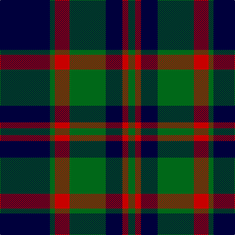

In pattern [GRKGRGK](/patterns/grkgrgk/).

This was sourced from tartans-authority.  It is a [7 stripes tartan](/stripes/stripes7/).

Original link http://www.tartansauthority.com/tartan-ferret/display/2480/

## Thread count
DB/102 G10 R30 G74 DB34 R12 G/14

## Palette
Each colour and its ΔE from the base-6 reference it is a variant of.

| Colour | Shade | Base | ΔE (OKLab) |
|---|---|---|---|
| DB | <code style="background-color:#00003C;">#00003C</code> `#00003C` | K <code style="background-color:#000000;">#000000</code> | 0.20 |
| G | <code style="background-color:#006818;">#006818</code> `#006818` | G <code style="background-color:#006400;">#006400</code> | 0.02 |
| R | <code style="background-color:#C80000;">#C80000</code> `#C80000` | R <code style="background-color:#C80000;">#C80000</code> | 0.00 |

# Sample pattern

ID: /setts/s7/k102g10r30g74k34r12g14-g006818-k00003c-rc80000/
