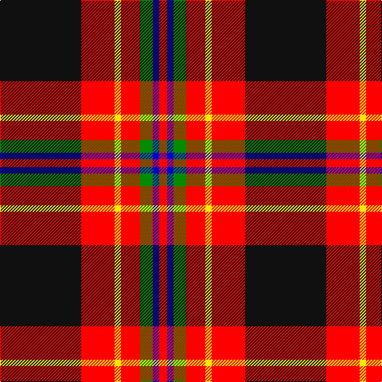

In pattern [KRYRGBR](/patterns/kryrgbr/).

This was sourced from register-of-tartans.  It is a [7 stripes tartan](/stripes/stripes7/).

Original link https://www.tartanregister.gov.uk/tartanDetails.aspx?ref=10770

## Thread count
K/102 R42 Y8 R24 G16 B8 R/10

## Palette
Each colour and its ΔE from the base-6 reference it is a variant of.

| Colour | Shade | Base | ΔE (OKLab) |
|---|---|---|---|
| B | <code style="background-color:#0000CD;">#0000CD</code> `#0000CD` | B <code style="background-color:#2C4084;">#2C4084</code> | 0.15 |
| G | <code style="background-color:#008B00;">#008B00</code> `#008B00` | G <code style="background-color:#006400;">#006400</code> | 0.12 |
| K | <code style="background-color:#101010;">#101010</code> `#101010` | K <code style="background-color:#000000;">#000000</code> | 0.17 |
| R | <code style="background-color:#FF0000;">#FF0000</code> `#FF0000` | R <code style="background-color:#C80000;">#C80000</code> | 0.11 |
| Y | <code style="background-color:#FFE600;">#FFE600</code> `#FFE600` | Y <code style="background-color:#E8C000;">#E8C000</code> | 0.10 |

# Sample pattern

## Nearest tartans

The nearest existing variants by ΔTartan distance.

1. [Tott (Personal))](/setts/s7/k102r42y8r24g16b8r10-b2c2c80-g006818-k101010-rc80000-yc4bc68/) — ΔT 0.87
1. [Drambuie](/setts/s6/w6r36k48y4k5ya6-k101010-r880000-we0e0e0-ya08858-yae8c000/) — ΔT 0.92
1. [Dean Brae](/setts/s8/k44r8k8g8k32ra72ga6ra12-g447438-ga789484-k000000-rb07430-rafc2020/) — ΔT 0.99
1. [Hoffman Texas German](/setts/s7/k46r54b6r10w6k28y12-b0000cd-k1c1714-rca2625-wffffff-yffe700/) — ΔT 1.01
1. [State Seal of Alabama (Fashion)](/setts/s9/r120y8k44g10k50b16k8r8k8-b2888c4-g006818-k101010-rc80000-ybc8c00/) — ΔT 1.03
1. [Golfers](/setts/s10/y8r4k18r50k6r4k6r8b30w6-b304080-k000000-rc00000-we0e0e0-yd08010/) — ΔT 1.11
1. [Castle Stewart (District)](/setts/s9/y14k6b8k6r42k4r8k4w8-b2c2c80-k101010-r880000-we0e0e0-yd87c00/) — ΔT 1.14
1. [Wormeck (2013) Germany](/setts/s5/b8y8r66k60w4-b271b86-k120a01-ra90725-wf7f1e8-yebaa57/) — ΔT 1.18
1. [Dunbar](/setts/s6/k8r52k8w4k26y8-k000000-rc00000-we0e0e0-yf0c000/) — ΔT 1.23
1. [Fraser Gathering, Red](/setts/s9/r4b24r4g22r8b10g4r48w4-b000050-g008000-rc00000-we0e0e0/) — ΔT 1.23

## Neighbour map

Every grey dot is one of 15726 variants placed by the first two principal components of the ΔTartan feature space (44% of its variance). Red is this tartan; blue dots are its nearest — click one to open its page.

<svg viewBox="0 0 640 380" role="img" style="max-width:100%;height:auto;border:1px solid #e0e0e0;border-radius:4px;display:block" xmlns="http://www.w3.org/2000/svg"><image href="/nn/cloud.v1.png" width="640" height="380"/><a href="/setts/s7/k102r42y8r24g16b8r10-b2c2c80-g006818-k101010-rc80000-yc4bc68/"><circle cx="266.2" cy="156.6" r="4" fill="#3465a4"><title>Tott (Personal))</title></circle></a><a href="/setts/s6/w6r36k48y4k5ya6-k101010-r880000-we0e0e0-ya08858-yae8c000/"><circle cx="264.5" cy="167.1" r="4" fill="#3465a4"><title>Drambuie</title></circle></a><a href="/setts/s8/k44r8k8g8k32ra72ga6ra12-g447438-ga789484-k000000-rb07430-rafc2020/"><circle cx="223.9" cy="145.5" r="4" fill="#3465a4"><title>Dean Brae</title></circle></a><a href="/setts/s7/k46r54b6r10w6k28y12-b0000cd-k1c1714-rca2625-wffffff-yffe700/"><circle cx="206.5" cy="175.4" r="4" fill="#3465a4"><title>Hoffman Texas German</title></circle></a><a href="/setts/s9/r120y8k44g10k50b16k8r8k8-b2888c4-g006818-k101010-rc80000-ybc8c00/"><circle cx="277.4" cy="128.7" r="4" fill="#3465a4"><title>State Seal of Alabama (Fashion)</title></circle></a><a href="/setts/s10/y8r4k18r50k6r4k6r8b30w6-b304080-k000000-rc00000-we0e0e0-yd08010/"><circle cx="216.1" cy="129.8" r="4" fill="#3465a4"><title>Golfers</title></circle></a><a href="/setts/s9/y14k6b8k6r42k4r8k4w8-b2c2c80-k101010-r880000-we0e0e0-yd87c00/"><circle cx="236.8" cy="146.6" r="4" fill="#3465a4"><title>Castle Stewart (District)</title></circle></a><a href="/setts/s5/b8y8r66k60w4-b271b86-k120a01-ra90725-wf7f1e8-yebaa57/"><circle cx="266.5" cy="164.5" r="4" fill="#3465a4"><title>Wormeck (2013) Germany</title></circle></a><a href="/setts/s6/k8r52k8w4k26y8-k000000-rc00000-we0e0e0-yf0c000/"><circle cx="272.2" cy="170.6" r="4" fill="#3465a4"><title>Dunbar</title></circle></a><a href="/setts/s9/r4b24r4g22r8b10g4r48w4-b000050-g008000-rc00000-we0e0e0/"><circle cx="261.7" cy="159.7" r="4" fill="#3465a4"><title>Fraser Gathering, Red</title></circle></a><circle cx="244.9" cy="143.6" r="5" fill="#c00000"/></svg>

ID: /setts/s7/k102r42y8r24g16b8r10-b0000cd-g008b00-k101010-rff0000-yffe600/
