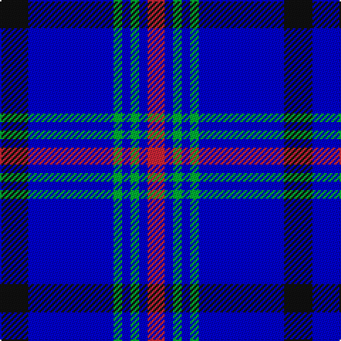

In pattern [KBGBGBR](/patterns/kbgbgbr/).

This was sourced from register-of-tartans.  It is a [7 stripes tartan](/stripes/stripes7/).

Original link https://www.tartanregister.gov.uk/tartanDetails.aspx?ref=10091

## Thread count
K/20 B60 G6 B6 G6 B6 R/12

## Palette
Each colour and its ΔE from the base-6 reference it is a variant of.

| Colour | Shade | Base | ΔE (OKLab) |
|---|---|---|---|
| B | <code style="background-color:#0000CD;">#0000CD</code> `#0000CD` | B <code style="background-color:#2A418A;">#2A418A</code> | 0.14 |
| G | <code style="background-color:#00AF33;">#00AF33</code> `#00AF33` | G <code style="background-color:#006100;">#006100</code> | 0.24 |
| K | <code style="background-color:#101010;">#101010</code> `#101010` | K <code style="background-color:#000000;">#000000</code> | 0.17 |
| R | <code style="background-color:#C82536;">#C82536</code> `#C82536` | R <code style="background-color:#CC0000;">#CC0000</code> | 0.04 |

# Sample pattern

## Nearest tartans

The nearest existing variants by ΔTartan distance.

1. [Auto Docs](/setts/s8/b30ba2k9w3b6w4k3ba6~b000080-ba2c4084-k101010-wffffff~x2/) — ΔT 1.14
1. [Hannah (Personal)](/setts/s6/w2b35k9w3k9y2~b003df5-k101010-wffffff-yffe600~x2/) — ΔT 1.25
1. [Lytley alias Parsons Hunting (Personal)](/setts/s5/b10r1y1ba3y2~b0000cd-ba000080-rff0000-yffe600~x5/) — ΔT 1.28
1. [Hoosier (Fashion)](/setts/s8/b15ba65y7b4y3ba30b15w3~b1474b4-ba1c0070-we0e0e0-ye8c000~x2/) — ΔT 1.54
1. [Callaway (Name)](/setts/s9/r4b12ba36w4ba4b16w3ba6b3~b2474e8-ba2c2c80-rc80000-we0e0e0~x2/) — ΔT 1.60
1. [Instakilt, Blue (Fashion)](/setts/s7/b8w4b50k12b4k15r5~b6840fc-k101010-re40018-wf8f8f8~x2/) — ΔT 1.63
1. [Bermuda Blue](/setts/s13/b12r4ba4b42r6b6ba11b6g19b8r4b6ba6~b3474fc-ba000064-g004c00-rb00000/) — ΔT 1.66
1. [Int. Police Association (Official)](/setts/s7/b7r3b26ba2b2ba26y4~b1c0070-ba5c8ca8-rc80000-ye8c000~x2/) — ΔT 1.69
1. [Indigo Blue Works](/setts/s11/b9k1ba4k1b18bb5k1bb1k1bb5b4~b000050-ba304080-bb8080d0-k000000~x2/) — ΔT 1.69
1. [Jethart (District)](/setts/s9/k22b16r3b16k2b16g3b3w5~b3850c8-g289c18-k101010-r880000-w98c8e8~x2/) — ΔT 1.70

## Neighbour map

Every grey dot is one of 15726 variants placed by the first two principal components of the ΔTartan feature space (44% of its variance). Red is this tartan; blue dots are its nearest — click one to open its page.

<svg viewBox="0 0 640 380" role="img" style="max-width:100%;height:auto;border:1px solid #e0e0e0;border-radius:4px;display:block" xmlns="http://www.w3.org/2000/svg"><image href="/nn/cloud.v1.png" width="640" height="380"/><a href="/setts/s8/b30ba2k9w3b6w4k3ba6~b000080-ba2c4084-k101010-wffffff~x2/"><circle cx="297.3" cy="169.6" r="4" fill="#3465a4"><title>Auto Docs</title></circle></a><a href="/setts/s6/w2b35k9w3k9y2~b003df5-k101010-wffffff-yffe600~x2/"><circle cx="317.2" cy="165.6" r="4" fill="#3465a4"><title>Hannah (Personal)</title></circle></a><a href="/setts/s5/b10r1y1ba3y2~b0000cd-ba000080-rff0000-yffe600~x5/"><circle cx="279.7" cy="200.1" r="4" fill="#3465a4"><title>Lytley alias Parsons Hunting (Personal)</title></circle></a><a href="/setts/s8/b15ba65y7b4y3ba30b15w3~b1474b4-ba1c0070-we0e0e0-ye8c000~x2/"><circle cx="403.0" cy="163.2" r="4" fill="#3465a4"><title>Hoosier (Fashion)</title></circle></a><a href="/setts/s9/r4b12ba36w4ba4b16w3ba6b3~b2474e8-ba2c2c80-rc80000-we0e0e0~x2/"><circle cx="300.6" cy="178.7" r="4" fill="#3465a4"><title>Callaway (Name)</title></circle></a><a href="/setts/s7/b8w4b50k12b4k15r5~b6840fc-k101010-re40018-wf8f8f8~x2/"><circle cx="348.9" cy="173.9" r="4" fill="#3465a4"><title>Instakilt, Blue (Fashion)</title></circle></a><a href="/setts/s13/b12r4ba4b42r6b6ba11b6g19b8r4b6ba6~b3474fc-ba000064-g004c00-rb00000/"><circle cx="293.6" cy="169.1" r="4" fill="#3465a4"><title>Bermuda Blue</title></circle></a><a href="/setts/s7/b7r3b26ba2b2ba26y4~b1c0070-ba5c8ca8-rc80000-ye8c000~x2/"><circle cx="285.3" cy="180.8" r="4" fill="#3465a4"><title>Int. Police Association (Official)</title></circle></a><a href="/setts/s11/b9k1ba4k1b18bb5k1bb1k1bb5b4~b000050-ba304080-bb8080d0-k000000~x2/"><circle cx="354.6" cy="162.2" r="4" fill="#3465a4"><title>Indigo Blue Works</title></circle></a><a href="/setts/s9/k22b16r3b16k2b16g3b3w5~b3850c8-g289c18-k101010-r880000-w98c8e8~x2/"><circle cx="281.0" cy="186.6" r="4" fill="#3465a4"><title>Jethart (District)</title></circle></a><circle cx="323.0" cy="191.5" r="5" fill="#c00000"/></svg>

ID: /setts/s7/k10b30g3b3g3b3r6~b0000cd-g00af33-k101010-rc82536~x2/
