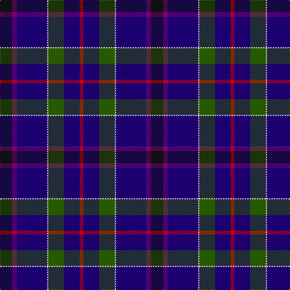

In pattern [KBBWGBR](/patterns/kbbwgbr/).

This was sourced from register-of-tartans.  It is a [7 stripes tartan](/stripes/stripes7/).

Original link https://www.tartanregister.gov.uk/tartanDetails.aspx?ref=11386

## Thread count
K/20 P8 DB50 LN2 G26 DB26 R/6

## Palette
Each colour and its ΔE from the base-6 reference it is a variant of.

| Colour | Shade | Base | ΔE (OKLab) |
|---|---|---|---|
| DB | <code style="background-color:#1C0070;">#1C0070</code> `#1C0070` | B <code style="background-color:#2A418A;">#2A418A</code> | 0.14 |
| G | <code style="background-color:#285800;">#285800</code> `#285800` | G <code style="background-color:#006100;">#006100</code> | 0.03 |
| K | <code style="background-color:#101010;">#101010</code> `#101010` | K <code style="background-color:#000000;">#000000</code> | 0.17 |
| LN | <code style="background-color:#E0E0E0;">#E0E0E0</code> `#E0E0E0` | W <code style="background-color:#F7F7F7;">#F7F7F7</code> | 0.07 |
| P | <code style="background-color:#780078;">#780078</code> `#780078` | B <code style="background-color:#2A418A;">#2A418A</code> | 0.17 |
| R | <code style="background-color:#D40000;">#D40000</code> `#D40000` | R <code style="background-color:#CC0000;">#CC0000</code> | 0.02 |

# Sample pattern

## Nearest tartans

The nearest existing variants by ΔTartan distance.

1. [Amarillo District Tartan Tartan Number: 2190. Earliest known date: 1996 Designed for the city of Amarillo in Texas, USA, by Dr. Phil Smith, at West Chester University in Penn. The tartan has been adopted by the city authorities. See products available Copyright © Blair Urquhart, Comrie, 2015](/setts/s11/b18k2ba2b9k4g9r4b9ba2k2y1x4~b2c2c80-ba2888c4-g006818-k101010-rc80000-ye8c000/) — ΔT 1.32
1. [Stewmann (2009) (Personal)](/setts/s9/g24b4g3ba11bb8ba37k3ba2y4x2~b5ea0f4-ba00137c-bb6a1058-g003807-k101010-yd7a0b5/) — ΔT 1.36
1. [Al-Fadhli (Personal)](/setts/s10/k17b24g3b3w3b3r3b24k17w1x2~b2c2c80-g006818-k101010-rc80000-we0e0e0/) — ΔT 1.36
1. [Barton-Watson, de](/setts/s8/b3k16r3g17ka16k26y1b3x2~b800080-g004010-k000030-ka000000-rc00020-yf0c000/) — ΔT 1.43
1. [St Andrew's College](/setts/s9/b18w2b2r3b21k28y1k1g2x2~b2c2c80-g289c18-k101010-rc80000-wf8f8f8-ye8c000/) — ΔT 1.44
1. [Pipers' Trail (Corporate)](/setts/s6/y4b8ba4k53bb54w2~b1474b4-ba780078-bb2c2c80-k101010-we0e0e0-ybc8c00/) — ΔT 1.44
1. [Gamblin Thompson (Personal)](/setts/s6/b2g13r2k6ba23w1x4~b2888c4-ba2c2c80-g408060-k101010-rc80000-wfcfcfc/) — ΔT 1.47
1. [Hatfield & Mize (Personal)](/setts/s6/g10w2b10y5ba35r6x2~b1c1c1c-ba202060-g003820-rc80000-wffffff-ye0a126/) — ΔT 1.52
1. [Lapsley, The Tom (Personal)](/setts/s8/b35g10ba10k10b23y1b3r2x2~b1c0070-ba5c8ca8-g006818-k101010-rc80000-ybc8c00/) — ΔT 1.53
1. [Diaspora](/setts/s6/b3g1r22k12b28w3x2~b003478-g003800-k000034-r8c0000-wc8c8c8/) — ΔT 1.53

## Neighbour map

Every grey dot is one of 15726 variants placed by the first two principal components of the ΔTartan feature space (44% of its variance). Red is this tartan; blue dots are its nearest — click one to open its page.

<svg viewBox="0 0 640 380" role="img" style="max-width:100%;height:auto;border:1px solid #e0e0e0;border-radius:4px;display:block" xmlns="http://www.w3.org/2000/svg"><image href="/nn/cloud.v1.png" width="640" height="380"/><a href="/setts/s11/b18k2ba2b9k4g9r4b9ba2k2y1x4~b2c2c80-ba2888c4-g006818-k101010-rc80000-ye8c000/"><circle cx="293.7" cy="145.6" r="4" fill="#3465a4"><title>Amarillo District Tartan Tartan Number: 2190. Earliest known date: 1996 Designed for the city of Amarillo in Texas, USA, by Dr. Phil Smith, at West Chester University in Penn. The tartan has been adopted by the city authorities. See products available Copyright © Blair Urquhart, Comrie, 2015</title></circle></a><a href="/setts/s9/g24b4g3ba11bb8ba37k3ba2y4x2~b5ea0f4-ba00137c-bb6a1058-g003807-k101010-yd7a0b5/"><circle cx="284.5" cy="144.1" r="4" fill="#3465a4"><title>Stewmann (2009) (Personal)</title></circle></a><a href="/setts/s10/k17b24g3b3w3b3r3b24k17w1x2~b2c2c80-g006818-k101010-rc80000-we0e0e0/"><circle cx="332.4" cy="154.1" r="4" fill="#3465a4"><title>Al-Fadhli (Personal)</title></circle></a><a href="/setts/s8/b3k16r3g17ka16k26y1b3x2~b800080-g004010-k000030-ka000000-rc00020-yf0c000/"><circle cx="260.4" cy="156.4" r="4" fill="#3465a4"><title>Barton-Watson, de</title></circle></a><a href="/setts/s9/b18w2b2r3b21k28y1k1g2x2~b2c2c80-g289c18-k101010-rc80000-wf8f8f8-ye8c000/"><circle cx="319.1" cy="117.8" r="4" fill="#3465a4"><title>St Andrew's College</title></circle></a><a href="/setts/s6/y4b8ba4k53bb54w2~b1474b4-ba780078-bb2c2c80-k101010-we0e0e0-ybc8c00/"><circle cx="292.3" cy="143.8" r="4" fill="#3465a4"><title>Pipers' Trail (Corporate)</title></circle></a><a href="/setts/s6/b2g13r2k6ba23w1x4~b2888c4-ba2c2c80-g408060-k101010-rc80000-wfcfcfc/"><circle cx="265.5" cy="145.2" r="4" fill="#3465a4"><title>Gamblin Thompson (Personal)</title></circle></a><a href="/setts/s6/g10w2b10y5ba35r6x2~b1c1c1c-ba202060-g003820-rc80000-wffffff-ye0a126/"><circle cx="251.8" cy="154.1" r="4" fill="#3465a4"><title>Hatfield &amp; Mize (Personal)</title></circle></a><a href="/setts/s8/b35g10ba10k10b23y1b3r2x2~b1c0070-ba5c8ca8-g006818-k101010-rc80000-ybc8c00/"><circle cx="376.0" cy="137.4" r="4" fill="#3465a4"><title>Lapsley, The Tom (Personal)</title></circle></a><a href="/setts/s6/b3g1r22k12b28w3x2~b003478-g003800-k000034-r8c0000-wc8c8c8/"><circle cx="279.5" cy="162.6" r="4" fill="#3465a4"><title>Diaspora</title></circle></a><circle cx="293.2" cy="163.7" r="5" fill="#c00000"/></svg>

ID: /setts/s7/k10b4ba25w1g13ba13r3x2~b780078-ba1c0070-g285800-k101010-rd40000-we0e0e0/
