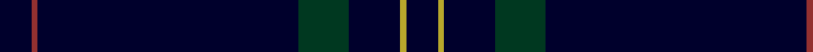
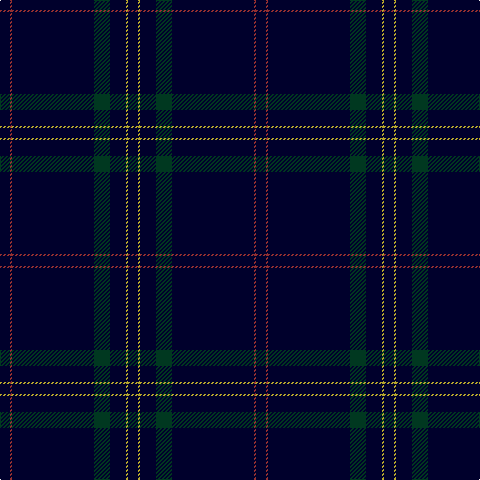

In pattern [KRKGKYK](/patterns/krkgkyk/).

This was sourced from register-of-tartans.  It is a [7 stripes tartan](/stripes/stripes7/).

Original link https://www.tartanregister.gov.uk/tartanDetails.aspx?ref=483

## Attestations

This cloth appears in 2 source records; the oldest owns this page.

- 01/08/2007 — Callaghan (register-of-tartans, [record](https://www.tartanregister.gov.uk/tartanDetails.aspx?ref=483))
- August 2007 — Callaghan (Name) (tartans-authority, [record](http://www.tartansauthority.com/tartan-ferret/display/7299/))

## Thread count
DBa/10 DR2 DBa82 DG16 DBa16 Y2 DBa/10

## Palette
Each colour and its ΔE from the base-6 reference it is a variant of.

| Colour | Shade | Base | ΔE (OKLab) |
|---|---|---|---|
| DB | <code style="background-color:#2C2C80;">#2C2C80</code> `#2C2C80` | B <code style="background-color:#2C4084;">#2C4084</code> | 0.05 |
| DBa | <code style="background-color:#00002C;">#00002C</code> `#00002C` | K <code style="background-color:#000000;">#000000</code> | 0.16 |
| DG | <code style="background-color:#003820;">#003820</code> `#003820` | G <code style="background-color:#006400;">#006400</code> | 0.16 |
| DR | <code style="background-color:#943030;">#943030</code> `#943030` | R <code style="background-color:#C80000;">#C80000</code> | 0.10 |
| G | <code style="background-color:#289C18;">#289C18</code> `#289C18` | G <code style="background-color:#006400;">#006400</code> | 0.18 |
| LN | <code style="background-color:#E0E0E0;">#E0E0E0</code> `#E0E0E0` | W <code style="background-color:#F4F4F0;">#F4F4F0</code> | 0.06 |
| Y | <code style="background-color:#B8A82C;">#B8A82C</code> `#B8A82C` | Y <code style="background-color:#E8C000;">#E8C000</code> | 0.10 |

# Sample pattern

## Nearest tartans

The nearest existing variants by ΔTartan distance.

1. [Cullen (Christian Hill)](/setts/s7/b16y4b16g14b114k6ba2-b202060-ba5c8ca8-g285800-k101010-yd09800/) — ΔT 1.62
1. [Laird (Restricted)](/setts/s9/k150g4k8b20ba2b8ba2b8k8-b780078-ba2c2c80-g006818-k101010/) — ΔT 2.20
1. [Pisniak (Personal)](/setts/s7/b80g6ba8b56y4ya4b14-b1c1c1c-ba440044-g003820-ybc8c00-yab8b8b8/) — ΔT 2.25
1. [Clan Inebriated (Corporate)](/setts/s9/k150b12r4k4r4b12k24ba4r4-b780078-ba1c0070-k101010-r888888/) — ΔT 2.26
1. [Selkirk Silver Band (Corporate)](/setts/s10/k150r2k8b30k4b2k6ba2k4r2-b5c5c5c-ba1c0070-k101010-r880000/) — ΔT 2.26
1. [Scotland's Lionheart](/setts/s9/k156g32k4b4k4g4k6r4k20-b4c4c4c-g686868-k101010-rac0034/) — ΔT 2.32
1. [Alich (Personal)](/setts/s4/k200r4b12ba4-b000080-ba551a8b-k101010-rd41a1f/) — ΔT 2.36
1. [CI (Corporate)](/setts/s9/k100b8r4k4r4b8k25ba10r4-b440044-ba1c1c50-k101010-r888888/) — ΔT 2.38
1. [Norwich No.030](/setts/s6/b66g6r2b66g6r2-b2c2c80-g006818-rc80000/) — ΔT 2.38
1. [Auchairne (Corporate)](/setts/s6/b22ba14b6ba140w8ba12-b1474b4-ba1c1c50-w98c8e8/) — ΔT 2.39

## Neighbour map

Every grey dot is one of 15726 variants placed by the first two principal components of the ΔTartan feature space (44% of its variance). Red is this tartan; blue dots are its nearest — click one to open its page.

<svg viewBox="0 0 640 380" role="img" style="max-width:100%;height:auto;border:1px solid #e0e0e0;border-radius:4px;display:block" xmlns="http://www.w3.org/2000/svg"><image href="/nn/cloud.v1.png" width="640" height="380"/><a href="/setts/s7/b16y4b16g14b114k6ba2-b202060-ba5c8ca8-g285800-k101010-yd09800/"><circle cx="626.0" cy="144.2" r="4" fill="#3465a4"><title>Cullen (Christian Hill)</title></circle></a><a href="/setts/s9/k150g4k8b20ba2b8ba2b8k8-b780078-ba2c2c80-g006818-k101010/"><circle cx="626.0" cy="125.0" r="4" fill="#3465a4"><title>Laird (Restricted)</title></circle></a><a href="/setts/s7/b80g6ba8b56y4ya4b14-b1c1c1c-ba440044-g003820-ybc8c00-yab8b8b8/"><circle cx="626.0" cy="197.5" r="4" fill="#3465a4"><title>Pisniak (Personal)</title></circle></a><a href="/setts/s9/k150b12r4k4r4b12k24ba4r4-b780078-ba1c0070-k101010-r888888/"><circle cx="626.0" cy="130.7" r="4" fill="#3465a4"><title>Clan Inebriated (Corporate)</title></circle></a><a href="/setts/s10/k150r2k8b30k4b2k6ba2k4r2-b5c5c5c-ba1c0070-k101010-r880000/"><circle cx="626.0" cy="121.0" r="4" fill="#3465a4"><title>Selkirk Silver Band (Corporate)</title></circle></a><a href="/setts/s9/k156g32k4b4k4g4k6r4k20-b4c4c4c-g686868-k101010-rac0034/"><circle cx="626.0" cy="132.6" r="4" fill="#3465a4"><title>Scotland's Lionheart</title></circle></a><a href="/setts/s4/k200r4b12ba4-b000080-ba551a8b-k101010-rd41a1f/"><circle cx="626.0" cy="204.2" r="4" fill="#3465a4"><title>Alich (Personal)</title></circle></a><a href="/setts/s9/k100b8r4k4r4b8k25ba10r4-b440044-ba1c1c50-k101010-r888888/"><circle cx="584.6" cy="165.4" r="4" fill="#3465a4"><title>CI (Corporate)</title></circle></a><a href="/setts/s6/b66g6r2b66g6r2-b2c2c80-g006818-rc80000/"><circle cx="626.0" cy="218.1" r="4" fill="#3465a4"><title>Norwich No.030</title></circle></a><a href="/setts/s6/b22ba14b6ba140w8ba12-b1474b4-ba1c1c50-w98c8e8/"><circle cx="611.6" cy="193.9" r="4" fill="#3465a4"><title>Auchairne (Corporate)</title></circle></a><circle cx="626.0" cy="187.1" r="5" fill="#c00000"/></svg>

ID: /setts/s7/k10r2k82g16k16y2k10-g003820-k00002c-r943030-yb8a82c/
