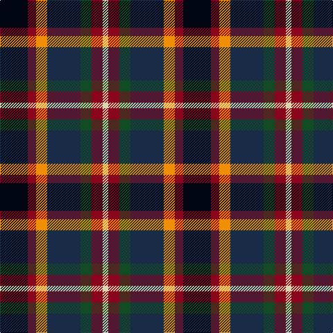

**Bands:** [KRYBGRW](/stripes/krybgrw/) · **Stripes:** [K R LO DT DG R W](/stripes/stripes7/) K R LO DT DG R W

This was sourced from register-of-tartans.  It is a [7 band tartan](/bands/bands7/).

Original link https://www.tartanregister.gov.uk/tartanDetails.aspx?ref=10584

## Register references

External register numbers recorded for this tartan.

- Scottish Register of Tartans: [10584](https://www.tartanregister.gov.uk/tartanDetails.aspx?ref=10584)

## Thread count
K/40 DR12 O16 DN48 G16 DR16 LR/8

## Palette
Each colour and its ΔE from the base-6 reference it is a variant of.

| Colour | Shade | Base | ΔE (OKLab) |
|---|---|---|---|
| DN | <code style="background-color:#1A2B47;">#1A2B47</code> `#1A2B47` | B <code style="background-color:#2A418A;">#2A418A</code> | 0.13 |
| DR | <code style="background-color:#89051B;">#89051B</code> `#89051B` | R <code style="background-color:#CC0000;">#CC0000</code> | 0.15 |
| G | <code style="background-color:#124B24;">#124B24</code> `#124B24` | G <code style="background-color:#006100;">#006100</code> | 0.09 |
| K | <code style="background-color:#010512;">#010512</code> `#010512` | K <code style="background-color:#000000;">#000000</code> | 0.12 |
| LR | <code style="background-color:#DDD5AF;">#DDD5AF</code> `#DDD5AF` | W <code style="background-color:#F7F7F7;">#F7F7F7</code> | 0.12 |
| O | <code style="background-color:#EF8F06;">#EF8F06</code> `#EF8F06` | Y <code style="background-color:#F2BF00;">#F2BF00</code> | 0.12 |

# Sample pattern

## Nearest tartans

The nearest existing variants by ΔTartan distance.

1. [Bro-Menez Are (Corporate)](/setts/s7/b8k25g13m5lo5r5m8~x2/) — ΔT 0.82
1. [Burnfoot Check](/setts/s8/r3dg2n2dg3k6db2o10db2~x2/) — ΔT 0.83
1. [Huntly Gordon](/setts/s6/ly2dg11k11n12dt3r2~x2/) — ΔT 0.88
1. [Caledonian Labrador Retrievers](/setts/s8/m21db4dr5db4m5k21g21ly5~x2/) — ΔT 0.93
1. [Mekos, The](/setts/s6/do19dg23lo3db15r11w5~x2/) — ΔT 0.98
1. [Jamestown Parish Church (Corporate)](/setts/s6/r3ly2g12k12db14w3~x2/) — ΔT 1.03
1. [Cumming LO](/setts/s9/b4k2b4k10y1dg10r4lr1r4~x2/) — ΔT 1.14
1. [Cumming LO](/setts/s9/b4k2b4k10y1dg10r4lr1r4/) — ΔT 1.14
1. [Celtic Women International](/setts/s9/r3db16m2db2m12k8g12k12w3~x2/) — ΔT 1.14
1. [Logan Rogers](/setts/s10/db2r2db2w1db8k8dg8r2dg2ly2~x2/) — ΔT 1.18

## Neighbour map

Every grey dot is one of 14313 variants placed by the first two principal components of the ΔTartan feature space (44% of its variance). Red is this tartan; blue dots are its nearest — click one to open its page.

<svg viewBox="0 0 640 380" role="img" style="max-width:100%;height:auto;border:1px solid #e0e0e0;border-radius:4px;display:block" xmlns="http://www.w3.org/2000/svg"><image href="/nn/cloud.v1.png" width="640" height="380"/><a href="/setts/s7/b8k25g13m5lo5r5m8~x2/"><circle cx="98.1" cy="212.5" r="4" fill="#3465a4"><title>Bro-Menez Are (Corporate)</title></circle></a><a href="/setts/s8/r3dg2n2dg3k6db2o10db2~x2/"><circle cx="60.7" cy="192.2" r="4" fill="#3465a4"><title>Burnfoot Check</title></circle></a><a href="/setts/s6/ly2dg11k11n12dt3r2~x2/"><circle cx="65.7" cy="209.6" r="4" fill="#3465a4"><title>Huntly Gordon</title></circle></a><a href="/setts/s8/m21db4dr5db4m5k21g21ly5~x2/"><circle cx="62.7" cy="189.6" r="4" fill="#3465a4"><title>Caledonian Labrador Retrievers</title></circle></a><a href="/setts/s6/do19dg23lo3db15r11w5~x2/"><circle cx="86.4" cy="216.8" r="4" fill="#3465a4"><title>Mekos, The</title></circle></a><a href="/setts/s6/r3ly2g12k12db14w3~x2/"><circle cx="74.8" cy="202.6" r="4" fill="#3465a4"><title>Jamestown Parish Church (Corporate)</title></circle></a><a href="/setts/s9/b4k2b4k10y1dg10r4lr1r4~x2/"><circle cx="84.5" cy="166.0" r="4" fill="#3465a4"><title>Cumming LO</title></circle></a><a href="/setts/s9/b4k2b4k10y1dg10r4lr1r4/"><circle cx="84.5" cy="166.0" r="4" fill="#3465a4"><title>Cumming LO</title></circle></a><a href="/setts/s9/r3db16m2db2m12k8g12k12w3~x2/"><circle cx="66.0" cy="180.2" r="4" fill="#3465a4"><title>Celtic Women International</title></circle></a><a href="/setts/s10/db2r2db2w1db8k8dg8r2dg2ly2~x2/"><circle cx="104.4" cy="175.8" r="4" fill="#3465a4"><title>Logan Rogers</title></circle></a><circle cx="66.8" cy="204.1" r="5" fill="#c00000"/></svg>

ID: /setts/s7/k10r3lo4dt12dg4r4w2~x4/
