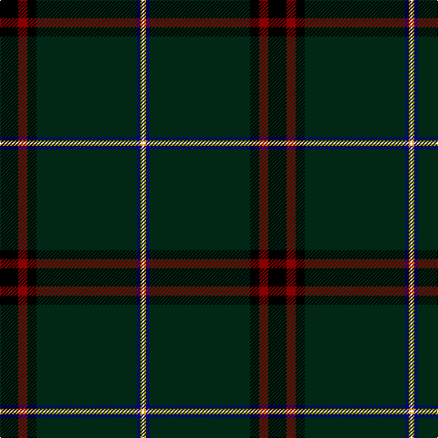

In pattern [KRKGBYW](/patterns/krkgbyw/).

This was sourced from register-of-tartans.  It is a [7 stripes tartan](/stripes/stripes7/).

Original link https://www.tartanregister.gov.uk/tartanDetails.aspx?ref=11362

## Thread count
K/20 DR10 K10 DG110 DB4 DY2 W/2

## Palette
Each colour and its ΔE from the base-6 reference it is a variant of.

| Colour | Shade | Base | ΔE (OKLab) |
|---|---|---|---|
| DB | <code style="background-color:#00008C;">#00008C</code> `#00008C` | B <code style="background-color:#2A418A;">#2A418A</code> | 0.13 |
| DG | <code style="background-color:#002814;">#002814</code> `#002814` | G <code style="background-color:#006100;">#006100</code> | 0.20 |
| DR | <code style="background-color:#880000;">#880000</code> `#880000` | R <code style="background-color:#CC0000;">#CC0000</code> | 0.15 |
| DY | <code style="background-color:#D09800;">#D09800</code> `#D09800` | Y <code style="background-color:#F2BF00;">#F2BF00</code> | 0.12 |
| K | <code style="background-color:#000000;">#000000</code> `#000000` | K <code style="background-color:#000000;">#000000</code> | 0.00 |
| W | <code style="background-color:#FFFFFF;">#FFFFFF</code> `#FFFFFF` | W <code style="background-color:#F7F7F7;">#F7F7F7</code> | 0.02 |

# Sample pattern

## Nearest tartans

The nearest existing variants by ΔTartan distance.

1. [Touch](/setts/s6/g5y1k5ga46k5r3x2~g808080-ga003000-k000000-rc00000-yf0c000/) — ΔT 1.33
1. [Christie (London) Hunting](/setts/s6/b60y11r5ba5k1ra4x2~b1e2925-ba47426a-k101010-r8b2316-raa37a28-ya2a093/) — ΔT 1.33
1. [Cumnock (District)](/setts/s8/g3b16k3ba2k45r1k2y3x2~b2c2c80-ba780078-g289c18-k101010-rc80000-yfcb464/) — ΔT 1.34
1. [Cumnock District Tartan Tartan Number: 10436. Earliest known date: March 2011 Based on the MacMillan hunting tartan in honour of the founder of the Cumnock Games, Councillor James McMillan. The blue is from the lion rampant in the Cumnock coat of arms. The orange and red commemorate the great iron ore blast furnaces at Lugar and the surrounding black is for the coal mines that fed those furnaces and formed the heart of the Cumnock community. Approved by Cumnock Community Council. See products available Copyright © Blair Urquhart, Comrie, 2015](/setts/s8/g3b16k3ba2k45r1k2y3x2~b34349c-ba780078-g289c18-k101010-rf80000-yf88000/) — ΔT 1.50
1. [Center (Name)](/setts/s8/k50b2k13w1k13b5g15r2x2~b1474b4-g006818-k101010-rc80000-we0e0e0/) — ΔT 1.55
1. [MTV](/setts/s7/b5k3b9g56ba4g2w3~b680028-ba5c8ca8-g003820-k101010-wfcfcfc/) — ΔT 1.58
1. [Moran Family Ubique](/setts/s10/g68k2g2k2g2y8r8k8y2b7x2~b2c4084-g002814-k101010-rc80028-yc89600/) — ΔT 1.63
1. [Ataç, H.M. & I.C. (Personal)](/setts/s8/b9g5w1g15k2g1k44r1x2~b000080-g006400-k101010-rff0000-wffffff/) — ΔT 1.65
1. [Watt (Corporate/Name)](/setts/s12/k96b8k12ba3k3ba3k3g20r8k3r4w4~b2c2c80-ba780078-g006818-k101010-rc80000-we0e0e0/) — ΔT 1.69
1. [Colleges Scotland (Corp)](/setts/s7/b1k50r1k2ba4bb7w1x2~b1474b4-ba5c5c5c-bb202060-k101010-rc80000-wfcfcfc/) — ΔT 1.70

## Neighbour map

Every grey dot is one of 15726 variants placed by the first two principal components of the ΔTartan feature space (44% of its variance). Red is this tartan; blue dots are its nearest — click one to open its page.

<svg viewBox="0 0 640 380" role="img" style="max-width:100%;height:auto;border:1px solid #e0e0e0;border-radius:4px;display:block" xmlns="http://www.w3.org/2000/svg"><image href="/nn/cloud.v1.png" width="640" height="380"/><a href="/setts/s6/g5y1k5ga46k5r3x2~g808080-ga003000-k000000-rc00000-yf0c000/"><circle cx="480.6" cy="129.1" r="4" fill="#3465a4"><title>Touch</title></circle></a><a href="/setts/s6/b60y11r5ba5k1ra4x2~b1e2925-ba47426a-k101010-r8b2316-raa37a28-ya2a093/"><circle cx="469.3" cy="107.7" r="4" fill="#3465a4"><title>Christie (London) Hunting</title></circle></a><a href="/setts/s8/g3b16k3ba2k45r1k2y3x2~b2c2c80-ba780078-g289c18-k101010-rc80000-yfcb464/"><circle cx="436.7" cy="94.8" r="4" fill="#3465a4"><title>Cumnock (District)</title></circle></a><a href="/setts/s8/g3b16k3ba2k45r1k2y3x2~b34349c-ba780078-g289c18-k101010-rf80000-yf88000/"><circle cx="432.9" cy="92.4" r="4" fill="#3465a4"><title>Cumnock District Tartan Tartan Number: 10436. Earliest known date: March 2011 Based on the MacMillan hunting tartan in honour of the founder of the Cumnock Games, Councillor James McMillan. The blue is from the lion rampant in the Cumnock coat of arms. The orange and red commemorate the great iron ore blast furnaces at Lugar and the surrounding black is for the coal mines that fed those furnaces and formed the heart of the Cumnock community. Approved by Cumnock Community Council. See products available Copyright © Blair Urquhart, Comrie, 2015</title></circle></a><a href="/setts/s8/k50b2k13w1k13b5g15r2x2~b1474b4-g006818-k101010-rc80000-we0e0e0/"><circle cx="513.2" cy="133.0" r="4" fill="#3465a4"><title>Center (Name)</title></circle></a><a href="/setts/s7/b5k3b9g56ba4g2w3~b680028-ba5c8ca8-g003820-k101010-wfcfcfc/"><circle cx="477.1" cy="137.0" r="4" fill="#3465a4"><title>MTV</title></circle></a><a href="/setts/s10/g68k2g2k2g2y8r8k8y2b7x2~b2c4084-g002814-k101010-rc80028-yc89600/"><circle cx="440.2" cy="101.8" r="4" fill="#3465a4"><title>Moran Family Ubique</title></circle></a><a href="/setts/s8/b9g5w1g15k2g1k44r1x2~b000080-g006400-k101010-rff0000-wffffff/"><circle cx="399.6" cy="117.3" r="4" fill="#3465a4"><title>Ataç, H.M. &amp; I.C. (Personal)</title></circle></a><a href="/setts/s12/k96b8k12ba3k3ba3k3g20r8k3r4w4~b2c2c80-ba780078-g006818-k101010-rc80000-we0e0e0/"><circle cx="443.9" cy="76.2" r="4" fill="#3465a4"><title>Watt (Corporate/Name)</title></circle></a><a href="/setts/s7/b1k50r1k2ba4bb7w1x2~b1474b4-ba5c5c5c-bb202060-k101010-rc80000-wfcfcfc/"><circle cx="579.9" cy="108.5" r="4" fill="#3465a4"><title>Colleges Scotland (Corp)</title></circle></a><circle cx="480.1" cy="105.0" r="5" fill="#c00000"/></svg>

ID: /setts/s7/k10r5k5g55b2y1w1x2~b00008c-g002814-k000000-r880000-wffffff-yd09800/
