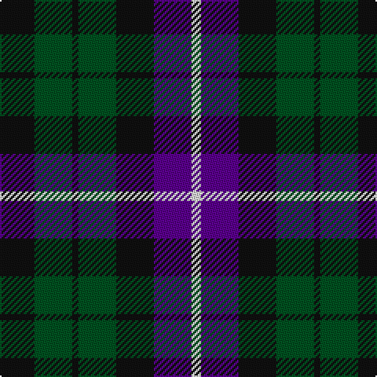

In pattern [KGKGKBW](/patterns/kgkgkbw/).

This was sourced from register-of-tartans.  It is a [7 stripes tartan](/stripes/stripes7/).

Original link https://www.tartanregister.gov.uk/tartanDetails.aspx?ref=4641

## Register references

External register numbers recorded for this tartan.

- Scottish Register of Tartans: [4641](https://www.tartanregister.gov.uk/tartanDetails.aspx?ref=4641)
- Scottish Tartans World Register: 1098

## Thread count
K/22 G24 K4 G24 K24 P24 LN/6

## Palette
Each colour and its ΔE from the base-6 reference it is a variant of.

| Colour | Shade | Base | ΔE (OKLab) |
|---|---|---|---|
| G | <code style="background-color:#005020;">#005020</code> `#005020` | G <code style="background-color:#006100;">#006100</code> | 0.07 |
| K | <code style="background-color:#101010;">#101010</code> `#101010` | K <code style="background-color:#000000;">#000000</code> | 0.17 |
| LN | <code style="background-color:#E0E0E0;">#E0E0E0</code> `#E0E0E0` | W <code style="background-color:#F7F7F7;">#F7F7F7</code> | 0.07 |
| P | <code style="background-color:#5A008C;">#5A008C</code> `#5A008C` | B <code style="background-color:#2A418A;">#2A418A</code> | 0.13 |

# Sample pattern

## Nearest tartans

The nearest existing variants by ΔTartan distance.

1. [MacNeil of Colonsay](/setts/s7/b4g6w1g6k6b6k2~b2c2c80-g285800-k101010-wffffff~x2/) — ΔT 0.49
1. [Abercrombie (Wilsons No 2/64)](/setts/s7/k6g6y1g6k6b6k1~b5a008c-g005020-k101010-ye8c000~x4/) — ΔT 0.55
1. [MacNeil of Colonsay Clan Tartan Tartan Number: 196. Earliest known date: 1906 This sett is the usual modern form that appeared in Johnston's publication of 1906. MacNeil tartans had been produced by Wilson's of Bannockburn since the earliest pattern book of 1819 and various changes were made to the sett. The present form of the tartan appears to be developed from Wilson's early samples. It is substantially different from the certified version in the Highland Society of London collection. See products available Copyright © Blair Urquhart, Comrie, 2015](/setts/s7/b4g6w1g6k6b6k2~b2c2c80-g006818-k101010-we0e0e0~x4/) — ΔT 0.70
1. [MacLaggan](/setts/s7/k13g12w2g12k13b12k2~b440044-g006818-k101010-wffffff~x2/) — ΔT 0.72
1. [MacLaggan Artifact Tartan Tartan Number: 1045. Earliest known date: pre 1856 Same as Graham of Montrose. From Baronage of Angus & Mearns 1856. Dalgety Archives say "Family . . . of Glenquiech". Is this Glen Quaich in Perthshire which runs from Amulree up into the hills that lead down to Kenmore on Loch Tay? See products available Copyright © Blair Urquhart, Comrie, 2015](/setts/s7/k7g6w1g6k7b7k1~b2c2c80-g006818-k101010-we0e0e0~x4/) — ΔT 0.74
1. [MacNeil of Colonsay (Clan)](/setts/s7/b16g14w2g14k13b12k4~b202060-g006818-k101010-wfcfcfc~x2/) — ΔT 0.78
1. [MacIntyre Hunting Clan Tartan Tartan Number: 56. Earliest known date: 1930-50 This sample comes from the MacGregor-Hastie collection which forms the basis of the cloth archive of the Scottish Tartans Society. Some of the samples, including this one, were unmarked. One can assume that the sample dates between 1930 and 1950. See products available Copyright © Blair Urquhart, Comrie, 2015](/setts/s7/k12g12k2g12k12b12ba3~b2c2c80-ba5c8ca8-g006818-k101010~x2/) — ΔT 0.86
1. [Gunn - 1810 (Clan)](/setts/s6/r4g12k12g2b12g3~b1c0070-g006818-k101010-rc80000~x2/) — ΔT 0.89
1. [Graham of Montrose - 1850 (Clan)](/setts/s7/k9g9w2g9k9b9k3~b2c2c80-g006818-k101010-wfcfcfc~x2/) — ΔT 0.91
1. [Campbell of Breadalbane Clan Tartan Tartan Number: 1046. Earliest known date: 1810-15 The earliest reference to this pattern is called simply, Breadalbane. W. and A. Smith (1850) were the first to illustrate the sett in its present form. Wilson's of Bannockburn produced this pattern, the No. 64 or 'Abercrombie' in a variety of colours. (See Graham, MacCallum, Rollo.) See products available Copyright © Blair Urquhart, Comrie, 2015](/setts/s7/k9g9y2g9k9b9k3~b2c2c80-g006818-k101010-ye8c000~x2/) — ΔT 0.92

## Neighbour map

Every grey dot is one of 15726 variants placed by the first two principal components of the ΔTartan feature space (44% of its variance). Red is this tartan; blue dots are its nearest — click one to open its page.

<svg viewBox="0 0 640 380" role="img" style="max-width:100%;height:auto;border:1px solid #e0e0e0;border-radius:4px;display:block" xmlns="http://www.w3.org/2000/svg"><image href="/nn/cloud.v1.png" width="640" height="380"/><a href="/setts/s7/b4g6w1g6k6b6k2~b2c2c80-g285800-k101010-wffffff~x2/"><circle cx="158.5" cy="275.8" r="4" fill="#3465a4"><title>MacNeil of Colonsay</title></circle></a><a href="/setts/s7/k6g6y1g6k6b6k1~b5a008c-g005020-k101010-ye8c000~x4/"><circle cx="189.9" cy="274.5" r="4" fill="#3465a4"><title>Abercrombie (Wilsons No 2/64)</title></circle></a><a href="/setts/s7/b4g6w1g6k6b6k2~b2c2c80-g006818-k101010-we0e0e0~x4/"><circle cx="154.5" cy="275.2" r="4" fill="#3465a4"><title>MacNeil of Colonsay Clan Tartan Tartan Number: 196. Earliest known date: 1906 This sett is the usual modern form that appeared in Johnston's publication of 1906. MacNeil tartans had been produced by Wilson's of Bannockburn since the earliest pattern book of 1819 and various changes were made to the sett. The present form of the tartan appears to be developed from Wilson's early samples. It is substantially different from the certified version in the Highland Society of London collection. See products available Copyright © Blair Urquhart, Comrie, 2015</title></circle></a><a href="/setts/s7/k13g12w2g12k13b12k2~b440044-g006818-k101010-wffffff~x2/"><circle cx="182.6" cy="264.2" r="4" fill="#3465a4"><title>MacLaggan</title></circle></a><a href="/setts/s7/k7g6w1g6k7b7k1~b2c2c80-g006818-k101010-we0e0e0~x4/"><circle cx="190.3" cy="263.8" r="4" fill="#3465a4"><title>MacLaggan Artifact Tartan Tartan Number: 1045. Earliest known date: pre 1856 Same as Graham of Montrose. From Baronage of Angus &amp; Mearns 1856. Dalgety Archives say &quot;Family . . . of Glenquiech&quot;. Is this Glen Quaich in Perthshire which runs from Amulree up into the hills that lead down to Kenmore on Loch Tay? See products available Copyright © Blair Urquhart, Comrie, 2015</title></circle></a><a href="/setts/s7/b16g14w2g14k13b12k4~b202060-g006818-k101010-wfcfcfc~x2/"><circle cx="170.5" cy="265.1" r="4" fill="#3465a4"><title>MacNeil of Colonsay (Clan)</title></circle></a><a href="/setts/s7/k12g12k2g12k12b12ba3~b2c2c80-ba5c8ca8-g006818-k101010~x2/"><circle cx="177.2" cy="279.9" r="4" fill="#3465a4"><title>MacIntyre Hunting Clan Tartan Tartan Number: 56. Earliest known date: 1930-50 This sample comes from the MacGregor-Hastie collection which forms the basis of the cloth archive of the Scottish Tartans Society. Some of the samples, including this one, were unmarked. One can assume that the sample dates between 1930 and 1950. See products available Copyright © Blair Urquhart, Comrie, 2015</title></circle></a><a href="/setts/s6/r4g12k12g2b12g3~b1c0070-g006818-k101010-rc80000~x2/"><circle cx="164.3" cy="260.3" r="4" fill="#3465a4"><title>Gunn - 1810 (Clan)</title></circle></a><a href="/setts/s7/k9g9w2g9k9b9k3~b2c2c80-g006818-k101010-wfcfcfc~x2/"><circle cx="145.0" cy="286.9" r="4" fill="#3465a4"><title>Graham of Montrose - 1850 (Clan)</title></circle></a><a href="/setts/s7/k9g9y2g9k9b9k3~b2c2c80-g006818-k101010-ye8c000~x2/"><circle cx="155.6" cy="291.1" r="4" fill="#3465a4"><title>Campbell of Breadalbane Clan Tartan Tartan Number: 1046. Earliest known date: 1810-15 The earliest reference to this pattern is called simply, Breadalbane. W. and A. Smith (1850) were the first to illustrate the sett in its present form. Wilson's of Bannockburn produced this pattern, the No. 64 or 'Abercrombie' in a variety of colours. (See Graham, MacCallum, Rollo.) See products available Copyright © Blair Urquhart, Comrie, 2015</title></circle></a><circle cx="162.1" cy="271.9" r="5" fill="#c00000"/></svg>

ID: /setts/s7/k11g12k2g12k12b12w3~b5a008c-g005020-k101010-we0e0e0~x2/
