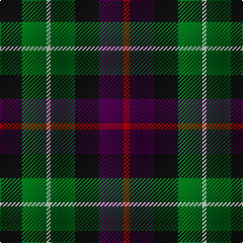

In pattern [KGWGKBR](/patterns/kgwgkbr/).

This was sourced from register-of-tartans.  It is a [7 stripes tartan](/stripes/stripes7/).

Original link https://www.tartanregister.gov.uk/tartanDetails.aspx?ref=845

## Thread count
K/22 G24 LN4 G24 K24 DP24 R/6

## Palette
Each colour and its ΔE from the base-6 reference it is a variant of.

| Colour | Shade | Base | ΔE (OKLab) |
|---|---|---|---|
| DP | <code style="background-color:#440044;">#440044</code> `#440044` | B <code style="background-color:#2A418A;">#2A418A</code> | 0.18 |
| G | <code style="background-color:#006818;">#006818</code> `#006818` | G <code style="background-color:#006100;">#006100</code> | 0.02 |
| K | <code style="background-color:#101010;">#101010</code> `#101010` | K <code style="background-color:#000000;">#000000</code> | 0.17 |
| LN | <code style="background-color:#E0E0E0;">#E0E0E0</code> `#E0E0E0` | W <code style="background-color:#F7F7F7;">#F7F7F7</code> | 0.07 |
| R | <code style="background-color:#C80000;">#C80000</code> `#C80000` | R <code style="background-color:#CC0000;">#CC0000</code> | 0.01 |

# Sample pattern

## Nearest tartans

The nearest existing variants by ΔTartan distance.

1. [Wilson's No.217](/setts/s8/b11ba2k10g10y3g10k10ba2x2~b440044-ba2888c4-g006818-k101010-ye8c000/) — ΔT 0.66
1. [Scottish Parliament (unofficial)](/setts/s7/b14g18k3g18r20k14y3x2~b1c0070-g006818-k101010-r880000-yd09800/) — ΔT 0.67
1. [Selkirk (Personal) Original](/setts/s8/b11g2k10ga10y2ga10k10g2x2~b780078-g789484-ga006818-k101010-yd09800/) — ΔT 0.71
1. [Wilson's No.176](/setts/s8/k8b3g13ba12y2ba12g13b3x2~b5c8ca8-ba440044-g006818-k101010-ye8c000/) — ΔT 0.75
1. [Tennant](/setts/s7/r1b7ba7k7g7b7r1x4~b401000-ba304080-g008000-k000000-rc00000/) — ΔT 0.86
1. [Brodie Hunting Clan Tartan Tartan Number: 1334. Earliest known date: 1891 The Hunting Brodie first appears in Whyte's first edition of 1891, published by W. and A.K. Johnston, at which time it seems to have been a recent design. D.W. Stewart remarks in his book, 'Old And Rare..'(1893), "of late a green tartan has been sold as undress or hunting Brodie..." See products available Copyright © Blair Urquhart, Comrie, 2015](/setts/s7/r2b8g8k8y1k8r2x2~b2c2c80-g006818-k101010-rc80000-ye8c000/) — ΔT 1.04
1. [MacLaggan](/setts/s7/k13g12w2g12k13b12k2x2~b440044-g006818-k101010-wffffff/) — ΔT 1.05
1. [Brodie Hunting](/setts/s7/r2b8g8k8y1k8r2x4~b5c8ca8-g006818-k101010-rc80000-yd09800/) — ΔT 1.10
1. [Wilson's No 97](/setts/s7/k11g12k2g12k12b12w3x2~b5a008c-g005020-k101010-we0e0e0/) — ΔT 1.11
1. [Arrol Corporate Tartan Tartan Number: 1365. Earliest known date: c.1910 From James Johnston & Co. (Glasgow) pattern book covering 1863 to 1963. Designed early 20th century for Sir William Arrol, head of the engineering firm which built Forth Bridge, and of the Arrol-Johnston motor car company, but it is not clear whether it was intended as a corporate tartan or for his personal use. See products available Copyright © Blair Urquhart, Comrie, 2015](/setts/s9/r5b15k15g15w2g15k15g15w2x2~b2c2c80-g006818-k101010-rc80000-we0e0e0/) — ΔT 1.14

## Neighbour map

Every grey dot is one of 15726 variants placed by the first two principal components of the ΔTartan feature space (44% of its variance). Red is this tartan; blue dots are its nearest — click one to open its page.

<svg viewBox="0 0 640 380" role="img" style="max-width:100%;height:auto;border:1px solid #e0e0e0;border-radius:4px;display:block" xmlns="http://www.w3.org/2000/svg"><image href="/nn/cloud.v1.png" width="640" height="380"/><a href="/setts/s8/b11ba2k10g10y3g10k10ba2x2~b440044-ba2888c4-g006818-k101010-ye8c000/"><circle cx="103.2" cy="237.6" r="4" fill="#3465a4"><title>Wilson's No.217</title></circle></a><a href="/setts/s7/b14g18k3g18r20k14y3x2~b1c0070-g006818-k101010-r880000-yd09800/"><circle cx="140.7" cy="241.8" r="4" fill="#3465a4"><title>Scottish Parliament (unofficial)</title></circle></a><a href="/setts/s8/b11g2k10ga10y2ga10k10g2x2~b780078-g789484-ga006818-k101010-yd09800/"><circle cx="116.0" cy="233.2" r="4" fill="#3465a4"><title>Selkirk (Personal) Original</title></circle></a><a href="/setts/s8/k8b3g13ba12y2ba12g13b3x2~b5c8ca8-ba440044-g006818-k101010-ye8c000/"><circle cx="147.6" cy="230.4" r="4" fill="#3465a4"><title>Wilson's No.176</title></circle></a><a href="/setts/s7/r1b7ba7k7g7b7r1x4~b401000-ba304080-g008000-k000000-rc00000/"><circle cx="119.0" cy="235.1" r="4" fill="#3465a4"><title>Tennant</title></circle></a><a href="/setts/s7/r2b8g8k8y1k8r2x2~b2c2c80-g006818-k101010-rc80000-ye8c000/"><circle cx="168.8" cy="224.8" r="4" fill="#3465a4"><title>Brodie Hunting Clan Tartan Tartan Number: 1334. Earliest known date: 1891 The Hunting Brodie first appears in Whyte's first edition of 1891, published by W. and A.K. Johnston, at which time it seems to have been a recent design. D.W. Stewart remarks in his book, 'Old And Rare..'(1893), &quot;of late a green tartan has been sold as undress or hunting Brodie...&quot; See products available Copyright © Blair Urquhart, Comrie, 2015</title></circle></a><a href="/setts/s7/k13g12w2g12k13b12k2x2~b440044-g006818-k101010-wffffff/"><circle cx="182.6" cy="264.2" r="4" fill="#3465a4"><title>MacLaggan</title></circle></a><a href="/setts/s7/r2b8g8k8y1k8r2x4~b5c8ca8-g006818-k101010-rc80000-yd09800/"><circle cx="152.7" cy="217.0" r="4" fill="#3465a4"><title>Brodie Hunting</title></circle></a><a href="/setts/s7/k11g12k2g12k12b12w3x2~b5a008c-g005020-k101010-we0e0e0/"><circle cx="162.1" cy="271.9" r="4" fill="#3465a4"><title>Wilson's No 97</title></circle></a><a href="/setts/s9/r5b15k15g15w2g15k15g15w2x2~b2c2c80-g006818-k101010-rc80000-we0e0e0/"><circle cx="162.5" cy="226.4" r="4" fill="#3465a4"><title>Arrol Corporate Tartan Tartan Number: 1365. Earliest known date: c.1910 From James Johnston &amp; Co. (Glasgow) pattern book covering 1863 to 1963. Designed early 20th century for Sir William Arrol, head of the engineering firm which built Forth Bridge, and of the Arrol-Johnston motor car company, but it is not clear whether it was intended as a corporate tartan or for his personal use. See products available Copyright © Blair Urquhart, Comrie, 2015</title></circle></a><circle cx="128.3" cy="252.0" r="5" fill="#c00000"/></svg>

ID: /setts/s7/k11g12w2g12k12b12r3x2~b440044-g006818-k101010-rc80000-we0e0e0/
