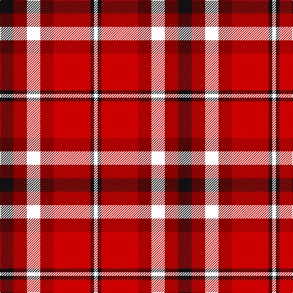

**Bands:** [KRWRRKW](/stripes/krwrrkw/) · **Stripes:** [K R W R R K W](/stripes/stripes7/) K R W R R K W

This was sourced from register-of-tartans.  It is a [7 band tartan](/bands/bands7/).

Original link https://www.tartanregister.gov.uk/tartanDetails.aspx?ref=10173

## Attestations

This cloth appears in 2 source records; the oldest owns this page.

- 23/12/2009 — Swallow (Personal) (register-of-tartans, [record](https://www.tartanregister.gov.uk/tartanDetails.aspx?ref=10173))
- 23rd Dec. 2009 — Swallow (Personal) (tartans-authority, [record](http://www.tartansauthority.com/tartan-ferret/display/10173/))

## Register references

External register numbers recorded for this tartan.

- Scottish Register of Tartans: [10173](https://www.tartanregister.gov.uk/tartanDetails.aspx?ref=10173)

## Thread count
K/22 DR22 W22 DR22 R60 K6 W/6

## Palette
Each colour and its ΔE from the base-6 reference it is a variant of.

| Colour | Shade | Base | ΔE (OKLab) |
|---|---|---|---|
| DR | <code style="background-color:#8B0000;">#8B0000</code> `#8B0000` | R <code style="background-color:#CC0000;">#CC0000</code> | 0.14 |
| K | <code style="background-color:#101010;">#101010</code> `#101010` | K <code style="background-color:#000000;">#000000</code> | 0.17 |
| R | <code style="background-color:#CD0000;">#CD0000</code> `#CD0000` | R <code style="background-color:#CC0000;">#CC0000</code> | 0.00 |
| W | <code style="background-color:#FFFFFF;">#FFFFFF</code> `#FFFFFF` | W <code style="background-color:#F7F7F7;">#F7F7F7</code> | 0.02 |

# Sample pattern

## Nearest tartans

The nearest existing variants by ΔTartan distance.

1. [St. Andrews (Queens University) (Cor](/setts/s8/dy11db1dy11w10db1r11db1r11~x2/) — ΔT 1.23
1. [MacTavish](/setts/s6/lb2r12db2lb6k6lb1~x2/) — ΔT 1.25
1. [Gigha, Cherry (Dance)](/setts/s8/r4r3r18r18w18r1w2r4~x2/) — ΔT 1.35
1. [Graham Red](/setts/s9/lr1k1r10g10k5lr5r10k1lr1~x4/) — ΔT 1.44
1. [MacNaughton (Logan) #2](/setts/s9/k2db2r26dg25k13db13r26db2k2~x2/) — ΔT 1.46
1. [Ballater](/setts/s9/r12w2o3w2r3k5r2o18w2~x2/) — ΔT 1.48
1. [Thermos Un-named (aretefact)](/setts/s6/k6r20w2r9w3lb2~x2/) — ΔT 1.50
1. [Afternoon Tea / Apple Tea](/setts/s6/ly15r98do72m25do8w15/) — ΔT 1.52
1. [Montrose](/setts/s9/lb2k2r14dg15k8lb7r14k2lb2/) — ΔT 1.53
1. [Thirkill (Dalgliesh)](/setts/s7/ly6k8g7r6k2r18w6~x4/) — ΔT 1.54

## Neighbour map

Every grey dot is one of 14313 variants placed by the first two principal components of the ΔTartan feature space (44% of its variance). Red is this tartan; blue dots are its nearest — click one to open its page.

<svg viewBox="0 0 640 380" role="img" style="max-width:100%;height:auto;border:1px solid #e0e0e0;border-radius:4px;display:block" xmlns="http://www.w3.org/2000/svg"><image href="/nn/cloud.v1.png" width="640" height="380"/><a href="/setts/s8/dy11db1dy11w10db1r11db1r11~x2/"><circle cx="200.8" cy="190.2" r="4" fill="#3465a4"><title>St. Andrews (Queens University) (Cor</title></circle></a><a href="/setts/s6/lb2r12db2lb6k6lb1~x2/"><circle cx="186.2" cy="173.4" r="4" fill="#3465a4"><title>MacTavish</title></circle></a><a href="/setts/s8/r4r3r18r18w18r1w2r4~x2/"><circle cx="207.4" cy="143.9" r="4" fill="#3465a4"><title>Gigha, Cherry (Dance)</title></circle></a><a href="/setts/s9/lr1k1r10g10k5lr5r10k1lr1~x4/"><circle cx="201.4" cy="171.6" r="4" fill="#3465a4"><title>Graham Red</title></circle></a><a href="/setts/s9/k2db2r26dg25k13db13r26db2k2~x2/"><circle cx="230.5" cy="161.5" r="4" fill="#3465a4"><title>MacNaughton (Logan) #2</title></circle></a><a href="/setts/s9/r12w2o3w2r3k5r2o18w2~x2/"><circle cx="223.4" cy="162.4" r="4" fill="#3465a4"><title>Ballater</title></circle></a><a href="/setts/s6/k6r20w2r9w3lb2~x2/"><circle cx="227.0" cy="162.2" r="4" fill="#3465a4"><title>Thermos Un-named (aretefact)</title></circle></a><a href="/setts/s6/ly15r98do72m25do8w15/"><circle cx="221.4" cy="162.3" r="4" fill="#3465a4"><title>Afternoon Tea / Apple Tea</title></circle></a><a href="/setts/s9/lb2k2r14dg15k8lb7r14k2lb2/"><circle cx="159.3" cy="184.0" r="4" fill="#3465a4"><title>Montrose</title></circle></a><a href="/setts/s7/ly6k8g7r6k2r18w6~x4/"><circle cx="149.7" cy="180.2" r="4" fill="#3465a4"><title>Thirkill (Dalgliesh)</title></circle></a><circle cx="163.5" cy="176.8" r="5" fill="#c00000"/></svg>

ID: /setts/s7/k11r11w11r11r30k3w3~x2/
