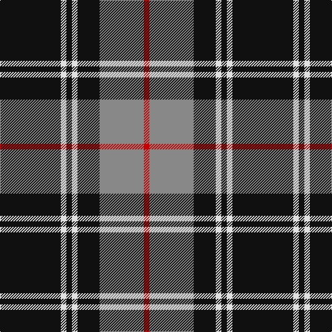

In pattern [KWKWKRR](/stripes/kwkwkrr/).

This was sourced from tartans-authority.  It is a [7 stripe tartan](/stripes/stripes7/).

Original link http://www.tartansauthority.com/tartan-ferret/display/7538/

## Also known as

This cloth is also recorded under:

- Dunfermline Athletic Football Club New Pars

## Attestations

This cloth appears in 2 source records; the oldest owns this page.

- 2005 — Dunfermline Athletic (2008) (Corp) (tartans-authority, [record](http://www.tartansauthority.com/tartan-ferret/display/7538/))
- undated — Dunfermline Athletic Football Club New Pars (2008) (register-of-tartans, [record](https://www.tartanregister.gov.uk/tartanDetails.aspx?ref=5573))

## Register references

External register numbers recorded for this tartan.

- Scottish Register of Tartans: [5573](https://www.tartanregister.gov.uk/tartanDetails.aspx?ref=5573)
- Scottish Tartans Authority (ITI): 7538

## Thread count
K/88 LN8 K8 LN8 K32 N64 R/8

## Palette
Each colour and its ΔE from the base-6 reference it is a variant of.

| Colour | Shade | Base | ΔE (OKLab) |
|---|---|---|---|
| K | <code style="background-color:#101010;">#101010</code> `#101010` | K <code style="background-color:#000000;">#000000</code> | 0.17 |
| LN | <code style="background-color:#E0E0E0;">#E0E0E0</code> `#E0E0E0` | W <code style="background-color:#F7F7F7;">#F7F7F7</code> | 0.07 |
| N | <code style="background-color:#888888;">#888888</code> `#888888` | R <code style="background-color:#CC0000;">#CC0000</code> | 0.24 |
| R | <code style="background-color:#C80000;">#C80000</code> `#C80000` | R <code style="background-color:#CC0000;">#CC0000</code> | 0.01 |

# Sample pattern

## Nearest tartans

The nearest existing variants by ΔTartan distance.

1. [Callaway (Corporate)](/setts/s6/r1k10n2lb5k5r1~x4/) — ΔT 0.80
1. [Bro-Wened](/setts/s6/k43r10w3k3w15db3~x2/) — ΔT 0.85
1. [Corrie](/setts/s8/dt14o1dt1o1dt6o14w1o1~x4/) — ΔT 1.03
1. [Australian Police](/setts/s8/k5w5k5t11k3y17k30t3~x2/) — ΔT 1.06
1. [Moffat (1984)](/setts/s7/k39o3k3o3k14o28r3~x2/) — ΔT 1.11
1. [West Point](/setts/s8/k13o1k1o1k4o10ly1o1~x6/) — ΔT 1.12
1. [Coalfields Regeneration Trust, The](/setts/s7/k2r1ly1y8k15y2dp1~x4/) — ΔT 1.14
1. [Wild Highlanders (Corporate)](/setts/s7/k36w3k10w3g28r6k18~x2/) — ΔT 1.15
1. [West Point Military Academy (Mil.)](/setts/s8/k10o1k2o1k4o10ly1o2~x4/) — ΔT 1.16
1. [Woodberry Forest School (Corporate)](/setts/s10/r6k3w3k3w3k34r6g5r6k5~x2/) — ΔT 1.19

## Neighbour map

Every grey dot is one of 14299 variants placed by the first two principal components of the ΔTartan feature space (44% of its variance). Red is this tartan; blue dots are its nearest — click one to open its page.

<svg viewBox="0 0 640 380" role="img" style="max-width:100%;height:auto;border:1px solid #e0e0e0;border-radius:4px;display:block" xmlns="http://www.w3.org/2000/svg"><image href="/nn/cloud.v1.png" width="640" height="380"/><a href="/setts/s6/r1k10n2lb5k5r1~x4/"><circle cx="309.4" cy="208.8" r="4" fill="#3465a4"><title>Callaway (Corporate)</title></circle></a><a href="/setts/s6/k43r10w3k3w15db3~x2/"><circle cx="317.2" cy="162.1" r="4" fill="#3465a4"><title>Bro-Wened</title></circle></a><a href="/setts/s8/dt14o1dt1o1dt6o14w1o1~x4/"><circle cx="325.7" cy="166.1" r="4" fill="#3465a4"><title>Corrie</title></circle></a><a href="/setts/s8/k5w5k5t11k3y17k30t3~x2/"><circle cx="258.0" cy="188.9" r="4" fill="#3465a4"><title>Australian Police</title></circle></a><a href="/setts/s7/k39o3k3o3k14o28r3~x2/"><circle cx="372.9" cy="198.0" r="4" fill="#3465a4"><title>Moffat (1984)</title></circle></a><a href="/setts/s8/k13o1k1o1k4o10ly1o1~x6/"><circle cx="351.6" cy="182.5" r="4" fill="#3465a4"><title>West Point</title></circle></a><a href="/setts/s7/k2r1ly1y8k15y2dp1~x4/"><circle cx="310.7" cy="149.4" r="4" fill="#3465a4"><title>Coalfields Regeneration Trust, The</title></circle></a><a href="/setts/s7/k36w3k10w3g28r6k18~x2/"><circle cx="329.2" cy="209.0" r="4" fill="#3465a4"><title>Wild Highlanders (Corporate)</title></circle></a><a href="/setts/s8/k10o1k2o1k4o10ly1o2~x4/"><circle cx="309.6" cy="202.1" r="4" fill="#3465a4"><title>West Point Military Academy (Mil.)</title></circle></a><a href="/setts/s10/r6k3w3k3w3k34r6g5r6k5~x2/"><circle cx="325.5" cy="150.1" r="4" fill="#3465a4"><title>Woodberry Forest School (Corporate)</title></circle></a><circle cx="311.8" cy="182.6" r="5" fill="#c00000"/></svg>

ID: /setts/s7/k11w1k1w1k4o8r1~x8/
