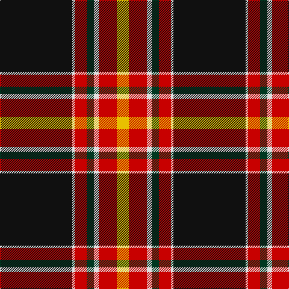

In pattern [KWRGWRY](/patterns/kwrgwry/).

This was sourced from tartans-authority.  It is a [7 stripes tartan](/stripes/stripes7/).

Original link http://www.tartansauthority.com/tartan-ferret/display/6972/

## Thread count
K/120 LN4 R20 DG12 LN8 R30 Y/20

## Palette
Each colour and its ΔE from the base-6 reference it is a variant of.

| Colour | Shade | Base | ΔE (OKLab) |
|---|---|---|---|
| DG | <code style="background-color:#003820;">#003820</code> `#003820` | G <code style="background-color:#006100;">#006100</code> | 0.15 |
| K | <code style="background-color:#101010;">#101010</code> `#101010` | K <code style="background-color:#000000;">#000000</code> | 0.17 |
| LN | <code style="background-color:#E0E0E0;">#E0E0E0</code> `#E0E0E0` | W <code style="background-color:#F7F7F7;">#F7F7F7</code> | 0.07 |
| R | <code style="background-color:#C80000;">#C80000</code> `#C80000` | R <code style="background-color:#CC0000;">#CC0000</code> | 0.01 |
| Y | <code style="background-color:#E8C000;">#E8C000</code> `#E8C000` | Y <code style="background-color:#F2BF00;">#F2BF00</code> | 0.02 |

# Sample pattern

## Nearest tartans

The nearest existing variants by ΔTartan distance.

1. [Superstition Fire Honor Guard Pipes & Drums](/setts/s9/b24w2b4k6r30k2y4k78r4-b5f749c-k101010-rff0000-wffffff-ye0a126/) — ΔT 0.90
1. [Distripress (Corporate)](/setts/s8/r12k2w8k8b30r2k70ra4-b5c5c5c-k101010-rc80000-ra888888-we0e0e0/) — ΔT 1.10
1. [MacEvil (Corporate)](/setts/s8/r35w8k85ra6k4ra14k2b4-b780078-k101010-r880000-ra888888-we0e0e0/) — ΔT 1.12
1. [Gedling, Peter (Personal)](/setts/s9/r16y18b6ya2b2ya4b4k64b6-b6c0070-k101010-rff0000-y48a4c0-yaffe600/) — ΔT 1.14
1. [Livingstone, MacLay MacLeay](/setts/s7/r56g8k8g8k8b12y2-b5480b0-g008000-k000000-rc00000-yf0c000/) — ΔT 1.20
1. [Royal College of G.P.s (Corporate)](/setts/s8/y16k100r30g12r12b6r12y4-b2c2c80-g003820-k101010-r888888-yd87c00/) — ΔT 1.21
1. [Legion of Frontiersmen](/setts/s8/b124y14g14r6w6ba26w6r10-b441800-ba000048-g008b00-rc80000-wffffff-yffd700/) — ΔT 1.24
1. [Westin Kierland](/setts/s8/r4k74ra20b6ra10y8ra6w4-b2c2c80-k101010-rb84c00-rac80000-wfcfcfc-ye8c000/) — ΔT 1.24
1. [Dunlop](/setts/s8/k6r2k60w2ra56g2ra2w6-g008000-k000000-rc00000-ra806050-we0e0e0/) — ΔT 1.28
1. [Papua New Guinea Pipes and Drums](/setts/s5/g6y10r26k66w4-g309c18-k101010-rdc0000-we0e0e0-ye8c000/) — ΔT 1.29

## Neighbour map

Every grey dot is one of 15726 variants placed by the first two principal components of the ΔTartan feature space (44% of its variance). Red is this tartan; blue dots are its nearest — click one to open its page.

<svg viewBox="0 0 640 380" role="img" style="max-width:100%;height:auto;border:1px solid #e0e0e0;border-radius:4px;display:block" xmlns="http://www.w3.org/2000/svg"><image href="/nn/cloud.v1.png" width="640" height="380"/><a href="/setts/s9/b24w2b4k6r30k2y4k78r4-b5f749c-k101010-rff0000-wffffff-ye0a126/"><circle cx="333.1" cy="82.8" r="4" fill="#3465a4"><title>Superstition Fire Honor Guard Pipes &amp; Drums</title></circle></a><a href="/setts/s8/r12k2w8k8b30r2k70ra4-b5c5c5c-k101010-rc80000-ra888888-we0e0e0/"><circle cx="351.7" cy="108.6" r="4" fill="#3465a4"><title>Distripress (Corporate)</title></circle></a><a href="/setts/s8/r35w8k85ra6k4ra14k2b4-b780078-k101010-r880000-ra888888-we0e0e0/"><circle cx="358.8" cy="97.2" r="4" fill="#3465a4"><title>MacEvil (Corporate)</title></circle></a><a href="/setts/s9/r16y18b6ya2b2ya4b4k64b6-b6c0070-k101010-rff0000-y48a4c0-yaffe600/"><circle cx="287.6" cy="87.7" r="4" fill="#3465a4"><title>Gedling, Peter (Personal)</title></circle></a><a href="/setts/s7/r56g8k8g8k8b12y2-b5480b0-g008000-k000000-rc00000-yf0c000/"><circle cx="308.4" cy="108.6" r="4" fill="#3465a4"><title>Livingstone, MacLay MacLeay</title></circle></a><a href="/setts/s8/y16k100r30g12r12b6r12y4-b2c2c80-g003820-k101010-r888888-yd87c00/"><circle cx="293.2" cy="119.9" r="4" fill="#3465a4"><title>Royal College of G.P.s (Corporate)</title></circle></a><a href="/setts/s8/b124y14g14r6w6ba26w6r10-b441800-ba000048-g008b00-rc80000-wffffff-yffd700/"><circle cx="312.8" cy="91.5" r="4" fill="#3465a4"><title>Legion of Frontiersmen</title></circle></a><a href="/setts/s8/r4k74ra20b6ra10y8ra6w4-b2c2c80-k101010-rb84c00-rac80000-wfcfcfc-ye8c000/"><circle cx="294.3" cy="100.8" r="4" fill="#3465a4"><title>Westin Kierland</title></circle></a><a href="/setts/s8/k6r2k60w2ra56g2ra2w6-g008000-k000000-rc00000-ra806050-we0e0e0/"><circle cx="301.5" cy="101.4" r="4" fill="#3465a4"><title>Dunlop</title></circle></a><a href="/setts/s5/g6y10r26k66w4-g309c18-k101010-rdc0000-we0e0e0-ye8c000/"><circle cx="306.2" cy="157.0" r="4" fill="#3465a4"><title>Papua New Guinea Pipes and Drums</title></circle></a><circle cx="313.7" cy="110.0" r="5" fill="#c00000"/></svg>

ID: /setts/s7/k120w4r20g12w8r30y20-g003820-k101010-rc80000-we0e0e0-ye8c000/
