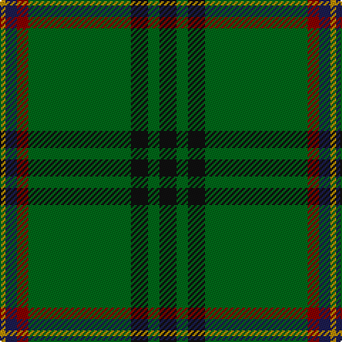

In pattern [KGKGRBY](/patterns/kgkgrby/).

This was sourced from house-of-tartan.  It is a [7 stripes tartan](/stripes/stripes7/).

Original link http://www.house-of-tartan.scotland.net/house/TartanViewjs.asp?colr=Def&tnam=7566

## Thread count
DY/4 DBa8 DRa8 Ga72 K12 Ga8 K/12

## Palette
Each colour and its ΔE from the base-6 reference it is a variant of.

| Colour | Shade | Base | ΔE (OKLab) |
|---|---|---|---|
| DB | <code style="background-color:#2C2C80;">#2C2C80</code> `#2C2C80` | B <code style="background-color:#2C4084;">#2C4084</code> | 0.05 |
| DBa | <code style="background-color:#1C1C50;">#1C1C50</code> `#1C1C50` | B <code style="background-color:#2C4084;">#2C4084</code> | 0.14 |
| DR | <code style="background-color:#780028;">#780028</code> `#780028` | R <code style="background-color:#C80000;">#C80000</code> | 0.18 |
| DRa | <code style="background-color:#880000;">#880000</code> `#880000` | R <code style="background-color:#C80000;">#C80000</code> | 0.14 |
| DY | <code style="background-color:#BC8C00;">#BC8C00</code> `#BC8C00` | Y <code style="background-color:#E8C000;">#E8C000</code> | 0.16 |
| DYa | <code style="background-color:#D09800;">#D09800</code> `#D09800` | Y <code style="background-color:#E8C000;">#E8C000</code> | 0.11 |
| G | <code style="background-color:#288028;">#288028</code> `#288028` | G <code style="background-color:#006400;">#006400</code> | 0.09 |
| Ga | <code style="background-color:#006818;">#006818</code> `#006818` | G <code style="background-color:#006400;">#006400</code> | 0.02 |
| K | <code style="background-color:#101010;">#101010</code> `#101010` | K <code style="background-color:#000000;">#000000</code> | 0.17 |

# Sample pattern

## Nearest tartans

The nearest existing variants by ΔTartan distance.

1. [Selvon-Bruce (Personal)](/setts/s7/k12g8k12g72r8b8y4-b1c1c50-g288028-k101010-r880000-ybc8c00/) — ΔT 0.86
1. [Crieff & Strathearn #1](/setts/s7/g110b14r48g24ba8y6ba8-b2c2c80-ba003c64-g006818-r880000-ye8c000/) — ΔT 0.86
1. [Military Medical Memorial (USA)(Corp](/setts/s6/b24w12r12g220k40r12-b2c2c80-g006818-k101010-rc80000-we0e0e0/) — ΔT 0.98
1. [Celtic (New) Corporate Sport Tartan Tartan Number: 2232. Earliest known date: 1842 Should have a white line (?). See products available Copyright © Blair Urquhart, Comrie, 2015](/setts/s8/g88k4g4k4g6k24b20r6-b2c2c80-g006818-k101010-rc80000/) — ΔT 1.05
1. [Celtic Pride](/setts/s8/g20y6w4k4g16k44g86ya8-g006818-k101010-wfcfcfc-ybc8c00-yaec8048/) — ΔT 1.08
1. [Marshall Fields Corporate Tartan Tartan Number: 747. Earliest known date: 1986 Long established and famous mail order company based in Chicago. For use in their production launch for the opening of the British production, Augst 1986 - Christmas 1986. See products available Copyright © Blair Urquhart, Comrie, 2015](/setts/s8/g80b4w4b4y4b46g64r4-b202060-g006818-rc80000-we0e0e0-ye8c000/) — ΔT 1.10
1. [Green Rover (Personal)](/setts/s7/y20k4g10k4ga92ya4k4-g289c18-ga285800-k101010-ya08858-yabc8c00/) — ΔT 1.15
1. [U.S. Army (Military)](/setts/s6/b12k34g8ga102y6gb8-b2c2c80-g8c7038-ga006818-gb408060-k101010-ye8c000/) — ΔT 1.17
1. [U.S. Army](/setts/s10/k34g8ga102y6gb8y6ga102g8k34b12-b2c2c80-g8c7038-ga006818-gb408060-k101010-ye8c000/) — ΔT 1.22
1. [Military Medical Memorial (USA)](/setts/s6/b24w12r12g220k40r12-b292e7f-g016819-k101010-rec1a1b-wffffff/) — ΔT 1.27

## Neighbour map

Every grey dot is one of 15726 variants placed by the first two principal components of the ΔTartan feature space (44% of its variance). Red is this tartan; blue dots are its nearest — click one to open its page.

<svg viewBox="0 0 640 380" role="img" style="max-width:100%;height:auto;border:1px solid #e0e0e0;border-radius:4px;display:block" xmlns="http://www.w3.org/2000/svg"><image href="/nn/cloud.v1.png" width="640" height="380"/><a href="/setts/s7/k12g8k12g72r8b8y4-b1c1c50-g288028-k101010-r880000-ybc8c00/"><circle cx="376.3" cy="152.0" r="4" fill="#3465a4"><title>Selvon-Bruce (Personal)</title></circle></a><a href="/setts/s7/g110b14r48g24ba8y6ba8-b2c2c80-ba003c64-g006818-r880000-ye8c000/"><circle cx="383.9" cy="170.3" r="4" fill="#3465a4"><title>Crieff &amp; Strathearn #1</title></circle></a><a href="/setts/s6/b24w12r12g220k40r12-b2c2c80-g006818-k101010-rc80000-we0e0e0/"><circle cx="419.5" cy="153.3" r="4" fill="#3465a4"><title>Military Medical Memorial (USA)(Corp</title></circle></a><a href="/setts/s8/g88k4g4k4g6k24b20r6-b2c2c80-g006818-k101010-rc80000/"><circle cx="416.1" cy="159.8" r="4" fill="#3465a4"><title>Celtic (New) Corporate Sport Tartan Tartan Number: 2232. Earliest known date: 1842 Should have a white line (?). See products available Copyright © Blair Urquhart, Comrie, 2015</title></circle></a><a href="/setts/s8/g20y6w4k4g16k44g86ya8-g006818-k101010-wfcfcfc-ybc8c00-yaec8048/"><circle cx="380.1" cy="148.4" r="4" fill="#3465a4"><title>Celtic Pride</title></circle></a><a href="/setts/s8/g80b4w4b4y4b46g64r4-b202060-g006818-rc80000-we0e0e0-ye8c000/"><circle cx="425.8" cy="161.0" r="4" fill="#3465a4"><title>Marshall Fields Corporate Tartan Tartan Number: 747. Earliest known date: 1986 Long established and famous mail order company based in Chicago. For use in their production launch for the opening of the British production, Augst 1986 - Christmas 1986. See products available Copyright © Blair Urquhart, Comrie, 2015</title></circle></a><a href="/setts/s7/y20k4g10k4ga92ya4k4-g289c18-ga285800-k101010-ya08858-yabc8c00/"><circle cx="450.0" cy="147.8" r="4" fill="#3465a4"><title>Green Rover (Personal)</title></circle></a><a href="/setts/s6/b12k34g8ga102y6gb8-b2c2c80-g8c7038-ga006818-gb408060-k101010-ye8c000/"><circle cx="335.6" cy="154.8" r="4" fill="#3465a4"><title>U.S. Army (Military)</title></circle></a><a href="/setts/s10/k34g8ga102y6gb8y6ga102g8k34b12-b2c2c80-g8c7038-ga006818-gb408060-k101010-ye8c000/"><circle cx="350.2" cy="139.1" r="4" fill="#3465a4"><title>U.S. Army</title></circle></a><a href="/setts/s6/b24w12r12g220k40r12-b292e7f-g016819-k101010-rec1a1b-wffffff/"><circle cx="408.7" cy="148.1" r="4" fill="#3465a4"><title>Military Medical Memorial (USA)</title></circle></a><circle cx="399.6" cy="164.3" r="5" fill="#c00000"/></svg>

ID: /setts/s7/k12g8k12g72r8b8y4-b1c1c50-g006818-k101010-r880000-ybc8c00/
