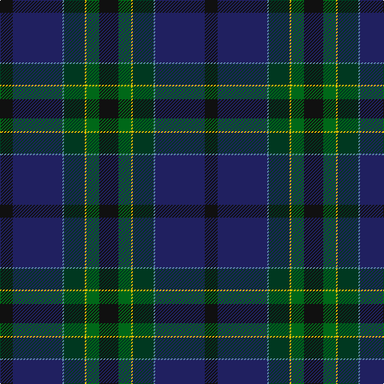

**Bands:** [KBBGYGK](/stripes/kbbgygk/) · **Stripes:** [K DB T DG LY G K](/stripes/stripes7/) K DB T DG LY G K

This was sourced from tartans-authority.  It is a [7 band tartan](/bands/bands7/).

Original link http://www.tartansauthority.com/tartan-ferret/display/11018/

## Thread count
K/16 DB62 B2 DG26 Y2 G16 K/24

## Palette
Each colour and its ΔE from the base-6 reference it is a variant of.

| Colour | Shade | Base | ΔE (OKLab) |
|---|---|---|---|
| B | <code style="background-color:#5C8CA8;">#5C8CA8</code> `#5C8CA8` | B <code style="background-color:#2A418A;">#2A418A</code> | 0.23 |
| DB | <code style="background-color:#202060;">#202060</code> `#202060` | B <code style="background-color:#2A418A;">#2A418A</code> | 0.11 |
| DG | <code style="background-color:#003820;">#003820</code> `#003820` | G <code style="background-color:#006100;">#006100</code> | 0.15 |
| G | <code style="background-color:#006818;">#006818</code> `#006818` | G <code style="background-color:#006100;">#006100</code> | 0.02 |
| K | <code style="background-color:#101010;">#101010</code> `#101010` | K <code style="background-color:#000000;">#000000</code> | 0.17 |
| Y | <code style="background-color:#E8C000;">#E8C000</code> `#E8C000` | Y <code style="background-color:#F2BF00;">#F2BF00</code> | 0.02 |

# Sample pattern

## Nearest tartans

The nearest existing variants by ΔTartan distance.

1. [Muir-Hill (Personal)](/setts/s7/w2k2r1dt20k15dg30ly1~x2/) — ΔT 0.97
1. [Nova Scotia Int. Tattoo (Corporate)](/setts/s7/db3t2db21k12dg24r1lo3~x2/) — ΔT 1.01
1. [Barton-Watson de Bavidge (Personal)](/setts/s8/dp3k16r3dg17k16k26ly1dp3~x2/) — ΔT 1.15
1. [Chesters, Eric (Personal)](/setts/s7/k12g8ly1dg13lb1db31k8~x2/) — ΔT 1.22
1. [Waterfront](/setts/s6/r2db38k20w1dg20r2/) — ΔT 1.23
1. [Robb Hunting (Personal)](/setts/s9/db2r1dg26ly1k18db26y1r1db2~x2/) — ΔT 1.30
1. [Little-Dowse Wedding](/setts/s8/do31lo6lr3db36do8dg60lo7t7~x2/) — ΔT 1.31
1. [Batten of Argyll (Baddenach)](/setts/s8/dp10k2dg10dp30dg30dg55k4r8/) — ΔT 1.36
1. [McMeeken](/setts/s10/o7dg20y2dg4k5db4k2db20k3w1~x2/) — ΔT 1.41
1. [Spirit of Alva (Fashion)](/setts/s10/db6dp10dp4dp11dg20k4dg8k21db47db2/) — ΔT 1.42

## Neighbour map

Every grey dot is one of 14313 variants placed by the first two principal components of the ΔTartan feature space (44% of its variance). Red is this tartan; blue dots are its nearest — click one to open its page.

<svg viewBox="0 0 640 380" role="img" style="max-width:100%;height:auto;border:1px solid #e0e0e0;border-radius:4px;display:block" xmlns="http://www.w3.org/2000/svg"><image href="/nn/cloud.v1.png" width="640" height="380"/><a href="/setts/s7/w2k2r1dt20k15dg30ly1~x2/"><circle cx="291.2" cy="160.8" r="4" fill="#3465a4"><title>Muir-Hill (Personal)</title></circle></a><a href="/setts/s7/db3t2db21k12dg24r1lo3~x2/"><circle cx="245.5" cy="172.7" r="4" fill="#3465a4"><title>Nova Scotia Int. Tattoo (Corporate)</title></circle></a><a href="/setts/s8/dp3k16r3dg17k16k26ly1dp3~x2/"><circle cx="307.0" cy="185.7" r="4" fill="#3465a4"><title>Barton-Watson de Bavidge (Personal)</title></circle></a><a href="/setts/s7/k12g8ly1dg13lb1db31k8~x2/"><circle cx="253.7" cy="164.3" r="4" fill="#3465a4"><title>Chesters, Eric (Personal)</title></circle></a><a href="/setts/s6/r2db38k20w1dg20r2/"><circle cx="355.4" cy="190.9" r="4" fill="#3465a4"><title>Waterfront</title></circle></a><a href="/setts/s9/db2r1dg26ly1k18db26y1r1db2~x2/"><circle cx="310.7" cy="160.3" r="4" fill="#3465a4"><title>Robb Hunting (Personal)</title></circle></a><a href="/setts/s8/do31lo6lr3db36do8dg60lo7t7~x2/"><circle cx="254.0" cy="176.6" r="4" fill="#3465a4"><title>Little-Dowse Wedding</title></circle></a><a href="/setts/s8/dp10k2dg10dp30dg30dg55k4r8/"><circle cx="255.8" cy="167.7" r="4" fill="#3465a4"><title>Batten of Argyll (Baddenach)</title></circle></a><a href="/setts/s10/o7dg20y2dg4k5db4k2db20k3w1~x2/"><circle cx="252.9" cy="169.5" r="4" fill="#3465a4"><title>McMeeken</title></circle></a><a href="/setts/s10/db6dp10dp4dp11dg20k4dg8k21db47db2/"><circle cx="230.2" cy="156.9" r="4" fill="#3465a4"><title>Spirit of Alva (Fashion)</title></circle></a><circle cx="285.2" cy="177.2" r="5" fill="#c00000"/></svg>

ID: /setts/s7/k12g8ly1dg13t1db31k8~x2/
