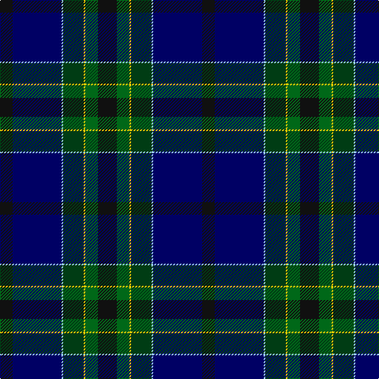

In pattern [KBWGYGK](/patterns/kbwgygk/).

This was sourced from register-of-tartans.  It is a [7 stripes tartan](/stripes/stripes7/).

Original link https://www.tartanregister.gov.uk/tartanDetails.aspx?ref=11018

## Thread count
K/16 DB62 LB2 DG26 Y2 G16 K/24

## Palette
Each colour and its ΔE from the base-6 reference it is a variant of.

| Colour | Shade | Base | ΔE (OKLab) |
|---|---|---|---|
| DB | <code style="background-color:#000064;">#000064</code> `#000064` | B <code style="background-color:#2A418A;">#2A418A</code> | 0.18 |
| DG | <code style="background-color:#003C14;">#003C14</code> `#003C14` | G <code style="background-color:#006100;">#006100</code> | 0.13 |
| G | <code style="background-color:#006818;">#006818</code> `#006818` | G <code style="background-color:#006100;">#006100</code> | 0.02 |
| K | <code style="background-color:#101010;">#101010</code> `#101010` | K <code style="background-color:#000000;">#000000</code> | 0.17 |
| LB | <code style="background-color:#98C8E8;">#98C8E8</code> `#98C8E8` | W <code style="background-color:#F7F7F7;">#F7F7F7</code> | 0.18 |
| Y | <code style="background-color:#FCCC00;">#FCCC00</code> `#FCCC00` | Y <code style="background-color:#F2BF00;">#F2BF00</code> | 0.04 |

# Sample pattern

## Nearest tartans

The nearest existing variants by ΔTartan distance.

1. [Nova Scotia Int. Tattoo (Corporate)](/setts/s7/b3ba2b21k12g24r1y3~b000054-ba787ca8-g003820-k101010-rc80000-ybc8c00~x2/) — ΔT 0.77
1. [Chesters, Eric (Personal)](/setts/s7/k12g8y1ga13b1ba31k8~b5c8ca8-ba202060-g006818-ga003820-k101010-ye8c000~x2/) — ΔT 1.23
1. [Muir-Hill (Personal)](/setts/s7/w2k2r1b20k15g30y1~b003c64-g003820-k101010-rc80000-we0e0e0-yfccc00~x2/) — ΔT 1.35
1. [Singh, Gopal (Personal)](/setts/s6/k10r4g34b34k1y3~b000048-g002814-k000000-rfa4b00-yd87c00~x2/) — ΔT 1.37
1. [Police College Tulliallan](/setts/s7/b2k4ka36g1kb34b4w2~b00008c-g007800-k000000-ka001c00-kb000034-wfcfcfc~x2/) — ΔT 1.38
1. [Sidey Family Tartan (Name)](/setts/s10/b4w1k2b25k12ba1k2g16k2r1~b202060-ba1474b4-g006818-k101010-rc80000-we0e0e0~x2/) — ΔT 1.39
1. [Barton-Watson, de](/setts/s8/b3k16r3g17ka16k26y1b3~b800080-g004010-k000030-ka000000-rc00020-yf0c000~x2/) — ΔT 1.48
1. [Pictou County](/setts/s8/b23w1r3w1b12y9g40b3~b181034-g003c28-r700014-wfcf8ec-yb0840c~x2/) — ΔT 1.48
1. [Beauly Firth and Glens](/setts/s8/b3ba3b3ba27w1bb15k22r3~b5a008c-ba505050-bb067396-k101010-rdc0000-we0e0e0~x2/) — ΔT 1.48
1. [Buschke (Skye) (Personal)](/setts/s7/y2b4g11k30r2ba16w1~b501400-ba2c2c80-g003820-k101010-rc80000-wfcfcfc-ye8c000~x2/) — ΔT 1.48

## Neighbour map

Every grey dot is one of 15726 variants placed by the first two principal components of the ΔTartan feature space (44% of its variance). Red is this tartan; blue dots are its nearest — click one to open its page.

<svg viewBox="0 0 640 380" role="img" style="max-width:100%;height:auto;border:1px solid #e0e0e0;border-radius:4px;display:block" xmlns="http://www.w3.org/2000/svg"><image href="/nn/cloud.v1.png" width="640" height="380"/><a href="/setts/s7/b3ba2b21k12g24r1y3~b000054-ba787ca8-g003820-k101010-rc80000-ybc8c00~x2/"><circle cx="242.4" cy="162.7" r="4" fill="#3465a4"><title>Nova Scotia Int. Tattoo (Corporate)</title></circle></a><a href="/setts/s7/k12g8y1ga13b1ba31k8~b5c8ca8-ba202060-g006818-ga003820-k101010-ye8c000~x2/"><circle cx="282.7" cy="165.1" r="4" fill="#3465a4"><title>Chesters, Eric (Personal)</title></circle></a><a href="/setts/s7/w2k2r1b20k15g30y1~b003c64-g003820-k101010-rc80000-we0e0e0-yfccc00~x2/"><circle cx="288.5" cy="150.2" r="4" fill="#3465a4"><title>Muir-Hill (Personal)</title></circle></a><a href="/setts/s6/k10r4g34b34k1y3~b000048-g002814-k000000-rfa4b00-yd87c00~x2/"><circle cx="278.5" cy="163.0" r="4" fill="#3465a4"><title>Singh, Gopal (Personal)</title></circle></a><a href="/setts/s7/b2k4ka36g1kb34b4w2~b00008c-g007800-k000000-ka001c00-kb000034-wfcfcfc~x2/"><circle cx="318.5" cy="136.6" r="4" fill="#3465a4"><title>Police College Tulliallan</title></circle></a><a href="/setts/s10/b4w1k2b25k12ba1k2g16k2r1~b202060-ba1474b4-g006818-k101010-rc80000-we0e0e0~x2/"><circle cx="272.0" cy="122.0" r="4" fill="#3465a4"><title>Sidey Family Tartan (Name)</title></circle></a><a href="/setts/s8/b3k16r3g17ka16k26y1b3~b800080-g004010-k000030-ka000000-rc00020-yf0c000~x2/"><circle cx="260.4" cy="156.4" r="4" fill="#3465a4"><title>Barton-Watson, de</title></circle></a><a href="/setts/s8/b23w1r3w1b12y9g40b3~b181034-g003c28-r700014-wfcf8ec-yb0840c~x2/"><circle cx="291.6" cy="117.8" r="4" fill="#3465a4"><title>Pictou County</title></circle></a><a href="/setts/s8/b3ba3b3ba27w1bb15k22r3~b5a008c-ba505050-bb067396-k101010-rdc0000-we0e0e0~x2/"><circle cx="231.2" cy="131.6" r="4" fill="#3465a4"><title>Beauly Firth and Glens</title></circle></a><a href="/setts/s7/y2b4g11k30r2ba16w1~b501400-ba2c2c80-g003820-k101010-rc80000-wfcfcfc-ye8c000~x2/"><circle cx="250.3" cy="119.4" r="4" fill="#3465a4"><title>Buschke (Skye) (Personal)</title></circle></a><circle cx="250.4" cy="155.3" r="5" fill="#c00000"/></svg>

ID: /setts/s7/k12g8y1ga13w1b31k8~b000064-g006818-ga003c14-k101010-w98c8e8-yfccc00~x2/
