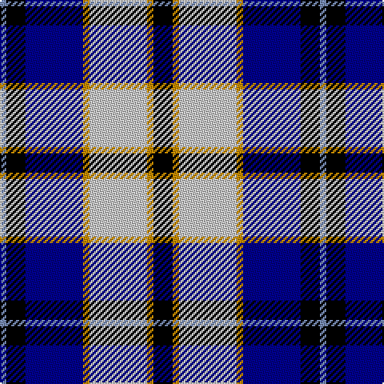

In pattern [BKBYWYK](/patterns/bkbywyk/).

This was sourced from register-of-tartans.  It is a [7 stripes tartan](/stripes/stripes7/).

Original link https://www.tartanregister.gov.uk/tartanDetails.aspx?ref=3890

## Attestations

This cloth appears in 2 source records; the oldest owns this page.

- 01/01/1994 — St. Francis Xavier University (register-of-tartans, [record](https://www.tartanregister.gov.uk/tartanDetails.aspx?ref=3890))
- Jun. 1994 — St. Francis Xavier University (Corp) (tartans-authority, [record](http://www.tartansauthority.com/tartan-ferret/display/5305/))

## Thread count
B/4 K12 DB36 DY4 N36 DY4 K/12

## Palette
Each colour and its ΔE from the base-6 reference it is a variant of.

| Colour | Shade | Base | ΔE (OKLab) |
|---|---|---|---|
| B | <code style="background-color:#788CB4;">#788CB4</code> `#788CB4` | B <code style="background-color:#2A418A;">#2A418A</code> | 0.25 |
| DB | <code style="background-color:#00008C;">#00008C</code> `#00008C` | B <code style="background-color:#2A418A;">#2A418A</code> | 0.13 |
| DR | <code style="background-color:#8C0000;">#8C0000</code> `#8C0000` | R <code style="background-color:#CC0000;">#CC0000</code> | 0.14 |
| DY | <code style="background-color:#C88C00;">#C88C00</code> `#C88C00` | Y <code style="background-color:#F2BF00;">#F2BF00</code> | 0.15 |
| G | <code style="background-color:#007800;">#007800</code> `#007800` | G <code style="background-color:#006100;">#006100</code> | 0.07 |
| K | <code style="background-color:#000000;">#000000</code> `#000000` | K <code style="background-color:#000000;">#000000</code> | 0.00 |
| N | <code style="background-color:#C8C8C8;">#C8C8C8</code> `#C8C8C8` | W <code style="background-color:#F7F7F7;">#F7F7F7</code> | 0.14 |
| P | <code style="background-color:#64008C;">#64008C</code> `#64008C` | B <code style="background-color:#2A418A;">#2A418A</code> | 0.14 |

# Sample pattern

## Nearest tartans

The nearest existing variants by ΔTartan distance.

1. [Sneddon, Jonathan Taylor (Personal)](/setts/s8/b60k8w8k8w8k64y88ya8-b0000ff-k101010-wffffff-ya0a0a0-yaffff00/) — ΔT 0.79
1. [Strathclyde](/setts/s7/k4b32w4ka32w30k4w4-b0060b0-k000000-ka000030-we0e0e0/) — ΔT 1.01
1. [Sibbald Blue (2014)](/setts/s9/g8b44ba12w20b6w12bb8ba6w8-b141e46-ba003c64-bb64008c-g003c14-wfcfcfc/) — ΔT 1.04
1. [Ailsa, Craig](/setts/s8/r10w4b40y4k32w36k4w10-b304080-k000000-rc00000-we0e0e0-yf0c000/) — ΔT 1.06
1. [Hanna of Stirlingshire (Clan)](/setts/s10/r4k4y8k8y8k4y16k4b36ya4-b1c0070-k101010-r880000-yb8b8b8-yad09800/) — ΔT 1.08
1. [Loch Ness (Fashion)](/setts/s7/r4b4r4b42y22k34w4-b5c8ca8-k00002c-rc80000-w98c8e8-y48a4c0/) — ΔT 1.12
1. [Naysmith, William A (Personal)](/setts/s10/w8r4b28k8w8k6w6k4r4wa4-b1c0070-k101010-r880000-wc0c0c0-waa8ace8/) — ΔT 1.12
1. [Ailsa Craig Trade Tartan Tartan Number: 1673. Earliest known date: 1972 Nothing See products available Copyright © Blair Urquhart, Comrie, 2015](/setts/s8/r10w4b40y4k32w36k4w10-b2c2c80-k101010-rc80000-we0e0e0-ye8c000/) — ΔT 1.13
1. [Highfield Dress (Name)](/setts/s11/b40k8g8r8g8k8w8k8w16k4w8-b1c0070-g006818-k101010-rc80000-we0e0e0/) — ΔT 1.15
1. [American Express](/setts/s6/b8ba36r4b36g36w8-b000050-ba8080d0-g003000-r802040-we0e0e0/) — ΔT 1.19

## Neighbour map

Every grey dot is one of 15726 variants placed by the first two principal components of the ΔTartan feature space (44% of its variance). Red is this tartan; blue dots are its nearest — click one to open its page.

<svg viewBox="0 0 640 380" role="img" style="max-width:100%;height:auto;border:1px solid #e0e0e0;border-radius:4px;display:block" xmlns="http://www.w3.org/2000/svg"><image href="/nn/cloud.v1.png" width="640" height="380"/><a href="/setts/s8/b60k8w8k8w8k64y88ya8-b0000ff-k101010-wffffff-ya0a0a0-yaffff00/"><circle cx="129.8" cy="147.3" r="4" fill="#3465a4"><title>Sneddon, Jonathan Taylor (Personal)</title></circle></a><a href="/setts/s7/k4b32w4ka32w30k4w4-b0060b0-k000000-ka000030-we0e0e0/"><circle cx="125.1" cy="188.7" r="4" fill="#3465a4"><title>Strathclyde</title></circle></a><a href="/setts/s9/g8b44ba12w20b6w12bb8ba6w8-b141e46-ba003c64-bb64008c-g003c14-wfcfcfc/"><circle cx="119.6" cy="166.0" r="4" fill="#3465a4"><title>Sibbald Blue (2014)</title></circle></a><a href="/setts/s8/r10w4b40y4k32w36k4w10-b304080-k000000-rc00000-we0e0e0-yf0c000/"><circle cx="113.3" cy="155.8" r="4" fill="#3465a4"><title>Ailsa, Craig</title></circle></a><a href="/setts/s10/r4k4y8k8y8k4y16k4b36ya4-b1c0070-k101010-r880000-yb8b8b8-yad09800/"><circle cx="143.7" cy="148.9" r="4" fill="#3465a4"><title>Hanna of Stirlingshire (Clan)</title></circle></a><a href="/setts/s7/r4b4r4b42y22k34w4-b5c8ca8-k00002c-rc80000-w98c8e8-y48a4c0/"><circle cx="165.0" cy="169.1" r="4" fill="#3465a4"><title>Loch Ness (Fashion)</title></circle></a><a href="/setts/s10/w8r4b28k8w8k6w6k4r4wa4-b1c0070-k101010-r880000-wc0c0c0-waa8ace8/"><circle cx="104.6" cy="166.3" r="4" fill="#3465a4"><title>Naysmith, William A (Personal)</title></circle></a><a href="/setts/s8/r10w4b40y4k32w36k4w10-b2c2c80-k101010-rc80000-we0e0e0-ye8c000/"><circle cx="118.2" cy="156.0" r="4" fill="#3465a4"><title>Ailsa Craig Trade Tartan Tartan Number: 1673. Earliest known date: 1972 Nothing See products available Copyright © Blair Urquhart, Comrie, 2015</title></circle></a><a href="/setts/s11/b40k8g8r8g8k8w8k8w16k4w8-b1c0070-g006818-k101010-rc80000-we0e0e0/"><circle cx="88.8" cy="148.2" r="4" fill="#3465a4"><title>Highfield Dress (Name)</title></circle></a><a href="/setts/s6/b8ba36r4b36g36w8-b000050-ba8080d0-g003000-r802040-we0e0e0/"><circle cx="122.5" cy="206.0" r="4" fill="#3465a4"><title>American Express</title></circle></a><circle cx="106.3" cy="169.1" r="5" fill="#c00000"/></svg>

ID: /setts/s7/k12y4w36y4b36k12ba4-b00008c-ba788cb4-k000000-wc8c8c8-yc88c00/
