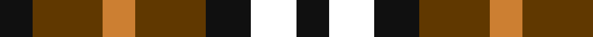

**Bands:** [KGYGKWK](/stripes/kgygkwk/) · **Stripes:** [K DY LO DY K W K](/stripes/stripes7/) K DY LO DY K W K

This was sourced from register-of-tartans.  It is a [7 band tartan](/bands/bands7/).

Original link https://www.tartanregister.gov.uk/tartanDetails.aspx?ref=10914

## Attestations

This cloth appears in 2 source records; the oldest owns this page.

- 14/09/2013 — Boxer Beauty (register-of-tartans, [record](https://www.tartanregister.gov.uk/tartanDetails.aspx?ref=10914))
- 2013 — Boxer Beauty (tartans-authority, [record](http://www.tartansauthority.com/tartan-ferret/display/10914/))

## Register references

External register numbers recorded for this tartan.

- Scottish Register of Tartans: [10914](https://www.tartanregister.gov.uk/tartanDetails.aspx?ref=10914)

## Thread count
K/26 T56 DO26 T56 K36 W36 K/26

## Palette
Each colour and its ΔE from the base-6 reference it is a variant of.

| Colour | Shade | Base | ΔE (OKLab) |
|---|---|---|---|
| DO | <code style="background-color:#CC7F32;">#CC7F32</code> `#CC7F32` | Y <code style="background-color:#F2BF00;">#F2BF00</code> | 0.18 |
| K | <code style="background-color:#101010;">#101010</code> `#101010` | K <code style="background-color:#000000;">#000000</code> | 0.17 |
| T | <code style="background-color:#603800;">#603800</code> `#603800` | G <code style="background-color:#006100;">#006100</code> | 0.16 |
| W | <code style="background-color:#FFFFFF;">#FFFFFF</code> `#FFFFFF` | W <code style="background-color:#F7F7F7;">#F7F7F7</code> | 0.02 |

# Sample pattern

## Nearest tartans

The nearest existing variants by ΔTartan distance.

1. [MacDuff](/setts/s7/r10db6k8g10r6g3r6~x2/) — ΔT 0.98
1. [Duffus Hose, Lord](/setts/s7/lo11m6k10lo10k10dy10m4~x2/) — ΔT 1.25
1. [Austin / Wilson's No 173](/setts/s5/p3k3p3g6ly2~x2/) — ΔT 1.26
1. [Wilson's No.113](/setts/s6/g3dp3w1dp3g3r1~x4/) — ΔT 1.32
1. [Austin / Wilson's No 137](/setts/s5/p3k3p3g6r2~x2/) — ΔT 1.36
1. [Hage-West (Personal)](/setts/s6/dg8k8dg8ly6k3ly6~x2/) — ΔT 1.36
1. [Daks, Black (Fashion)](/setts/s5/ly3k6dy4k6r3~x2/) — ΔT 1.38
1. [Duffus, Lord](/setts/s7/ly15r7k12ly12k12o12r7~x2/) — ΔT 1.42
1. [Robert, Burns check](/setts/s10/w2k2w2k2w2k2w1o1g1o1~x4/) — ΔT 1.48
1. [Duffus Lord... Portrait Tartan Tartan Number: 1661. Earliest known date: 1705 The hose in the portrait of Lord Duffus (1705). Reconstructed and woven by Scottish Tartans Society. See products available Copyright © Blair Urquhart, Comrie, 2015](/setts/s7/ly15r7k12ly12k12dy12r7~x2/) — ΔT 1.50

## Neighbour map

Every grey dot is one of 14313 variants placed by the first two principal components of the ΔTartan feature space (44% of its variance). Red is this tartan; blue dots are its nearest — click one to open its page.

<svg viewBox="0 0 640 380" role="img" style="max-width:100%;height:auto;border:1px solid #e0e0e0;border-radius:4px;display:block" xmlns="http://www.w3.org/2000/svg"><image href="/nn/cloud.v1.png" width="640" height="380"/><a href="/setts/s7/r10db6k8g10r6g3r6~x2/"><circle cx="115.7" cy="283.2" r="4" fill="#3465a4"><title>MacDuff</title></circle></a><a href="/setts/s7/lo11m6k10lo10k10dy10m4~x2/"><circle cx="62.1" cy="302.7" r="4" fill="#3465a4"><title>Duffus Hose, Lord</title></circle></a><a href="/setts/s5/p3k3p3g6ly2~x2/"><circle cx="71.2" cy="288.7" r="4" fill="#3465a4"><title>Austin / Wilson's No 173</title></circle></a><a href="/setts/s6/g3dp3w1dp3g3r1~x4/"><circle cx="148.7" cy="296.8" r="4" fill="#3465a4"><title>Wilson's No.113</title></circle></a><a href="/setts/s5/p3k3p3g6r2~x2/"><circle cx="85.1" cy="293.5" r="4" fill="#3465a4"><title>Austin / Wilson's No 137</title></circle></a><a href="/setts/s6/dg8k8dg8ly6k3ly6~x2/"><circle cx="90.6" cy="319.9" r="4" fill="#3465a4"><title>Hage-West (Personal)</title></circle></a><a href="/setts/s5/ly3k6dy4k6r3~x2/"><circle cx="146.8" cy="327.2" r="4" fill="#3465a4"><title>Daks, Black (Fashion)</title></circle></a><a href="/setts/s7/ly15r7k12ly12k12o12r7~x2/"><circle cx="14.6" cy="297.1" r="4" fill="#3465a4"><title>Duffus, Lord</title></circle></a><a href="/setts/s10/w2k2w2k2w2k2w1o1g1o1~x4/"><circle cx="56.5" cy="281.0" r="4" fill="#3465a4"><title>Robert, Burns check</title></circle></a><a href="/setts/s7/ly15r7k12ly12k12dy12r7~x2/"><circle cx="24.1" cy="300.7" r="4" fill="#3465a4"><title>Duffus Lord... Portrait Tartan Tartan Number: 1661. Earliest known date: 1705 The hose in the portrait of Lord Duffus (1705). Reconstructed and woven by Scottish Tartans Society. See products available Copyright © Blair Urquhart, Comrie, 2015</title></circle></a><circle cx="83.6" cy="297.6" r="5" fill="#c00000"/></svg>

ID: /setts/s7/k13dy28lo13dy28k18w18k13~x2/
