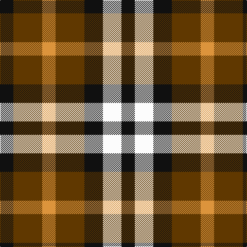

In pattern [KGYGKWK](/patterns/kgygkwk/).

This was sourced from tartans-authority.  It is a [7 stripes tartan](/stripes/stripes7/).

Original link http://www.tartansauthority.com/tartan-ferret/display/10914/

## Thread count
K/26 T56 O26 T56 K36 W36 K/26

## Palette
Each colour and its ΔE from the base-6 reference it is a variant of.

| Colour | Shade | Base | ΔE (OKLab) |
|---|---|---|---|
| K | <code style="background-color:#101010;">#101010</code> `#101010` | K <code style="background-color:#000000;">#000000</code> | 0.17 |
| O | <code style="background-color:#DC943C;">#DC943C</code> `#DC943C` | Y <code style="background-color:#F2BF00;">#F2BF00</code> | 0.12 |
| T | <code style="background-color:#603800;">#603800</code> `#603800` | G <code style="background-color:#006100;">#006100</code> | 0.16 |
| W | <code style="background-color:#FCFCFC;">#FCFCFC</code> `#FCFCFC` | W <code style="background-color:#F7F7F7;">#F7F7F7</code> | 0.01 |

# Sample pattern

## Nearest tartans

The nearest existing variants by ΔTartan distance.

1. [Boxer Beauty](/setts/s7/k13g28y13g28k18w18k13x2~g603800-k101010-wffffff-ycc7f32/) — ΔT 0.06
1. [MacDuff](/setts/s7/r10b6k8g10r6g3r6x2~b304080-g008000-k000000-rc00000/) — ΔT 1.00
1. [Harazeen (Personal)](/setts/s8/r2g1w1k1r2g1w1k1x20~g00801c-k101010-rc80000-we0e0e0/) — ΔT 1.23
1. [Austin / Wilson's No 173](/setts/s5/b3k3b3g6y2x2~b800080-g008000-k000000-yf0c000/) — ΔT 1.26
1. [Duffus Hose, Lord](/setts/s7/y11r6k10y10k10g10r4x2~g604000-k101010-ra00048-ybc8c00/) — ΔT 1.27
1. [Hage-West (Personal)](/setts/s6/g8k8g8y6k3y6x2~g23321b-k1c1714-yf8e38c/) — ΔT 1.33
1. [Wilson's No.113](/setts/s6/g3b3w1b3g3r1x4~b440044-g006818-rc80000-we0e0e0/) — ΔT 1.34
1. [Austin / Wilson's No 137](/setts/s5/b3k3b3g6r2x2~b800080-g008000-k000000-rc00000/) — ΔT 1.39
1. [Duffus, Lord](/setts/s7/y15r7k12y12k12ra12r7x2~k000000-rc00000-ra806050-yf0c000/) — ΔT 1.40
1. [Daks, Black (Fashion)](/setts/s5/r3k6g4k6y3x2~g604000-k101010-rb03000-ye8d880/) — ΔT 1.41

## Neighbour map

Every grey dot is one of 15726 variants placed by the first two principal components of the ΔTartan feature space (44% of its variance). Red is this tartan; blue dots are its nearest — click one to open its page.

<svg viewBox="0 0 640 380" role="img" style="max-width:100%;height:auto;border:1px solid #e0e0e0;border-radius:4px;display:block" xmlns="http://www.w3.org/2000/svg"><image href="/nn/cloud.v1.png" width="640" height="380"/><a href="/setts/s7/k13g28y13g28k18w18k13x2~g603800-k101010-wffffff-ycc7f32/"><circle cx="81.7" cy="300.9" r="4" fill="#3465a4"><title>Boxer Beauty</title></circle></a><a href="/setts/s7/r10b6k8g10r6g3r6x2~b304080-g008000-k000000-rc00000/"><circle cx="114.3" cy="286.2" r="4" fill="#3465a4"><title>MacDuff</title></circle></a><a href="/setts/s8/r2g1w1k1r2g1w1k1x20~g00801c-k101010-rc80000-we0e0e0/"><circle cx="53.8" cy="283.9" r="4" fill="#3465a4"><title>Harazeen (Personal)</title></circle></a><a href="/setts/s5/b3k3b3g6y2x2~b800080-g008000-k000000-yf0c000/"><circle cx="68.7" cy="291.7" r="4" fill="#3465a4"><title>Austin / Wilson's No 173</title></circle></a><a href="/setts/s7/y11r6k10y10k10g10r4x2~g604000-k101010-ra00048-ybc8c00/"><circle cx="60.6" cy="303.6" r="4" fill="#3465a4"><title>Duffus Hose, Lord</title></circle></a><a href="/setts/s6/g8k8g8y6k3y6x2~g23321b-k1c1714-yf8e38c/"><circle cx="88.2" cy="324.2" r="4" fill="#3465a4"><title>Hage-West (Personal)</title></circle></a><a href="/setts/s6/g3b3w1b3g3r1x4~b440044-g006818-rc80000-we0e0e0/"><circle cx="146.6" cy="298.1" r="4" fill="#3465a4"><title>Wilson's No.113</title></circle></a><a href="/setts/s5/b3k3b3g6r2x2~b800080-g008000-k000000-rc00000/"><circle cx="82.8" cy="295.7" r="4" fill="#3465a4"><title>Austin / Wilson's No 137</title></circle></a><a href="/setts/s7/y15r7k12y12k12ra12r7x2~k000000-rc00000-ra806050-yf0c000/"><circle cx="14.0" cy="302.1" r="4" fill="#3465a4"><title>Duffus, Lord</title></circle></a><a href="/setts/s5/r3k6g4k6y3x2~g604000-k101010-rb03000-ye8d880/"><circle cx="145.1" cy="331.0" r="4" fill="#3465a4"><title>Daks, Black (Fashion)</title></circle></a><circle cx="80.3" cy="300.3" r="5" fill="#c00000"/></svg>

ID: /setts/s7/k13g28y13g28k18w18k13x2~g603800-k101010-wfcfcfc-ydc943c/
