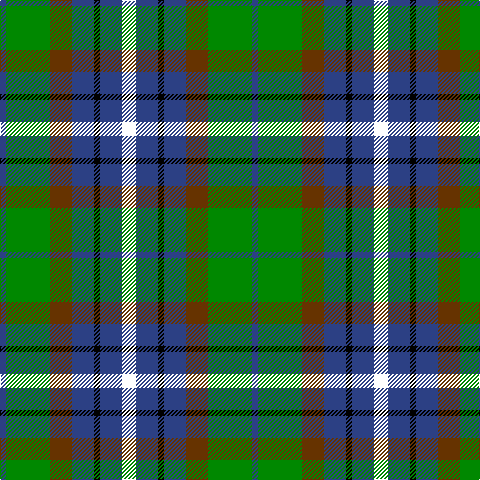

In pattern [BGGBKBK](/patterns/bggbkbk/).

This was sourced from house-of-tartan.  It is a [7 stripes tartan](/stripes/stripes7/).

Original link http://www.house-of-tartan.scotland.net/house/TartanViewjs.asp?colr=Def&tnam=4071

## Thread count
B/6 G44 T22 B22 K6 B22 LB/14

## Palette
Each colour and its ΔE from the base-6 reference it is a variant of.

| Colour | Shade | Base | ΔE (OKLab) |
|---|---|---|---|
| B | <code style="background-color:#2C4084;">#2C4084</code> `#2C4084` | B <code style="background-color:#2C4084;">#2C4084</code> | 0.00 |
| DB | <code style="background-color:#000080;">#000080</code> `#000080` | B <code style="background-color:#2C4084;">#2C4084</code> | 0.14 |
| G | <code style="background-color:#008800;">#008800</code> `#008800` | G <code style="background-color:#006400;">#006400</code> | 0.11 |
| K | <code style="background-color:#000000;">#000000</code> `#000000` | K <code style="background-color:#000000;">#000000</code> | 0.00 |
| T | <code style="background-color:#663300;">#663300</code> `#663300` | G <code style="background-color:#006400;">#006400</code> | 0.18 |

# Sample pattern

## Nearest tartans

The nearest existing variants by ΔTartan distance.

1. [Dyce Family Tartan Tartan Number: 1266. Earliest known date: 1880 From Ross-Craven research. Black guards on the white. See products available Copyright © Blair Urquhart, Comrie, 2015](/setts/s6/k8y4g24k24b24w4-b2c2c80-g006818-k101010-we0e0e0-ye8c000/) — ΔT 0.64
1. [Dyce #3](/setts/s6/k8y4g24k24b24w4-b2c4084-g005020-k101010-we0e0e0-ye8c000/) — ΔT 0.73
1. [Disciples of Christ Motorcycle Ministry (Switzerland)](/setts/s7/k44g42k10g24b24r6w8-b2888c4-g006818-k101010-r888888-we0e0e0/) — ΔT 0.74
1. [Lanarkshire](/setts/s6/g62y8g12k38b36ba18-b2c2c80-ba5c8ca8-g006818-k101010-ye8c000/) — ΔT 0.75
1. [Disciples of Christ MM (Switzerland)](/setts/s7/k44g42k10g24b24r6w8-b2888c4-g006818-k101010-r888888-wfcfcfc/) — ΔT 0.79
1. [Lanark](/setts/s6/g62y8g12k38b36ba18-b304080-ba5480b0-g004010-k000000-yf0c000/) — ΔT 0.81
1. [Wilson's No.217](/setts/s8/b22ba4k20g20y6g20k20ba4-b440044-ba2888c4-g006818-k101010-ye8c000/) — ΔT 0.85
1. [MacNeil Clan Tartan Tartan Number: 1767. Earliest known date: 1886 This version shows the narrow 'tramlines' about the yellow stripe, the usual modern form that differs from Logans earlier version. The MacNeils claim descent from Niall, King of Ireland, who came to Barra in 1049. The present chief, Professor Ian Roderick MacNeil of Barra, lives in Chicago, U.S.A. There is also a tartan for the MacNeils of Colonsay. MacNeils are hereditary pipers to the MacLeans of Duart. See products available Copyright © Blair Urquhart, Comrie, 2015](/setts/s6/w6b28k24g24k4y6-b2c2c80-g006818-k101010-we0e0e0-ye8c000/) — ΔT 0.86
1. [Nelson Mandela (Personal)](/setts/s7/b54g10y16k40y6g30r6-b202060-g006818-k101010-rc80000-yd8b000/) — ΔT 0.86
1. [MacLean, Donald (Personal)](/setts/s7/g32w6g6k20b24r4b6-b1c0070-g006818-k101010-r880000-wa8ace8/) — ΔT 0.87

## Neighbour map

Every grey dot is one of 15726 variants placed by the first two principal components of the ΔTartan feature space (44% of its variance). Red is this tartan; blue dots are its nearest — click one to open its page.

<svg viewBox="0 0 640 380" role="img" style="max-width:100%;height:auto;border:1px solid #e0e0e0;border-radius:4px;display:block" xmlns="http://www.w3.org/2000/svg"><image href="/nn/cloud.v1.png" width="640" height="380"/><a href="/setts/s6/k8y4g24k24b24w4-b2c2c80-g006818-k101010-we0e0e0-ye8c000/"><circle cx="122.7" cy="231.8" r="4" fill="#3465a4"><title>Dyce Family Tartan Tartan Number: 1266. Earliest known date: 1880 From Ross-Craven research. Black guards on the white. See products available Copyright © Blair Urquhart, Comrie, 2015</title></circle></a><a href="/setts/s6/k8y4g24k24b24w4-b2c4084-g005020-k101010-we0e0e0-ye8c000/"><circle cx="131.8" cy="236.3" r="4" fill="#3465a4"><title>Dyce #3</title></circle></a><a href="/setts/s7/k44g42k10g24b24r6w8-b2888c4-g006818-k101010-r888888-we0e0e0/"><circle cx="152.7" cy="219.2" r="4" fill="#3465a4"><title>Disciples of Christ Motorcycle Ministry (Switzerland)</title></circle></a><a href="/setts/s6/g62y8g12k38b36ba18-b2c2c80-ba5c8ca8-g006818-k101010-ye8c000/"><circle cx="161.7" cy="229.0" r="4" fill="#3465a4"><title>Lanarkshire</title></circle></a><a href="/setts/s7/k44g42k10g24b24r6w8-b2888c4-g006818-k101010-r888888-wfcfcfc/"><circle cx="148.0" cy="217.0" r="4" fill="#3465a4"><title>Disciples of Christ MM (Switzerland)</title></circle></a><a href="/setts/s6/g62y8g12k38b36ba18-b304080-ba5480b0-g004010-k000000-yf0c000/"><circle cx="150.5" cy="225.7" r="4" fill="#3465a4"><title>Lanark</title></circle></a><a href="/setts/s8/b22ba4k20g20y6g20k20ba4-b440044-ba2888c4-g006818-k101010-ye8c000/"><circle cx="103.2" cy="238.5" r="4" fill="#3465a4"><title>Wilson's No.217</title></circle></a><a href="/setts/s6/w6b28k24g24k4y6-b2c2c80-g006818-k101010-we0e0e0-ye8c000/"><circle cx="93.5" cy="218.6" r="4" fill="#3465a4"><title>MacNeil Clan Tartan Tartan Number: 1767. Earliest known date: 1886 This version shows the narrow 'tramlines' about the yellow stripe, the usual modern form that differs from Logans earlier version. The MacNeils claim descent from Niall, King of Ireland, who came to Barra in 1049. The present chief, Professor Ian Roderick MacNeil of Barra, lives in Chicago, U.S.A. There is also a tartan for the MacNeils of Colonsay. MacNeils are hereditary pipers to the MacLeans of Duart. See products available Copyright © Blair Urquhart, Comrie, 2015</title></circle></a><a href="/setts/s7/b54g10y16k40y6g30r6-b202060-g006818-k101010-rc80000-yd8b000/"><circle cx="123.2" cy="197.2" r="4" fill="#3465a4"><title>Nelson Mandela (Personal)</title></circle></a><a href="/setts/s7/g32w6g6k20b24r4b6-b1c0070-g006818-k101010-r880000-wa8ace8/"><circle cx="160.0" cy="211.9" r="4" fill="#3465a4"><title>MacLean, Donald (Personal)</title></circle></a><circle cx="124.2" cy="221.5" r="5" fill="#c00000"/></svg>

ID: /setts/s7/k14b22k6b22g22ga44b6-b2c4084-g663300-ga008800-k000000/
