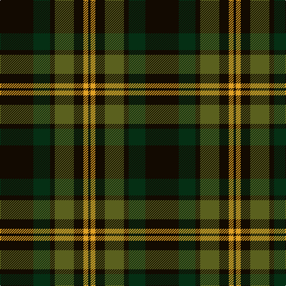

In pattern [KGKGKYK](/stripes/kgkgkyk/).

This was sourced from register-of-tartans.  It is a [7 stripe tartan](/stripes/stripes7/).

Original link https://www.tartanregister.gov.uk/tartanDetails.aspx?ref=10346

## Also known as

This cloth is also recorded under:

- Grass of Rasunda , The

## Register references

External register numbers recorded for this tartan.

- Scottish Register of Tartans: [10346](https://www.tartanregister.gov.uk/tartanDetails.aspx?ref=10346)

## Thread count
K/56 DG28 K8 G32 K16 Y8 K/4

## Palette
Each colour and its ΔE from the base-6 reference it is a variant of.

| Colour | Shade | Base | ΔE (OKLab) |
|---|---|---|---|
| DG | <code style="background-color:#052F14;">#052F14</code> `#052F14` | G <code style="background-color:#006100;">#006100</code> | 0.18 |
| G | <code style="background-color:#5A601E;">#5A601E</code> `#5A601E` | G <code style="background-color:#006100;">#006100</code> | 0.09 |
| K | <code style="background-color:#120A01;">#120A01</code> `#120A01` | K <code style="background-color:#000000;">#000000</code> | 0.15 |
| Y | <code style="background-color:#E0A126;">#E0A126</code> `#E0A126` | Y <code style="background-color:#F2BF00;">#F2BF00</code> | 0.08 |

# Sample pattern

## Nearest tartans

The nearest existing variants by ΔTartan distance.

1. [Grass of Rasunda (Commemorative)](/setts/s7/k14dg7k2y8k4ly2k1~x4/) — ΔT 0.46
1. [MacKintosh Hunting](/setts/s7/ly2dg12db6r3dg12r4db1~x2/) — ΔT 1.03
1. [Tolmie](/setts/s5/k8lo1k8dg13r2~x4/) — ΔT 1.04
1. [Lossiemouth/Hersbruck](/setts/s6/dg26k3dg12k10dp15w2~x2/) — ΔT 1.22
1. [Page](/setts/s7/dg46k18dg6k13r4k4w4~x2/) — ΔT 1.23
1. [Fibonacci7](/setts/s7/db13dg8r5db3dg2r1ly1~x4/) — ΔT 1.23
1. [Laois](/setts/s9/dr20db2dr5db5k18g5dr5g2dr15~x2/) — ΔT 1.26
1. [Sinclair Hunting](/setts/s7/dg6r2dg13k6w2k16r3~x2/) — ΔT 1.28
1. [Wilson's No.167](/setts/s10/k20t2k6g16dp4k9~x2/) — ΔT 1.32
1. [MacAulay Hunting](/setts/s8/g6k16w1k16g8k4g12r2~x2/) — ΔT 1.33

## Neighbour map

Every grey dot is one of 14299 variants placed by the first two principal components of the ΔTartan feature space (44% of its variance). Red is this tartan; blue dots are its nearest — click one to open its page.

<svg viewBox="0 0 640 380" role="img" style="max-width:100%;height:auto;border:1px solid #e0e0e0;border-radius:4px;display:block" xmlns="http://www.w3.org/2000/svg"><image href="/nn/cloud.v1.png" width="640" height="380"/><a href="/setts/s7/k14dg7k2y8k4ly2k1~x4/"><circle cx="312.8" cy="217.9" r="4" fill="#3465a4"><title>Grass of Rasunda (Commemorative)</title></circle></a><a href="/setts/s7/ly2dg12db6r3dg12r4db1~x2/"><circle cx="334.5" cy="226.4" r="4" fill="#3465a4"><title>MacKintosh Hunting</title></circle></a><a href="/setts/s5/k8lo1k8dg13r2~x4/"><circle cx="307.7" cy="245.6" r="4" fill="#3465a4"><title>Tolmie</title></circle></a><a href="/setts/s6/dg26k3dg12k10dp15w2~x2/"><circle cx="302.0" cy="228.7" r="4" fill="#3465a4"><title>Lossiemouth/Hersbruck</title></circle></a><a href="/setts/s7/dg46k18dg6k13r4k4w4~x2/"><circle cx="344.1" cy="209.7" r="4" fill="#3465a4"><title>Page</title></circle></a><a href="/setts/s7/db13dg8r5db3dg2r1ly1~x4/"><circle cx="283.8" cy="207.2" r="4" fill="#3465a4"><title>Fibonacci7</title></circle></a><a href="/setts/s9/dr20db2dr5db5k18g5dr5g2dr15~x2/"><circle cx="326.6" cy="220.5" r="4" fill="#3465a4"><title>Laois</title></circle></a><a href="/setts/s7/dg6r2dg13k6w2k16r3~x2/"><circle cx="254.0" cy="238.3" r="4" fill="#3465a4"><title>Sinclair Hunting</title></circle></a><a href="/setts/s10/k20t2k6g16dp4k9~x2/"><circle cx="267.9" cy="223.4" r="4" fill="#3465a4"><title>Wilson's No.167</title></circle></a><a href="/setts/s8/g6k16w1k16g8k4g12r2~x2/"><circle cx="326.7" cy="216.4" r="4" fill="#3465a4"><title>MacAulay Hunting</title></circle></a><circle cx="320.9" cy="221.0" r="5" fill="#c00000"/></svg>

ID: /setts/s7/k14dg7k2y8k4lo2k1~x4/
