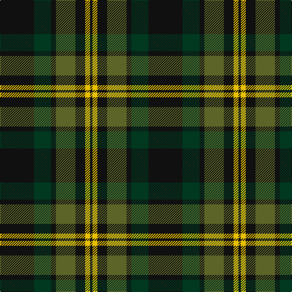

In pattern [KGKGKYK](/stripes/kgkgkyk/).

This was sourced from tartans-authority.  It is a [7 stripe tartan](/stripes/stripes7/).

Original link http://www.tartansauthority.com/tartan-ferret/display/10346/

## Also known as

This cloth is also recorded under:

- Grass of Rasunda , The

## Thread count
K/56 DG28 K8 G32 K16 Y8 K/4

## Palette
Each colour and the base-6 reference it is a variant of.

| Colour | Shade | Base |
|---|---|---|
| DG | <code style="background-color:#003820;">#003820</code> `oklch(30.0% 0.070 158.3)` <small>#003820</small> | G <code style="background-color:#006100;">#006100</code> |
| G | <code style="background-color:#5C6428;">#5C6428</code> `oklch(48.3% 0.084 116.0)` <small>#5C6428</small> | G <code style="background-color:#006100;">#006100</code> |
| K | <code style="background-color:#101010;">#101010</code> `oklch(17.3% 0.000 89.9)` <small>#101010</small> | K <code style="background-color:#000000;">#000000</code> |
| Y | <code style="background-color:#E8C000;">#E8C000</code> `oklch(81.9% 0.168 93.7)` <small>#E8C000</small> | Y <code style="background-color:#F2BF00;">#F2BF00</code> |

# Sample pattern

## Nearest tartans

The nearest existing variants by ΔTartan distance.

1. [Grass of Rasunda (2009), The](/setts/s7/k14dg7k2y8k4lo2k1~x4/) — ΔT 0.46
1. [MacKintosh Hunting](/setts/s7/ly2dg12db6r3dg12r4db1~x2/) — ΔT 0.88
1. [Fibonacci7](/setts/s7/db13dg8r5db3dg2r1ly1~x4/) — ΔT 0.95
1. [Tolmie](/setts/s5/k8lo1k8dg13r2~x4/) — ΔT 0.97
1. [Cameron Hunting](/setts/s7/r3dg10r3dg14db16dg3ly2~x2/) — ΔT 1.07
1. [Page](/setts/s7/dg46k18dg6k13r4k4w4~x2/) — ΔT 1.12
1. [Sinclair Hunting](/setts/s7/dg6r2dg13k6w2k16r3~x2/) — ΔT 1.14
1. [MacAulay Hunting](/setts/s8/g6k16w1k16g8k4g12r2~x2/) — ΔT 1.16
1. [Wilson's No.167](/setts/s10/k20t2k6g16dp4k9~x2/) — ΔT 1.16
1. [Lossiemouth/Hersbruck](/setts/s6/dg26k3dg12k10dp15w2~x2/) — ΔT 1.19

## Neighbour map

Every grey dot is one of 14299 variants placed by the first two principal components of the ΔTartan feature space (44% of its variance). Red is this tartan; blue dots are its nearest — click one to open its page.

<svg viewBox="0 0 640 380" role="img" style="max-width:100%;height:auto;border:1px solid #e0e0e0;border-radius:4px;display:block" xmlns="http://www.w3.org/2000/svg"><image href="/nn/cloud.v1.png" width="640" height="380"/><a href="/setts/s7/k14dg7k2y8k4lo2k1~x4/"><circle cx="320.9" cy="221.0" r="4" fill="#3465a4"><title>Grass of Rasunda (2009), The</title></circle></a><a href="/setts/s7/ly2dg12db6r3dg12r4db1~x2/"><circle cx="334.5" cy="226.4" r="4" fill="#3465a4"><title>MacKintosh Hunting</title></circle></a><a href="/setts/s7/db13dg8r5db3dg2r1ly1~x4/"><circle cx="283.8" cy="207.2" r="4" fill="#3465a4"><title>Fibonacci7</title></circle></a><a href="/setts/s5/k8lo1k8dg13r2~x4/"><circle cx="307.7" cy="245.6" r="4" fill="#3465a4"><title>Tolmie</title></circle></a><a href="/setts/s7/r3dg10r3dg14db16dg3ly2~x2/"><circle cx="285.4" cy="241.4" r="4" fill="#3465a4"><title>Cameron Hunting</title></circle></a><a href="/setts/s7/dg46k18dg6k13r4k4w4~x2/"><circle cx="344.1" cy="209.7" r="4" fill="#3465a4"><title>Page</title></circle></a><a href="/setts/s7/dg6r2dg13k6w2k16r3~x2/"><circle cx="254.0" cy="238.3" r="4" fill="#3465a4"><title>Sinclair Hunting</title></circle></a><a href="/setts/s8/g6k16w1k16g8k4g12r2~x2/"><circle cx="326.7" cy="216.4" r="4" fill="#3465a4"><title>MacAulay Hunting</title></circle></a><a href="/setts/s10/k20t2k6g16dp4k9~x2/"><circle cx="267.9" cy="223.4" r="4" fill="#3465a4"><title>Wilson's No.167</title></circle></a><a href="/setts/s6/dg26k3dg12k10dp15w2~x2/"><circle cx="302.0" cy="228.7" r="4" fill="#3465a4"><title>Lossiemouth/Hersbruck</title></circle></a><circle cx="312.8" cy="217.9" r="5" fill="#c00000"/></svg>

ID: /setts/s7/k14dg7k2y8k4ly2k1~x4/
