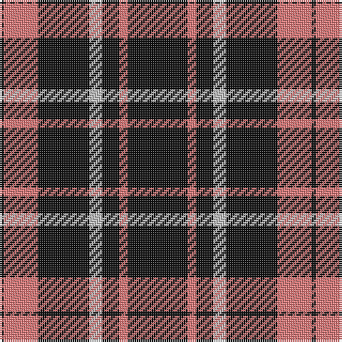

In pattern [KRKWKRK](/patterns/krkwkrk/).

This was sourced from tartans-authority.  It is a [7 stripes tartan](/stripes/stripes7/).

Original link http://www.tartansauthority.com/tartan-ferret/display/10618/

## Thread count
K/2 LR16 K24 N6 K8 LR4 K/28

## Palette
Each colour and its ΔE from the base-6 reference it is a variant of.

| Colour | Shade | Base | ΔE (OKLab) |
|---|---|---|---|
| K | <code style="background-color:#101010;">#101010</code> `#101010` | K <code style="background-color:#000000;">#000000</code> | 0.17 |
| LR | <code style="background-color:#E87878;">#E87878</code> `#E87878` | R <code style="background-color:#CC0000;">#CC0000</code> | 0.19 |
| N | <code style="background-color:#C0C0C0;">#C0C0C0</code> `#C0C0C0` | W <code style="background-color:#F7F7F7;">#F7F7F7</code> | 0.17 |

# Sample pattern

## Nearest tartans

The nearest existing variants by ΔTartan distance.

1. [New Zealand District Tartan Tartan Number: 3250. Earliest known date: 2000 Designed as a District sett by Timely Marketing Promotions, Christchurch, New Zealand See products available Copyright © Blair Urquhart, Comrie, 2015](/setts/s6/k21w2k5w9k13g2x4~g006818-k101010-we0e0e0/) — ΔT 1.16
1. [Black 1990 (Name)](/setts/s6/k17r6k2w6k17y2x2~k101010-r880000-we0e0e0-ybc8c00/) — ΔT 1.23
1. [Lundy Reform](/setts/s7/k2w5k1w1k10r1k1x4~k101010-rc80000-wc0c0c0/) — ΔT 1.29
1. [Black Clan/Family Tartan Tartan Number: 2761. Earliest known date: pre 1945 In 1990, taken to a TECA stand at one of the US Highland Games by a Timothy Wood, who explained that his faher had 'found' it in a shop in northern England during World War II. See products available Copyright © Blair Urquhart, Comrie, 2015](/setts/s6/k17r6k2w6k17y2x2~k101010-r880000-wc0c0c0-yd09800/) — ΔT 1.29
1. [DDB Canada (Fashion)](/setts/s7/k1r2k7r11k18y2k1x2~k101010-r888888-ye8c000/) — ΔT 1.29
1. [Black (symmetrical)](/setts/s6/k17r6k2w6k17y2x2~k101010-r880000-wc0c0c0-ybc8c00/) — ΔT 1.30
1. [Jensen, Sven (Personal)](/setts/s9/g12k8w6k22w3k8w3k40g6~g006818-k101010-we0e0e0/) — ΔT 1.38
1. [Burberry Black](/setts/s5/y3k3y3k10r1x6~k000000-rc80000-yb0b0b0/) — ΔT 1.43
1. [Benson (New England)](/setts/s7/k16b2k8r3y3r3k8x2~b1474b4-k101010-rc80000-yb8b8b8/) — ΔT 1.48
1. [Moffat (1984)](/setts/s7/k39r3k3r3k14r28ra3x2~k101010-r888888-rac80000/) — ΔT 1.48

## Neighbour map

Every grey dot is one of 15726 variants placed by the first two principal components of the ΔTartan feature space (44% of its variance). Red is this tartan; blue dots are its nearest — click one to open its page.

<svg viewBox="0 0 640 380" role="img" style="max-width:100%;height:auto;border:1px solid #e0e0e0;border-radius:4px;display:block" xmlns="http://www.w3.org/2000/svg"><image href="/nn/cloud.v1.png" width="640" height="380"/><a href="/setts/s6/k21w2k5w9k13g2x4~g006818-k101010-we0e0e0/"><circle cx="413.7" cy="235.4" r="4" fill="#3465a4"><title>New Zealand District Tartan Tartan Number: 3250. Earliest known date: 2000 Designed as a District sett by Timely Marketing Promotions, Christchurch, New Zealand See products available Copyright © Blair Urquhart, Comrie, 2015</title></circle></a><a href="/setts/s6/k17r6k2w6k17y2x2~k101010-r880000-we0e0e0-ybc8c00/"><circle cx="370.3" cy="228.7" r="4" fill="#3465a4"><title>Black 1990 (Name)</title></circle></a><a href="/setts/s7/k2w5k1w1k10r1k1x4~k101010-rc80000-wc0c0c0/"><circle cx="374.8" cy="202.4" r="4" fill="#3465a4"><title>Lundy Reform</title></circle></a><a href="/setts/s6/k17r6k2w6k17y2x2~k101010-r880000-wc0c0c0-yd09800/"><circle cx="378.5" cy="232.1" r="4" fill="#3465a4"><title>Black Clan/Family Tartan Tartan Number: 2761. Earliest known date: pre 1945 In 1990, taken to a TECA stand at one of the US Highland Games by a Timothy Wood, who explained that his faher had 'found' it in a shop in northern England during World War II. See products available Copyright © Blair Urquhart, Comrie, 2015</title></circle></a><a href="/setts/s7/k1r2k7r11k18y2k1x2~k101010-r888888-ye8c000/"><circle cx="393.2" cy="192.4" r="4" fill="#3465a4"><title>DDB Canada (Fashion)</title></circle></a><a href="/setts/s6/k17r6k2w6k17y2x2~k101010-r880000-wc0c0c0-ybc8c00/"><circle cx="379.8" cy="232.7" r="4" fill="#3465a4"><title>Black (symmetrical)</title></circle></a><a href="/setts/s9/g12k8w6k22w3k8w3k40g6~g006818-k101010-we0e0e0/"><circle cx="414.3" cy="202.6" r="4" fill="#3465a4"><title>Jensen, Sven (Personal)</title></circle></a><a href="/setts/s5/y3k3y3k10r1x6~k000000-rc80000-yb0b0b0/"><circle cx="346.2" cy="241.6" r="4" fill="#3465a4"><title>Burberry Black</title></circle></a><a href="/setts/s7/k16b2k8r3y3r3k8x2~b1474b4-k101010-rc80000-yb8b8b8/"><circle cx="402.0" cy="233.1" r="4" fill="#3465a4"><title>Benson (New England)</title></circle></a><a href="/setts/s7/k39r3k3r3k14r28ra3x2~k101010-r888888-rac80000/"><circle cx="370.6" cy="202.2" r="4" fill="#3465a4"><title>Moffat (1984)</title></circle></a><circle cx="397.4" cy="217.7" r="5" fill="#c00000"/></svg>

ID: /setts/s7/k14r2k4w3k12r8k1x2~k101010-re87878-wc0c0c0/
