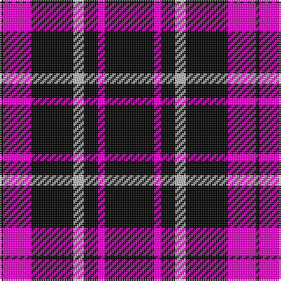

In pattern [KRKYKRK](/patterns/krkykrk/).

This was sourced from register-of-tartans.  It is a [7 stripes tartan](/stripes/stripes7/).

Original link https://www.tartanregister.gov.uk/tartanDetails.aspx?ref=10618

## Register references

External register numbers recorded for this tartan.

- Scottish Register of Tartans: [10618](https://www.tartanregister.gov.uk/tartanDetails.aspx?ref=10618)

## Thread count
K/2 LR16 K24 N6 K8 LR4 K/28

## Palette
Each colour and its ΔE from the base-6 reference it is a variant of.

| Colour | Shade | Base | ΔE (OKLab) |
|---|---|---|---|
| K | <code style="background-color:#000000;">#000000</code> `#000000` | K <code style="background-color:#000000;">#000000</code> | 0.00 |
| LR | <code style="background-color:#FF00CC;">#FF00CC</code> `#FF00CC` | R <code style="background-color:#CC0000;">#CC0000</code> | 0.26 |
| N | <code style="background-color:#BBBBBB;">#BBBBBB</code> `#BBBBBB` | Y <code style="background-color:#F2BF00;">#F2BF00</code> | 0.17 |

# Sample pattern

## Nearest tartans

The nearest existing variants by ΔTartan distance.

1. [Punky Princess (Fashion)](/setts/s7/k14r2k4w3k12r8k1~k101010-re87878-wc0c0c0~x2/) — ΔT 1.57
1. [Burberry Black](/setts/s5/y3k3y3k10r1~k000000-rc80000-yb0b0b0~x6/) — ΔT 1.68
1. [St. Eloi](/setts/s6/r3y2k10w1k10y2~k00002c-r880000-we0e0e0-yd09800~x6/) — ΔT 1.73
1. [New Zealand (2000)](/setts/s6/k21w2k5w9k13g2~g007800-k000000-wc8c8c8~x4/) — ΔT 1.77
1. [Unidentified Kirtle](/setts/s5/k55r18k4r18k38~k000000-rc00000/) — ΔT 1.88
1. [Moffat](/setts/s7/k39g3k3g3k14g28r3~g808080-k000000-rc00000~x2/) — ΔT 1.89
1. [Black 1990 (Name)](/setts/s6/k17r6k2w6k17y2~k101010-r880000-we0e0e0-ybc8c00~x2/) — ΔT 1.99
1. [Cameron, Black & Red (dress)](/setts/s6/k1r4k1r4k13r1~k000000-rc00000~x4/) — ΔT 2.00
1. [BC Corps of Commissionaires](/setts/s7/b12w1r3w1r3w1b6~b141e46-r800028-we0e0e0~x4/) — ΔT 2.03
1. [Black Clan/Family Tartan Tartan Number: 2761. Earliest known date: pre 1945 In 1990, taken to a TECA stand at one of the US Highland Games by a Timothy Wood, who explained that his faher had 'found' it in a shop in northern England during World War II. See products available Copyright © Blair Urquhart, Comrie, 2015](/setts/s6/k17r6k2w6k17y2~k101010-r880000-wc0c0c0-yd09800~x2/) — ΔT 2.05

## Neighbour map

Every grey dot is one of 15726 variants placed by the first two principal components of the ΔTartan feature space (44% of its variance). Red is this tartan; blue dots are its nearest — click one to open its page.

<svg viewBox="0 0 640 380" role="img" style="max-width:100%;height:auto;border:1px solid #e0e0e0;border-radius:4px;display:block" xmlns="http://www.w3.org/2000/svg"><image href="/nn/cloud.v1.png" width="640" height="380"/><a href="/setts/s7/k14r2k4w3k12r8k1~k101010-re87878-wc0c0c0~x2/"><circle cx="397.4" cy="217.7" r="4" fill="#3465a4"><title>Punky Princess (Fashion)</title></circle></a><a href="/setts/s5/y3k3y3k10r1~k000000-rc80000-yb0b0b0~x6/"><circle cx="346.2" cy="241.6" r="4" fill="#3465a4"><title>Burberry Black</title></circle></a><a href="/setts/s6/r3y2k10w1k10y2~k00002c-r880000-we0e0e0-yd09800~x6/"><circle cx="374.1" cy="221.2" r="4" fill="#3465a4"><title>St. Eloi</title></circle></a><a href="/setts/s6/k21w2k5w9k13g2~g007800-k000000-wc8c8c8~x4/"><circle cx="413.3" cy="241.9" r="4" fill="#3465a4"><title>New Zealand (2000)</title></circle></a><a href="/setts/s5/k55r18k4r18k38~k000000-rc00000/"><circle cx="456.5" cy="270.1" r="4" fill="#3465a4"><title>Unidentified Kirtle</title></circle></a><a href="/setts/s7/k39g3k3g3k14g28r3~g808080-k000000-rc00000~x2/"><circle cx="354.7" cy="201.5" r="4" fill="#3465a4"><title>Moffat</title></circle></a><a href="/setts/s6/k17r6k2w6k17y2~k101010-r880000-we0e0e0-ybc8c00~x2/"><circle cx="370.3" cy="228.7" r="4" fill="#3465a4"><title>Black 1990 (Name)</title></circle></a><a href="/setts/s6/k1r4k1r4k13r1~k000000-rc00000~x4/"><circle cx="415.6" cy="221.0" r="4" fill="#3465a4"><title>Cameron, Black &amp; Red (dress)</title></circle></a><a href="/setts/s7/b12w1r3w1r3w1b6~b141e46-r800028-we0e0e0~x4/"><circle cx="393.7" cy="210.4" r="4" fill="#3465a4"><title>BC Corps of Commissionaires</title></circle></a><a href="/setts/s6/k17r6k2w6k17y2~k101010-r880000-wc0c0c0-yd09800~x2/"><circle cx="378.5" cy="232.1" r="4" fill="#3465a4"><title>Black Clan/Family Tartan Tartan Number: 2761. Earliest known date: pre 1945 In 1990, taken to a TECA stand at one of the US Highland Games by a Timothy Wood, who explained that his faher had 'found' it in a shop in northern England during World War II. See products available Copyright © Blair Urquhart, Comrie, 2015</title></circle></a><circle cx="391.6" cy="217.7" r="5" fill="#c00000"/></svg>

ID: /setts/s7/k14r2k4y3k12r8k1~k000000-rff00cc-ybbbbbb~x2/
