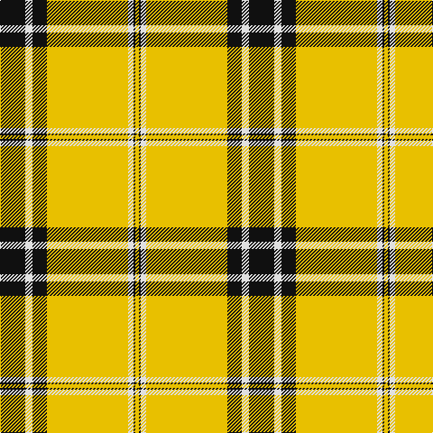

In pattern [KWKYWKY](/patterns/kwkywky/).

This was sourced from tartans-authority.  It is a [7 stripes tartan](/stripes/stripes7/).

Original link http://www.tartansauthority.com/tartan-ferret/display/7619/

## Attestations

This cloth appears in 2 source records; the oldest owns this page.

- pre 2008 — Kernow Spirit (Corporate) (tartans-authority, [record](http://www.tartansauthority.com/tartan-ferret/display/7619/))
- undated — Kernow Spirit (register-of-tartans, [record](https://www.tartanregister.gov.uk/tartanDetails.aspx?ref=5639))

## Thread count
K/28 LN8 K16 Y90 LN6 K2 Y/4

## Palette
Each colour and its ΔE from the base-6 reference it is a variant of.

| Colour | Shade | Base | ΔE (OKLab) |
|---|---|---|---|
| K | <code style="background-color:#101010;">#101010</code> `#101010` | K <code style="background-color:#000000;">#000000</code> | 0.17 |
| LN | <code style="background-color:#E0E0E0;">#E0E0E0</code> `#E0E0E0` | W <code style="background-color:#F7F7F7;">#F7F7F7</code> | 0.07 |
| Y | <code style="background-color:#E8C000;">#E8C000</code> `#E8C000` | Y <code style="background-color:#F2BF00;">#F2BF00</code> | 0.02 |

# Sample pattern

## Nearest tartans

The nearest existing variants by ΔTartan distance.

1. [Perry Ancient (Personal)](/setts/s5/y75k26k3y4k6x2~k101010-ye8c000/) — ΔT 1.53
1. [Jacobite #2](/setts/s6/y70k30w3g30k3y10~g005020-k101010-we0e0e0-ye8c000/) — ΔT 1.92
1. [Morris (Welsh Name)](/setts/s8/b6b3y3b2y3b4y48b4~b202060-ye8c000/) — ΔT 1.94
1. [Lermontov Bicentenary](/setts/s8/y5r6k5r6y36b3y2k1x2~b2c2c80-k101010-ra00000-yd09800/) — ΔT 1.95
1. [Jacobite](/setts/s6/y70k30w3g30k3y10~g008000-k000000-we0e0e0-yf0c000/) — ΔT 1.97
1. [Norton (Corporate)](/setts/s9/y75k6w3r2k6r2k6w3r2~k101010-r888888-we0e0e0-ye8c000/) — ΔT 1.97
1. [Westfalia (Corporate)](/setts/s6/g44w18g6w11b1r4x2~b003c64-g005c30-re86000-wf8f0e4/) — ΔT 1.99
1. [Australian Spirit](/setts/s12/g4w2g24y8g2y4g2y16g8w2g1w4x2~g005020-wffffff-yfccc00/) — ΔT 2.02
1. [Pollock](/setts/s7/g3r16w4k6g28r1g3x2~g008000-k000000-rc00000-we0e0e0/) — ΔT 2.10
1. [Unidentified, Blanket](/setts/s8/w50k1r12w1g12r13w1r2x2~g008000-k000000-rc00000-we0e0e0/) — ΔT 2.10

## Neighbour map

Every grey dot is one of 15726 variants placed by the first two principal components of the ΔTartan feature space (44% of its variance). Red is this tartan; blue dots are its nearest — click one to open its page.

<svg viewBox="0 0 640 380" role="img" style="max-width:100%;height:auto;border:1px solid #e0e0e0;border-radius:4px;display:block" xmlns="http://www.w3.org/2000/svg"><image href="/nn/cloud.v1.png" width="640" height="380"/><a href="/setts/s5/y75k26k3y4k6x2~k101010-ye8c000/"><circle cx="428.6" cy="159.3" r="4" fill="#3465a4"><title>Perry Ancient (Personal)</title></circle></a><a href="/setts/s6/y70k30w3g30k3y10~g005020-k101010-we0e0e0-ye8c000/"><circle cx="286.5" cy="151.5" r="4" fill="#3465a4"><title>Jacobite #2</title></circle></a><a href="/setts/s8/b6b3y3b2y3b4y48b4~b202060-ye8c000/"><circle cx="473.0" cy="122.4" r="4" fill="#3465a4"><title>Morris (Welsh Name)</title></circle></a><a href="/setts/s8/y5r6k5r6y36b3y2k1x2~b2c2c80-k101010-ra00000-yd09800/"><circle cx="438.2" cy="109.3" r="4" fill="#3465a4"><title>Lermontov Bicentenary</title></circle></a><a href="/setts/s6/y70k30w3g30k3y10~g008000-k000000-we0e0e0-yf0c000/"><circle cx="278.2" cy="149.0" r="4" fill="#3465a4"><title>Jacobite</title></circle></a><a href="/setts/s9/y75k6w3r2k6r2k6w3r2~k101010-r888888-we0e0e0-ye8c000/"><circle cx="459.8" cy="71.8" r="4" fill="#3465a4"><title>Norton (Corporate)</title></circle></a><a href="/setts/s6/g44w18g6w11b1r4x2~b003c64-g005c30-re86000-wf8f0e4/"><circle cx="360.5" cy="132.6" r="4" fill="#3465a4"><title>Westfalia (Corporate)</title></circle></a><a href="/setts/s12/g4w2g24y8g2y4g2y16g8w2g1w4x2~g005020-wffffff-yfccc00/"><circle cx="302.1" cy="134.8" r="4" fill="#3465a4"><title>Australian Spirit</title></circle></a><a href="/setts/s7/g3r16w4k6g28r1g3x2~g008000-k000000-rc00000-we0e0e0/"><circle cx="320.4" cy="145.0" r="4" fill="#3465a4"><title>Pollock</title></circle></a><a href="/setts/s8/w50k1r12w1g12r13w1r2x2~g008000-k000000-rc00000-we0e0e0/"><circle cx="363.4" cy="82.5" r="4" fill="#3465a4"><title>Unidentified, Blanket</title></circle></a><circle cx="392.1" cy="113.3" r="5" fill="#c00000"/></svg>

ID: /setts/s7/k14w4k8y45w3k1y2x2~k101010-we0e0e0-ye8c000/
