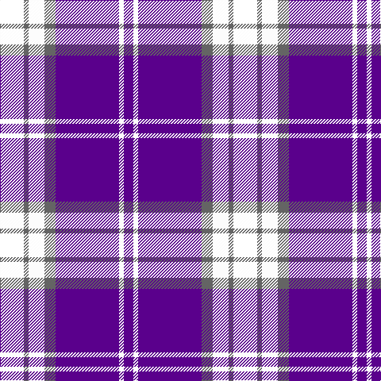

This page is one **sett** — a single exact thread-count. It belongs to the [tartan](/tartans/k15n3w10n7dp40w3dp6/)
(the same proportion at any scale), whose colour order is pattern [BWBBWBK](/stripes/bwbbwbk/).

Sourced from register-of-tartans.  It is a [7 stripe tartan](/stripes/stripes7/).

Original link https://www.tartanregister.gov.uk/tartanDetails.aspx?ref=11089

## Register references

External register numbers recorded for this tartan.

- Scottish Register of Tartans: [11089](https://www.tartanregister.gov.uk/tartanDetails.aspx?ref=11089)

## Thread count
LR/30 N6 W20 N14 P80 W6 P/12

## Palette

Palette: <strong>Tartan Register</strong>
<table><thead><tr><th>Colour</th><th>Threads</th><th>Shade</th><th>Base</th><th>OKLCh</th></tr></thead><tbody><tr><td>/</td><td style="text-align:right;font-variant-numeric:tabular-nums">30</td><td><code style="background-color:;"></code> <small style="color:#888"></small></td><td> <code style="background-color:;"></code></td><td><small style="color:#888"></small></td></tr><tr><td>N</td><td style="text-align:right;font-variant-numeric:tabular-nums">6</td><td><code style="background-color:#646464;">#646464</code> <small style="color:#888">#646464</small></td><td>B <code style="background-color:#2A418A;">#2A418A</code></td><td><small style="color:#888">oklch(50.3% 0.000 89.9)</small></td></tr><tr><td>W</td><td style="text-align:right;font-variant-numeric:tabular-nums">20</td><td><code style="background-color:#FCFCFC;">#FCFCFC</code> <small style="color:#888">#FCFCFC</small></td><td>W <code style="background-color:#F7F7F7;">#F7F7F7</code></td><td><small style="color:#888">oklch(99.1% 0.000 89.9)</small></td></tr><tr><td>N</td><td style="text-align:right;font-variant-numeric:tabular-nums">14</td><td><code style="background-color:#646464;">#646464</code> <small style="color:#888">#646464</small></td><td>B <code style="background-color:#2A418A;">#2A418A</code></td><td><small style="color:#888">oklch(50.3% 0.000 89.9)</small></td></tr><tr><td>P</td><td style="text-align:right;font-variant-numeric:tabular-nums">80</td><td><code style="background-color:#5A008C;">#5A008C</code> <small style="color:#888">#5A008C</small></td><td>B <code style="background-color:#2A418A;">#2A418A</code></td><td><small style="color:#888">oklch(37.0% 0.191 306.3)</small></td></tr><tr><td>W</td><td style="text-align:right;font-variant-numeric:tabular-nums">6</td><td><code style="background-color:#FCFCFC;">#FCFCFC</code> <small style="color:#888">#FCFCFC</small></td><td>W <code style="background-color:#F7F7F7;">#F7F7F7</code></td><td><small style="color:#888">oklch(99.1% 0.000 89.9)</small></td></tr><tr><td>P/</td><td style="text-align:right;font-variant-numeric:tabular-nums">12</td><td><code style="background-color:#5A008C;">#5A008C</code> <small style="color:#888">#5A008C</small></td><td>B <code style="background-color:#2A418A;">#2A418A</code></td><td><small style="color:#888">oklch(37.0% 0.191 306.3)</small></td></tr></tbody></table>

# Sample pattern

## Nearest tartans

The nearest existing variants by ΔTartan distance, with this tartan at the top so the swatches line up against it.

ΔTartan

Tartan

Sett

—

<a href="/ttd/edit/#slug=k15n3w10n7dp40w3dp6~x2">Loughborough Sport</a> <a class="nn-out" href="/setts/s7/k15n3w10n7dp40w3dp6~x2/" title="open its dictionary page">↗</a>

1.31

<a href="/ttd/edit/#slug=lo8w3db40k12w3lo3~x2">Wolverines (Corporate)</a> <a class="nn-out" href="/setts/s6/lo8w3db40k12w3lo3~x2/" title="open its dictionary page">↗</a>

1.38

<a href="/ttd/edit/#slug=k2r9w2db2w4db2w2db20w2~x4">Yudo (Corporate)</a> <a class="nn-out" href="/setts/s9/k2r9w2db2w4db2w2db20w2~x4/" title="open its dictionary page">↗</a>

1.39

<a href="/ttd/edit/#slug=k3db30k8w8k2r3~x2">Hydro-Electric</a> <a class="nn-out" href="/setts/s6/k3db30k8w8k2r3~x2/" title="open its dictionary page">↗</a>

1.42

<a href="/setts/s8/db8r1w1r1k1~x8/">Laing of Archiestown</a>

1.45

<a href="/ttd/edit/#slug=r10db15g2db2w1db1w1~x4">Ikelman #4 (Personal)</a> <a class="nn-out" href="/setts/s7/r10db15g2db2w1db1w1~x4/" title="open its dictionary page">↗</a>

1.48

<a href="/ttd/edit/#slug=lo12db2lo2db30dt2db2dt13lb4~x2">Highlands School (North Carolina)</a> <a class="nn-out" href="/setts/s8/lo12db2lo2db30dt2db2dt13lb4~x2/" title="open its dictionary page">↗</a>

1.52

<a href="/ttd/edit/#slug=db2w2r2w2r2db2r2db12ly1db2w2~x4">Good Morning America (Corporate)</a> <a class="nn-out" href="/setts/s11/db2w2r2w2r2db2r2db12ly1db2w2~x4/" title="open its dictionary page">↗</a>

1.53

<a href="/ttd/edit/#slug=ly12dbi2ly2dbi30db3dbi2db13w4~x2">Highlands School (N. Carolina) Corporate Tartan Tartan Number: 2109. Earliest known date: 1990 Highlands in North Carolina is the home of the Scottish Tartans Society's Museum Extension. The school tartan was designed by Bob Martin who is a 'Fellow of the Society'. Blue and Gold are the school colours. See products available Copyright © Blair Urquhart, Comrie, 2015</a> <a class="nn-out" href="/setts/s8/ly12dbi2ly2dbi30db3dbi2db13w4~x2/" title="open its dictionary page">↗</a>

1.53

<a href="/ttd/edit/#slug=k2w3dp5lo4w3lo4dp25lo2~x2">Western Illinois University</a> <a class="nn-out" href="/setts/s8/k2w3dp5lo4w3lo4dp25lo2~x2/" title="open its dictionary page">↗</a>

1.57

<a href="/ttd/edit/#slug=dp24k4lb10db3dp3w2~x2">Cramer (Personal)</a> <a class="nn-out" href="/setts/s6/dp24k4lb10db3dp3w2~x2/" title="open its dictionary page">↗</a>

## Neighbour map

Every grey dot is one of 14359 variants placed by the first two principal components of the ΔTartan feature space (44% of its variance). Red is this tartan; blue dots are its nearest — click one to open its page.

<svg viewBox="0 0 640 380" role="img" style="max-width:100%;height:auto;border:1px solid #e0e0e0;border-radius:4px;display:block" xmlns="http://www.w3.org/2000/svg"><image href="/nn/cloud.v1.png" width="640" height="380"/><a href="/setts/s6/lo8w3db40k12w3lo3~x2/"><circle cx="306.2" cy="167.5" r="4" fill="#3465a4"><title>Wolverines (Corporate)</title></circle></a><a href="/setts/s9/k2r9w2db2w4db2w2db20w2~x4/"><circle cx="258.4" cy="148.0" r="4" fill="#3465a4"><title>Yudo (Corporate)</title></circle></a><a href="/setts/s6/k3db30k8w8k2r3~x2/"><circle cx="291.2" cy="168.8" r="4" fill="#3465a4"><title>Hydro-Electric</title></circle></a><a href="/setts/s8/db8r1w1r1k1~x8/"><circle cx="269.4" cy="160.4" r="4" fill="#3465a4"><title>Laing of Archiestown</title></circle></a><a href="/setts/s7/r10db15g2db2w1db1w1~x4/"><circle cx="339.6" cy="170.7" r="4" fill="#3465a4"><title>Ikelman #4 (Personal)</title></circle></a><a href="/setts/s8/lo12db2lo2db30dt2db2dt13lb4~x2/"><circle cx="272.7" cy="161.3" r="4" fill="#3465a4"><title>Highlands School (North Carolina)</title></circle></a><a href="/setts/s11/db2w2r2w2r2db2r2db12ly1db2w2~x4/"><circle cx="285.3" cy="142.8" r="4" fill="#3465a4"><title>Good Morning America (Corporate)</title></circle></a><a href="/setts/s8/ly12dbi2ly2dbi30db3dbi2db13w4~x2/"><circle cx="259.8" cy="156.5" r="4" fill="#3465a4"><title>Highlands School (N. Carolina) Corporate Tartan Tartan Number: 2109. Earliest known date: 1990 Highlands in North Carolina is the home of the Scottish Tartans Society's Museum Extension. The school tartan was designed by Bob Martin who is a 'Fellow of the Society'. Blue and Gold are the school colours. See products available Copyright © Blair Urquhart, Comrie, 2015</title></circle></a><a href="/setts/s8/k2w3dp5lo4w3lo4dp25lo2~x2/"><circle cx="335.7" cy="141.5" r="4" fill="#3465a4"><title>Western Illinois University</title></circle></a><a href="/setts/s6/dp24k4lb10db3dp3w2~x2/"><circle cx="298.1" cy="156.8" r="4" fill="#3465a4"><title>Cramer (Personal)</title></circle></a><circle cx="269.7" cy="161.7" r="5" fill="#c00000"/></svg>

ID: /setts/s7/k15n3w10n7dp40w3dp6~x2/
