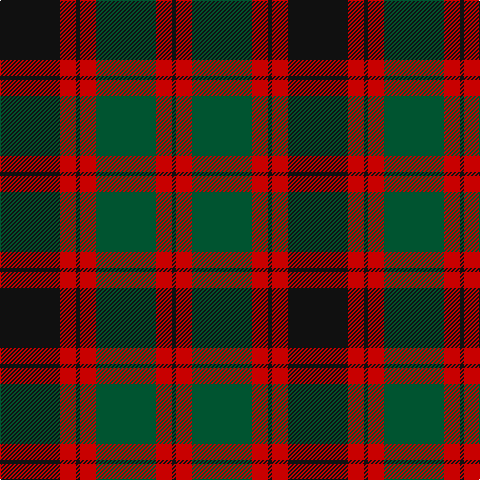

This page is one **sett** — a single exact thread-count. It belongs to the [tartan](/tartans/k15r4k1r4dg15r4k1/)
(the same proportion at any scale), whose colour order is pattern [KRGRKRK](/stripes/krgrkrk/).

Sourced from register-of-tartans.  It is a [7 stripe tartan](/stripes/stripes7/).

Original link https://www.tartanregister.gov.uk/tartanDetails.aspx?ref=4903

## Register references

External register numbers recorded for this tartan.

- Scottish Register of Tartans: [4903](https://www.tartanregister.gov.uk/tartanDetails.aspx?ref=4903)
- Scottish Tartans Authority (ITI): 6039

## Thread count
K/60 R16 K4 R16 G60 R16 K/4

## Palette

Palette: <strong>Tartan Register</strong> <small style="color:#888">(2 of 3 colours)</small>
<table><thead><tr><th>Colour</th><th>Threads</th><th>Shade</th><th>Base</th><th>OKLCh</th></tr></thead><tbody><tr><td>K/</td><td style="text-align:right;font-variant-numeric:tabular-nums">60</td><td><code style="background-color:#101010;">#101010</code> <small style="color:#888">#101010</small></td><td>K <code style="background-color:#000000;">#000000</code></td><td><small style="color:#888">oklch(17.3% 0.000 89.9)</small></td></tr><tr><td>R</td><td style="text-align:right;font-variant-numeric:tabular-nums">16</td><td><code style="background-color:#C80000;">#C80000</code> <small style="color:#888">#C80000</small></td><td>R <code style="background-color:#CC0000;">#CC0000</code></td><td><small style="color:#888">oklch(52.3% 0.215 29.2)</small></td></tr><tr><td>K</td><td style="text-align:right;font-variant-numeric:tabular-nums">4</td><td><code style="background-color:#101010;">#101010</code> <small style="color:#888">#101010</small></td><td>K <code style="background-color:#000000;">#000000</code></td><td><small style="color:#888">oklch(17.3% 0.000 89.9)</small></td></tr><tr><td>R</td><td style="text-align:right;font-variant-numeric:tabular-nums">16</td><td><code style="background-color:#C80000;">#C80000</code> <small style="color:#888">#C80000</small></td><td>R <code style="background-color:#CC0000;">#CC0000</code></td><td><small style="color:#888">oklch(52.3% 0.215 29.2)</small></td></tr><tr><td>G</td><td style="text-align:right;font-variant-numeric:tabular-nums">60</td><td><code style="background-color:#005430;">#005430</code> <small style="color:#888">#005430</small></td><td>G <code style="background-color:#006100;">#006100</code></td><td><small style="color:#888">oklch(39.2% 0.094 156.7)</small></td></tr><tr><td>R</td><td style="text-align:right;font-variant-numeric:tabular-nums">16</td><td><code style="background-color:#C80000;">#C80000</code> <small style="color:#888">#C80000</small></td><td>R <code style="background-color:#CC0000;">#CC0000</code></td><td><small style="color:#888">oklch(52.3% 0.215 29.2)</small></td></tr><tr><td>K/</td><td style="text-align:right;font-variant-numeric:tabular-nums">4</td><td><code style="background-color:#101010;">#101010</code> <small style="color:#888">#101010</small></td><td>K <code style="background-color:#000000;">#000000</code></td><td><small style="color:#888">oklch(17.3% 0.000 89.9)</small></td></tr></tbody></table>

# Sample pattern

## Nearest tartans

The nearest existing variants by ΔTartan distance, with this tartan at the top so the swatches line up against it.

ΔTartan

Tartan

Sett

—

<a href="/ttd/edit/#slug=k15r4k1r4dg15r4k1~x4">Logan (Dark)</a> <a class="nn-out" href="/setts/s7/k15r4k1r4dg15r4k1~x4/" title="open its dictionary page">↗</a>

0.70

<a href="/ttd/edit/#slug=k14r6k2r6dg25r6k2~x2">Logan - 1810 (Cockburn Collection)</a> <a class="nn-out" href="/setts/s7/k14r6k2r6dg25r6k2~x2/" title="open its dictionary page">↗</a>

1.05

<a href="/ttd/edit/#slug=db8r3db1r3dg14r3db1~x4">Logan</a> <a class="nn-out" href="/setts/s7/db8r3db1r3dg14r3db1~x4/" title="open its dictionary page">↗</a>

1.09

<a href="/ttd/edit/#slug=dg12g6dg6r15k1r1k2~x2">Cook (Name)</a> <a class="nn-out" href="/setts/s7/dg12g6dg6r15k1r1k2~x2/" title="open its dictionary page">↗</a>

1.15

<a href="/ttd/edit/#slug=k9lr4k1lr4dg15r4k1~x4">Logan - 1797 (Dark)</a> <a class="nn-out" href="/setts/s7/k9lr4k1lr4dg15r4k1~x4/" title="open its dictionary page">↗</a>

1.18

<a href="/ttd/edit/#slug=dg20db2dg2db2dg2db8r24db2r3">Lindsay Red</a> <a class="nn-out" href="/setts/s9/dg20db2dg2db2dg2db8r24db2r3/" title="open its dictionary page">↗</a>

1.22

<a href="/ttd/edit/#slug=db9r6dg2r6dg18r6dg2~x2">Skene D</a> <a class="nn-out" href="/setts/s7/db9r6dg2r6dg18r6dg2~x2/" title="open its dictionary page">↗</a>

1.25

<a href="/ttd/edit/#slug=db9r6dg2r6dg18r6dg2">Skene D</a> <a class="nn-out" href="/setts/s7/db9r6dg2r6dg18r6dg2/" title="open its dictionary page">↗</a>

1.27

<a href="/ttd/edit/#slug=db9r3db1r3dg9r3db1~x2">Skene</a> <a class="nn-out" href="/setts/s7/db9r3db1r3dg9r3db1~x2/" title="open its dictionary page">↗</a>

1.28

<a href="/ttd/edit/#slug=db6r3g1r3g12r3g1~x4">Skene - 1831 (Clan)</a> <a class="nn-out" href="/setts/s7/db6r3g1r3g12r3g1~x4/" title="open its dictionary page">↗</a>

1.28

<a href="/ttd/edit/#slug=k21g2k2g2k3g15r29g2r2g4~x2">City of Armadale</a> <a class="nn-out" href="/setts/s10/k21g2k2g2k3g15r29g2r2g4~x2/" title="open its dictionary page">↗</a>

## Neighbour map

Every grey dot is one of 14299 variants placed by the first two principal components of the ΔTartan feature space (44% of its variance). Red is this tartan; blue dots are its nearest — click one to open its page.

<svg viewBox="0 0 640 380" role="img" style="max-width:100%;height:auto;border:1px solid #e0e0e0;border-radius:4px;display:block" xmlns="http://www.w3.org/2000/svg"><image href="/nn/cloud.v1.png" width="640" height="380"/><a href="/setts/s7/k14r6k2r6dg25r6k2~x2/"><circle cx="250.3" cy="206.4" r="4" fill="#3465a4"><title>Logan - 1810 (Cockburn Collection)</title></circle></a><a href="/setts/s7/db8r3db1r3dg14r3db1~x4/"><circle cx="289.0" cy="209.7" r="4" fill="#3465a4"><title>Logan</title></circle></a><a href="/setts/s7/dg12g6dg6r15k1r1k2~x2/"><circle cx="253.2" cy="191.0" r="4" fill="#3465a4"><title>Cook (Name)</title></circle></a><a href="/setts/s7/k9lr4k1lr4dg15r4k1~x4/"><circle cx="215.3" cy="185.3" r="4" fill="#3465a4"><title>Logan - 1797 (Dark)</title></circle></a><a href="/setts/s9/dg20db2dg2db2dg2db8r24db2r3/"><circle cx="274.6" cy="177.2" r="4" fill="#3465a4"><title>Lindsay Red</title></circle></a><a href="/setts/s7/db9r6dg2r6dg18r6dg2~x2/"><circle cx="277.2" cy="246.1" r="4" fill="#3465a4"><title>Skene D</title></circle></a><a href="/setts/s7/db9r6dg2r6dg18r6dg2/"><circle cx="256.1" cy="233.3" r="4" fill="#3465a4"><title>Skene D</title></circle></a><a href="/setts/s7/db9r3db1r3dg9r3db1~x2/"><circle cx="219.0" cy="228.4" r="4" fill="#3465a4"><title>Skene</title></circle></a><a href="/setts/s7/db6r3g1r3g12r3g1~x4/"><circle cx="298.8" cy="216.7" r="4" fill="#3465a4"><title>Skene - 1831 (Clan)</title></circle></a><a href="/setts/s10/k21g2k2g2k3g15r29g2r2g4~x2/"><circle cx="261.7" cy="164.5" r="4" fill="#3465a4"><title>City of Armadale</title></circle></a><circle cx="268.6" cy="207.0" r="5" fill="#c00000"/></svg>

ID: /setts/s7/k15r4k1r4dg15r4k1~x4/
