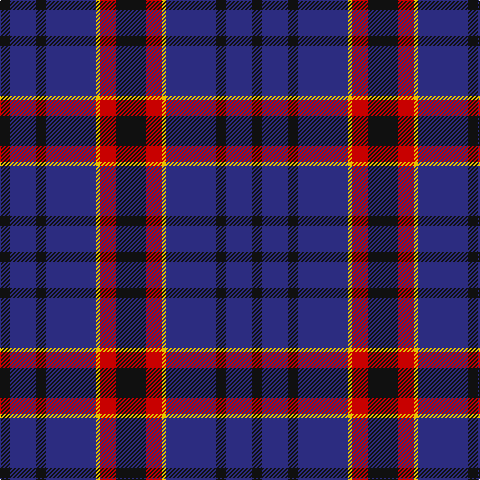

**Bands:** [KBKBYRK](/stripes/kbkbyrk/) · **Stripes:** [K DB K DB LY R K](/stripes/stripes7/) K DB K DB LY R K

This was sourced from tartans-authority.  It is a [7 band tartan](/bands/bands7/).

Original link http://www.tartansauthority.com/tartan-ferret/display/8029/

## Thread count
K/10 DB26 K10 DB50 Y4 R16 K/30

## Palette
Each colour and its ΔE from the base-6 reference it is a variant of.

| Colour | Shade | Base | ΔE (OKLab) |
|---|---|---|---|
| DB | <code style="background-color:#2C2C80;">#2C2C80</code> `#2C2C80` | B <code style="background-color:#2A418A;">#2A418A</code> | 0.06 |
| K | <code style="background-color:#101010;">#101010</code> `#101010` | K <code style="background-color:#000000;">#000000</code> | 0.17 |
| R | <code style="background-color:#C80000;">#C80000</code> `#C80000` | R <code style="background-color:#CC0000;">#CC0000</code> | 0.01 |
| Y | <code style="background-color:#E8C000;">#E8C000</code> `#E8C000` | Y <code style="background-color:#F2BF00;">#F2BF00</code> | 0.02 |

# Sample pattern

## Nearest tartans

The nearest existing variants by ΔTartan distance.

1. [Murdoch Clebration (Personal)](/setts/s8/k21db8r4db2r2db23k4w2~x2/) — ΔT 1.04
1. [Scottish Express International](/setts/s6/k1db7k4lb1k4p1~x4/) — ΔT 1.22
1. [Joker Fancy Tartan Tartan Number: 6769. Earliest known date: 2005 I have a photo of a fabric swatch that I am trying to match as close as possible. I have been commissioned to make a life size mannequin of Jack Nicholson as the Joker and he wore plaid/tartan pants. I could send you some photos through email and possibly you could help me. Thanks, Andy Garringer USA, January 2008. (96 threads @ 40 epi heavyweight = 2.5 inch repeat) See products available Copyright © Blair Urquhart, Comrie, 2015](/setts/s6/b11k1b3k5dp9lo1~x2/) — ΔT 1.22
1. [Ibrox](/setts/s11/db4r2db2r4k7db10w2k13db18k2db2~x4/) — ΔT 1.24
1. [Britannia](/setts/s5/k14r4k25db30w4~x2/) — ΔT 1.25
1. [Heritage of Wales (Fashion)](/setts/s7/r10db4r6db30k10db5w2~x2/) — ΔT 1.29
1. [Dege, of Saville Row](/setts/s6/o11db1o3db1db9r1~x4/) — ΔT 1.30
1. [Stone of Destiny](/setts/s9/db4ly2db17k2r4k2db3k11db3~x2/) — ΔT 1.33
1. [South African Air Force](/setts/s8/n15k14t1ly2t1k14n15k2~x4/) — ΔT 1.35
1. [Granger (Personal)](/setts/s6/db40k4db12k21g27w4~x2/) — ΔT 1.36

## Neighbour map

Every grey dot is one of 14313 variants placed by the first two principal components of the ΔTartan feature space (44% of its variance). Red is this tartan; blue dots are its nearest — click one to open its page.

<svg viewBox="0 0 640 380" role="img" style="max-width:100%;height:auto;border:1px solid #e0e0e0;border-radius:4px;display:block" xmlns="http://www.w3.org/2000/svg"><image href="/nn/cloud.v1.png" width="640" height="380"/><a href="/setts/s8/k21db8r4db2r2db23k4w2~x2/"><circle cx="308.9" cy="198.5" r="4" fill="#3465a4"><title>Murdoch Clebration (Personal)</title></circle></a><a href="/setts/s6/k1db7k4lb1k4p1~x4/"><circle cx="285.5" cy="257.0" r="4" fill="#3465a4"><title>Scottish Express International</title></circle></a><a href="/setts/s6/b11k1b3k5dp9lo1~x2/"><circle cx="263.7" cy="228.4" r="4" fill="#3465a4"><title>Joker Fancy Tartan Tartan Number: 6769. Earliest known date: 2005 I have a photo of a fabric swatch that I am trying to match as close as possible. I have been commissioned to make a life size mannequin of Jack Nicholson as the Joker and he wore plaid/tartan pants. I could send you some photos through email and possibly you could help me. Thanks, Andy Garringer USA, January 2008. (96 threads @ 40 epi heavyweight = 2.5 inch repeat) See products available Copyright © Blair Urquhart, Comrie, 2015</title></circle></a><a href="/setts/s11/db4r2db2r4k7db10w2k13db18k2db2~x4/"><circle cx="305.3" cy="203.8" r="4" fill="#3465a4"><title>Ibrox</title></circle></a><a href="/setts/s5/k14r4k25db30w4~x2/"><circle cx="285.3" cy="262.6" r="4" fill="#3465a4"><title>Britannia</title></circle></a><a href="/setts/s7/r10db4r6db30k10db5w2~x2/"><circle cx="340.2" cy="187.3" r="4" fill="#3465a4"><title>Heritage of Wales (Fashion)</title></circle></a><a href="/setts/s6/o11db1o3db1db9r1~x4/"><circle cx="329.3" cy="208.4" r="4" fill="#3465a4"><title>Dege, of Saville Row</title></circle></a><a href="/setts/s9/db4ly2db17k2r4k2db3k11db3~x2/"><circle cx="308.1" cy="207.1" r="4" fill="#3465a4"><title>Stone of Destiny</title></circle></a><a href="/setts/s8/n15k14t1ly2t1k14n15k2~x4/"><circle cx="311.1" cy="208.4" r="4" fill="#3465a4"><title>South African Air Force</title></circle></a><a href="/setts/s6/db40k4db12k21g27w4~x2/"><circle cx="253.8" cy="238.6" r="4" fill="#3465a4"><title>Granger (Personal)</title></circle></a><circle cx="299.7" cy="225.1" r="5" fill="#c00000"/></svg>

ID: /setts/s7/k15r8ly2db25k5db13k5~x2/
