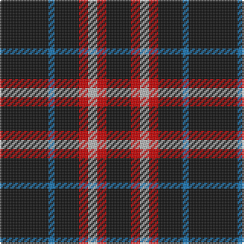

In pattern [KBKRYRK](/patterns/kbkryrk/).

This was sourced from register-of-tartans.  It is a [7 stripes tartan](/stripes/stripes7/).

Original link https://www.tartanregister.gov.uk/tartanDetails.aspx?ref=249

## Attestations

This cloth appears in 2 source records; the oldest owns this page.

- 01/01/2004 — Benson (New England) (register-of-tartans, [record](https://www.tartanregister.gov.uk/tartanDetails.aspx?ref=249))
- pre 2004 — Benson (Name) (tartans-authority, [record](http://www.tartansauthority.com/tartan-ferret/display/6465/))

## Thread count
K/32 B4 K16 R6 N6 R6 K/16

## Palette
Each colour and its ΔE from the base-6 reference it is a variant of.

| Colour | Shade | Base | ΔE (OKLab) |
|---|---|---|---|
| B | <code style="background-color:#1474B4;">#1474B4</code> `#1474B4` | B <code style="background-color:#2A418A;">#2A418A</code> | 0.15 |
| K | <code style="background-color:#101010;">#101010</code> `#101010` | K <code style="background-color:#000000;">#000000</code> | 0.17 |
| N | <code style="background-color:#B8B8B8;">#B8B8B8</code> `#B8B8B8` | Y <code style="background-color:#F2BF00;">#F2BF00</code> | 0.17 |
| R | <code style="background-color:#C80000;">#C80000</code> `#C80000` | R <code style="background-color:#CC0000;">#CC0000</code> | 0.01 |

# Sample pattern

## Nearest tartans

The nearest existing variants by ΔTartan distance.

1. [Black (symmetrical)](/setts/s6/k17r6k2w6k17y2~k101010-r880000-wc0c0c0-ybc8c00~x2/) — ΔT 0.59
1. [Black Clan/Family Tartan Tartan Number: 2761. Earliest known date: pre 1945 In 1990, taken to a TECA stand at one of the US Highland Games by a Timothy Wood, who explained that his faher had 'found' it in a shop in northern England during World War II. See products available Copyright © Blair Urquhart, Comrie, 2015](/setts/s6/k17r6k2w6k17y2~k101010-r880000-wc0c0c0-yd09800~x2/) — ΔT 0.61
1. [Black 1990 (Name)](/setts/s6/k17r6k2w6k17y2~k101010-r880000-we0e0e0-ybc8c00~x2/) — ΔT 0.79
1. [Cowe (Personal)](/setts/s7/k8b3k32ba14w3k25b3~b5c8ca8-ba1474b4-k101010-wfcfcfc~x2/) — ΔT 1.16
1. [London Fog Black 2 (fashion)](/setts/s10/k18b9k18w2k2w2k18y9k18w2~b2888c4-k101010-wd4d4c4-yccc0a4/) — ΔT 1.21
1. [Anzac (Fashion)](/setts/s8/k21w2k4w4b2w4k13g2~b4c3428-g006818-k101010-wc0c0c0~x4/) — ΔT 1.24
1. [Justus Family Tartan Tartan Number: 2100. Earliest known date: 1990 Submitted as the Justus family sett but awaits the approval of the proposed Justus Family Society of North America. Sample supplied in 9 tpi. See products available Copyright © Blair Urquhart, Comrie, 2015](/setts/s7/b1k4r1k1y1k4b1~b2c2c80-k101010-rc80000-ye8c000~x6/) — ΔT 1.32
1. [St. Eloi](/setts/s6/r3y2k10w1k10y2~k00002c-r880000-we0e0e0-yd09800~x6/) — ΔT 1.33
1. [Punky Princess (Fashion)](/setts/s7/k14r2k4w3k12r8k1~k101010-re87878-wc0c0c0~x2/) — ΔT 1.48
1. [Modowny](/setts/s9/r1b6k1b1k2b1k1b6y1~b646464-k000000-r8c0000-yc89800~x8/) — ΔT 1.52

## Neighbour map

Every grey dot is one of 15726 variants placed by the first two principal components of the ΔTartan feature space (44% of its variance). Red is this tartan; blue dots are its nearest — click one to open its page.

<svg viewBox="0 0 640 380" role="img" style="max-width:100%;height:auto;border:1px solid #e0e0e0;border-radius:4px;display:block" xmlns="http://www.w3.org/2000/svg"><image href="/nn/cloud.v1.png" width="640" height="380"/><a href="/setts/s6/k17r6k2w6k17y2~k101010-r880000-wc0c0c0-ybc8c00~x2/"><circle cx="379.8" cy="232.7" r="4" fill="#3465a4"><title>Black (symmetrical)</title></circle></a><a href="/setts/s6/k17r6k2w6k17y2~k101010-r880000-wc0c0c0-yd09800~x2/"><circle cx="378.5" cy="232.1" r="4" fill="#3465a4"><title>Black Clan/Family Tartan Tartan Number: 2761. Earliest known date: pre 1945 In 1990, taken to a TECA stand at one of the US Highland Games by a Timothy Wood, who explained that his faher had 'found' it in a shop in northern England during World War II. See products available Copyright © Blair Urquhart, Comrie, 2015</title></circle></a><a href="/setts/s6/k17r6k2w6k17y2~k101010-r880000-we0e0e0-ybc8c00~x2/"><circle cx="370.3" cy="228.7" r="4" fill="#3465a4"><title>Black 1990 (Name)</title></circle></a><a href="/setts/s7/k8b3k32ba14w3k25b3~b5c8ca8-ba1474b4-k101010-wfcfcfc~x2/"><circle cx="410.1" cy="216.7" r="4" fill="#3465a4"><title>Cowe (Personal)</title></circle></a><a href="/setts/s10/k18b9k18w2k2w2k18y9k18w2~b2888c4-k101010-wd4d4c4-yccc0a4/"><circle cx="381.6" cy="211.9" r="4" fill="#3465a4"><title>London Fog Black 2 (fashion)</title></circle></a><a href="/setts/s8/k21w2k4w4b2w4k13g2~b4c3428-g006818-k101010-wc0c0c0~x4/"><circle cx="400.6" cy="194.1" r="4" fill="#3465a4"><title>Anzac (Fashion)</title></circle></a><a href="/setts/s7/b1k4r1k1y1k4b1~b2c2c80-k101010-rc80000-ye8c000~x6/"><circle cx="334.0" cy="259.2" r="4" fill="#3465a4"><title>Justus Family Tartan Tartan Number: 2100. Earliest known date: 1990 Submitted as the Justus family sett but awaits the approval of the proposed Justus Family Society of North America. Sample supplied in 9 tpi. See products available Copyright © Blair Urquhart, Comrie, 2015</title></circle></a><a href="/setts/s6/r3y2k10w1k10y2~k00002c-r880000-we0e0e0-yd09800~x6/"><circle cx="374.1" cy="221.2" r="4" fill="#3465a4"><title>St. Eloi</title></circle></a><a href="/setts/s7/k14r2k4w3k12r8k1~k101010-re87878-wc0c0c0~x2/"><circle cx="397.4" cy="217.7" r="4" fill="#3465a4"><title>Punky Princess (Fashion)</title></circle></a><a href="/setts/s9/r1b6k1b1k2b1k1b6y1~b646464-k000000-r8c0000-yc89800~x8/"><circle cx="359.6" cy="210.1" r="4" fill="#3465a4"><title>Modowny</title></circle></a><circle cx="402.0" cy="233.1" r="5" fill="#c00000"/></svg>

ID: /setts/s7/k16b2k8r3y3r3k8~b1474b4-k101010-rc80000-yb8b8b8~x2/
