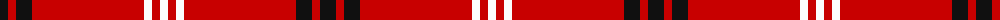
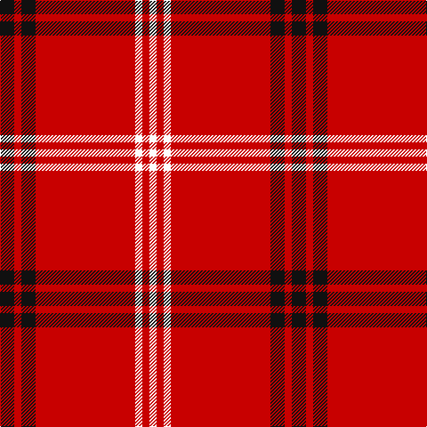

In pattern [KRKRWRW](/patterns/krkrwrw/).

This was sourced from tartans-authority.  It is a [7 stripes tartan](/stripes/stripes7/).

Original link http://www.tartansauthority.com/tartan-ferret/display/7207/

## Thread count
K/16 R8 K16 R112 W8 R8 W/8

## Palette
Each colour and its ΔE from the base-6 reference it is a variant of.

| Colour | Shade | Base | ΔE (OKLab) |
|---|---|---|---|
| K | <code style="background-color:#101010;">#101010</code> `#101010` | K <code style="background-color:#000000;">#000000</code> | 0.17 |
| R | <code style="background-color:#C80000;">#C80000</code> `#C80000` | R <code style="background-color:#C80000;">#C80000</code> | 0.00 |
| W | <code style="background-color:#FCFCFC;">#FCFCFC</code> `#FCFCFC` | W <code style="background-color:#F4F4F0;">#F4F4F0</code> | 0.03 |

# Sample pattern

## Nearest tartans

The nearest existing variants by ΔTartan distance.

1. [Duke of Sussex](/setts/s7/r36g2k10g2k2g2r18-g289c18-k000000-rc80000/) — ΔT 0.95
1. [Virgin](/setts/s8/r102ra4r12k20r4k8ra6k6-k101010-re80000-ra888888/) — ΔT 1.12
1. [Aberdeen Football Club (2002)](/setts/s8/k8r8y4r82k8r8k24w4-k101010-rdc0000-we0e0e0-ye8c000/) — ΔT 1.24
1. [Aberdeen F. C. (2002) (Sports)](/setts/s8/k8r8y4r82k8r8k24w4-k101010-rc80000-wfcfcfc-yfccc00/) — ΔT 1.32
1. [Rose](/setts/s9/g2r28b6r5b2r2b2r11w2-b000064-g004c00-rc80000-wd0d0d0/) — ΔT 1.42
1. [Howard, Vincent (Personal)](/setts/s6/r130g32r8b8r8w10-b440044-g006818-rc80000-wfcfcfc/) — ΔT 1.43
1. [Loch Morar](/setts/s5/r76w18r6b18w6-b401000-rc00000-we0e0e0/) — ΔT 1.47
1. [Loch Morar Trade Tartan Tartan Number: 1701. Earliest known date: pre 2003 Nothing See products available Copyright © Blair Urquhart, Comrie, 2015](/setts/s5/r76w18r6b18w6-b441800-rc80000-we0e0e0/) — ΔT 1.51
1. [Howard, Vincent (Personal)](/setts/s6/r130g32r8b8r8w10-b440044-g004c00-rc80000-we0e0e0/) — ΔT 1.51
1. [Swiss National (Fashion)](/setts/s8/w20r94b4r4b4r36ba6w8-b2c2c80-ba202060-rc80000-we0e0e0/) — ΔT 1.52

## Neighbour map

Every grey dot is one of 15726 variants placed by the first two principal components of the ΔTartan feature space (44% of its variance). Red is this tartan; blue dots are its nearest — click one to open its page.

<svg viewBox="0 0 640 380" role="img" style="max-width:100%;height:auto;border:1px solid #e0e0e0;border-radius:4px;display:block" xmlns="http://www.w3.org/2000/svg"><image href="/nn/cloud.v1.png" width="640" height="380"/><a href="/setts/s7/r36g2k10g2k2g2r18-g289c18-k000000-rc80000/"><circle cx="491.4" cy="159.5" r="4" fill="#3465a4"><title>Duke of Sussex</title></circle></a><a href="/setts/s8/r102ra4r12k20r4k8ra6k6-k101010-re80000-ra888888/"><circle cx="520.6" cy="120.6" r="4" fill="#3465a4"><title>Virgin</title></circle></a><a href="/setts/s8/k8r8y4r82k8r8k24w4-k101010-rdc0000-we0e0e0-ye8c000/"><circle cx="436.7" cy="119.2" r="4" fill="#3465a4"><title>Aberdeen Football Club (2002)</title></circle></a><a href="/setts/s8/k8r8y4r82k8r8k24w4-k101010-rc80000-wfcfcfc-yfccc00/"><circle cx="438.6" cy="122.7" r="4" fill="#3465a4"><title>Aberdeen F. C. (2002) (Sports)</title></circle></a><a href="/setts/s9/g2r28b6r5b2r2b2r11w2-b000064-g004c00-rc80000-wd0d0d0/"><circle cx="494.1" cy="145.8" r="4" fill="#3465a4"><title>Rose</title></circle></a><a href="/setts/s6/r130g32r8b8r8w10-b440044-g006818-rc80000-wfcfcfc/"><circle cx="505.8" cy="151.3" r="4" fill="#3465a4"><title>Howard, Vincent (Personal)</title></circle></a><a href="/setts/s5/r76w18r6b18w6-b401000-rc00000-we0e0e0/"><circle cx="415.5" cy="186.4" r="4" fill="#3465a4"><title>Loch Morar</title></circle></a><a href="/setts/s5/r76w18r6b18w6-b441800-rc80000-we0e0e0/"><circle cx="417.5" cy="186.1" r="4" fill="#3465a4"><title>Loch Morar Trade Tartan Tartan Number: 1701. Earliest known date: pre 2003 Nothing See products available Copyright © Blair Urquhart, Comrie, 2015</title></circle></a><a href="/setts/s6/r130g32r8b8r8w10-b440044-g004c00-rc80000-we0e0e0/"><circle cx="510.9" cy="153.7" r="4" fill="#3465a4"><title>Howard, Vincent (Personal)</title></circle></a><a href="/setts/s8/w20r94b4r4b4r36ba6w8-b2c2c80-ba202060-rc80000-we0e0e0/"><circle cx="513.7" cy="119.5" r="4" fill="#3465a4"><title>Swiss National (Fashion)</title></circle></a><circle cx="478.4" cy="150.2" r="5" fill="#c00000"/></svg>

ID: /setts/s7/k16r8k16r112w8r8w8-k101010-rc80000-wfcfcfc/
