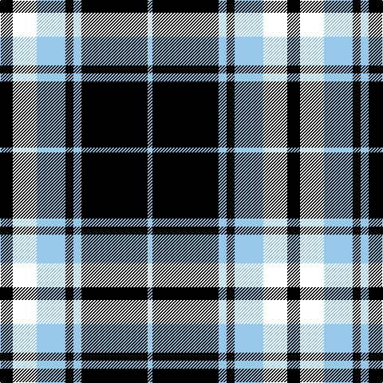

In pattern [KWWKWKW](/patterns/kwwkwkw/).

This was sourced from register-of-tartans.  It is a [7 stripes tartan](/stripes/stripes7/).

Original link https://www.tartanregister.gov.uk/tartanDetails.aspx?ref=11567

## Thread count
K/16 W30 LB36 K10 LB10 K83 LB/6

## Palette
Each colour and its ΔE from the base-6 reference it is a variant of.

| Colour | Shade | Base | ΔE (OKLab) |
|---|---|---|---|
| K | <code style="background-color:#000000;">#000000</code> `#000000` | K <code style="background-color:#000000;">#000000</code> | 0.00 |
| LB | <code style="background-color:#98C8E8;">#98C8E8</code> `#98C8E8` | W <code style="background-color:#F7F7F7;">#F7F7F7</code> | 0.18 |
| W | <code style="background-color:#FFFFFF;">#FFFFFF</code> `#FFFFFF` | W <code style="background-color:#F7F7F7;">#F7F7F7</code> | 0.02 |

# Sample pattern

## Nearest tartans

The nearest existing variants by ΔTartan distance.

1. [St Piran, Cornish Flag](/setts/s5/w5k20w10k1r2~k000000-rc00000-we0e0e0~x2/) — ΔT 1.14
1. [Glen Coe #2](/setts/s8/k37w9k3g9w3g9k3w9~g006818-k101010-wfcfcfc~x2/) — ΔT 1.19
1. [Sligo Irish County Tartan Tartan Number: 2256. Earliest known date: 1995 One of a series of Irish District tartans designed by Polly Wittering of the House of Edgar, with colours reminiscent of the Country with soft warm colours dominating. See products available Copyright © Blair Urquhart, Comrie, 2015](/setts/s6/b50k4b12k23y4k4~b687c94-k000000-yd49c1c~x2/) — ΔT 1.27
1. [Aquascutum (Kinloch Anderson)](/setts/s9/g7k7g4k26w12k3w14r2k6~g503c14-k000028-r781c38-wf5dca0/) — ΔT 1.28
1. [MacPherson, of Cluny](/setts/s7/w5r3w35k28w4k11w2~k000000-rc00000-we0e0e0~x2/) — ΔT 1.30
1. [Menzies Dress Tartan Tartan Number: 12444. Earliest known date: See products available Copyright © Blair Urquhart, Comrie, 2015](/setts/s9/w6k1w2k4w4k2w4k15r1~k101010-rc80000-we0e0e0~x2/) — ΔT 1.30
1. [St. Piran Cornish Flag](/setts/s8/r2k1w10k20w5k20w10k1~k101010-rc80000-we0e0e0~x2/) — ΔT 1.30
1. [Indian Pipe Band (Corporate)](/setts/s6/w4k26b26k2b5w2~b5c8ca8-k101010-wfcfcfc~x2/) — ΔT 1.31
1. [Ikelman No 1](/setts/s6/w8k16w2b2w1k1~b304080-k000030-we0e0e0~x4/) — ΔT 1.31
1. [Stutterheim (Corporate)](/setts/s6/k4y18b44k3y10k4~b2c2c80-k101010-yfccc00/) — ΔT 1.33

## Neighbour map

Every grey dot is one of 15726 variants placed by the first two principal components of the ΔTartan feature space (44% of its variance). Red is this tartan; blue dots are its nearest — click one to open its page.

<svg viewBox="0 0 640 380" role="img" style="max-width:100%;height:auto;border:1px solid #e0e0e0;border-radius:4px;display:block" xmlns="http://www.w3.org/2000/svg"><image href="/nn/cloud.v1.png" width="640" height="380"/><a href="/setts/s5/w5k20w10k1r2~k000000-rc00000-we0e0e0~x2/"><circle cx="321.4" cy="193.0" r="4" fill="#3465a4"><title>St Piran, Cornish Flag</title></circle></a><a href="/setts/s8/k37w9k3g9w3g9k3w9~g006818-k101010-wfcfcfc~x2/"><circle cx="263.5" cy="180.0" r="4" fill="#3465a4"><title>Glen Coe #2</title></circle></a><a href="/setts/s6/b50k4b12k23y4k4~b687c94-k000000-yd49c1c~x2/"><circle cx="367.4" cy="203.6" r="4" fill="#3465a4"><title>Sligo Irish County Tartan Tartan Number: 2256. Earliest known date: 1995 One of a series of Irish District tartans designed by Polly Wittering of the House of Edgar, with colours reminiscent of the Country with soft warm colours dominating. See products available Copyright © Blair Urquhart, Comrie, 2015</title></circle></a><a href="/setts/s9/g7k7g4k26w12k3w14r2k6~g503c14-k000028-r781c38-wf5dca0/"><circle cx="229.9" cy="175.3" r="4" fill="#3465a4"><title>Aquascutum (Kinloch Anderson)</title></circle></a><a href="/setts/s7/w5r3w35k28w4k11w2~k000000-rc00000-we0e0e0~x2/"><circle cx="302.8" cy="171.9" r="4" fill="#3465a4"><title>MacPherson, of Cluny</title></circle></a><a href="/setts/s9/w6k1w2k4w4k2w4k15r1~k101010-rc80000-we0e0e0~x2/"><circle cx="313.7" cy="173.3" r="4" fill="#3465a4"><title>Menzies Dress Tartan Tartan Number: 12444. Earliest known date: See products available Copyright © Blair Urquhart, Comrie, 2015</title></circle></a><a href="/setts/s8/r2k1w10k20w5k20w10k1~k101010-rc80000-we0e0e0~x2/"><circle cx="342.5" cy="178.2" r="4" fill="#3465a4"><title>St. Piran Cornish Flag</title></circle></a><a href="/setts/s6/w4k26b26k2b5w2~b5c8ca8-k101010-wfcfcfc~x2/"><circle cx="278.0" cy="197.8" r="4" fill="#3465a4"><title>Indian Pipe Band (Corporate)</title></circle></a><a href="/setts/s6/w8k16w2b2w1k1~b304080-k000030-we0e0e0~x4/"><circle cx="322.5" cy="181.7" r="4" fill="#3465a4"><title>Ikelman No 1</title></circle></a><a href="/setts/s6/k4y18b44k3y10k4~b2c2c80-k101010-yfccc00/"><circle cx="295.9" cy="182.6" r="4" fill="#3465a4"><title>Stutterheim (Corporate)</title></circle></a><circle cx="288.0" cy="192.3" r="5" fill="#c00000"/></svg>

ID: /setts/s7/k16w30wa36k10wa10k83wa6~k000000-wffffff-wa98c8e8/
