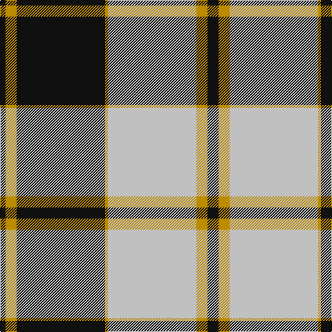

In pattern [KYKYWYK](/patterns/kykywyk/).

This was sourced from register-of-tartans.  It is a [7 stripes tartan](/stripes/stripes7/).

Original link https://www.tartanregister.gov.uk/tartanDetails.aspx?ref=1411

## Attestations

This cloth appears in 2 source records; the oldest owns this page.

- 01/01/1984 — Gleneagles Gold (Dalgleish) (register-of-tartans, [record](https://www.tartanregister.gov.uk/tartanDetails.aspx?ref=1411))
- 1984 — Gleneagles Gold (Corporate) (tartans-authority, [record](http://www.tartansauthority.com/tartan-ferret/display/1269/))

## Thread count
K/8 DY16 K128 DY4 N128 DY16 K/16

## Palette
Each colour and its ΔE from the base-6 reference it is a variant of.

| Colour | Shade | Base | ΔE (OKLab) |
|---|---|---|---|
| DY | <code style="background-color:#BC8C00;">#BC8C00</code> `#BC8C00` | Y <code style="background-color:#E8C000;">#E8C000</code> | 0.16 |
| K | <code style="background-color:#101010;">#101010</code> `#101010` | K <code style="background-color:#000000;">#000000</code> | 0.17 |
| N | <code style="background-color:#C0C0C0;">#C0C0C0</code> `#C0C0C0` | W <code style="background-color:#F4F4F0;">#F4F4F0</code> | 0.16 |

# Sample pattern

ID: /setts/s7/k16y16w128y4k128y16k8-k101010-wc0c0c0-ybc8c00/
